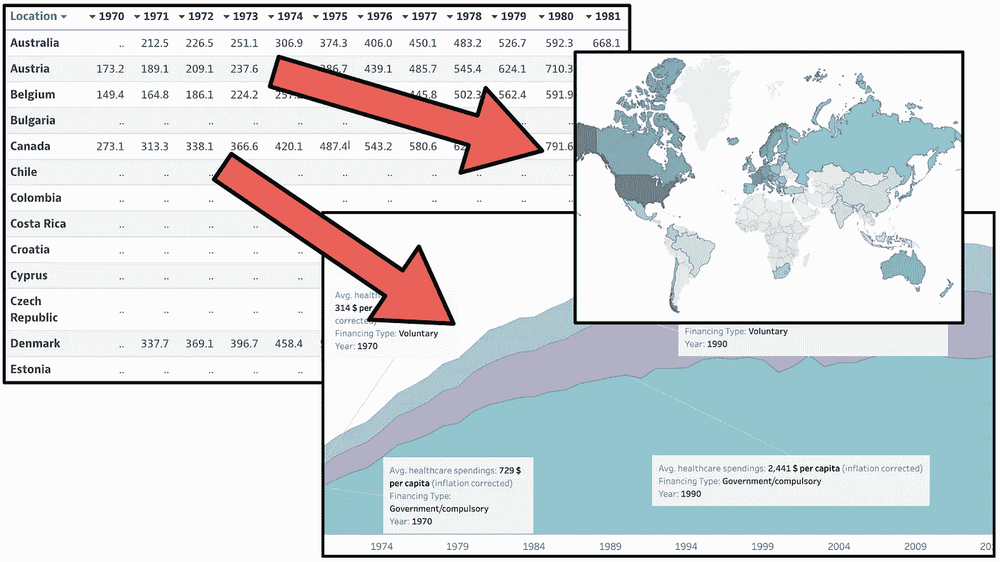
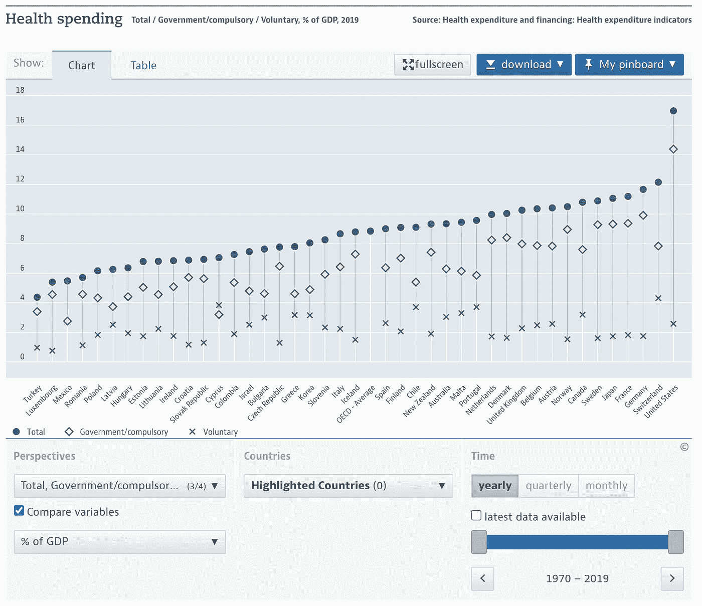
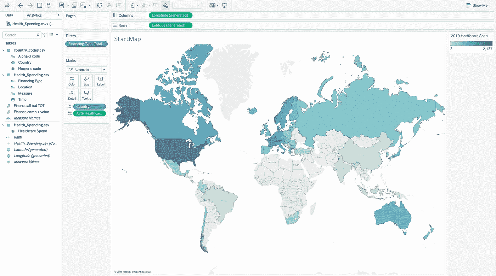
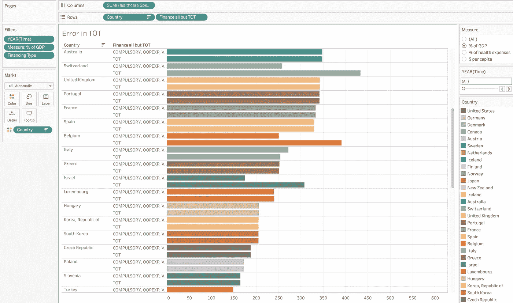
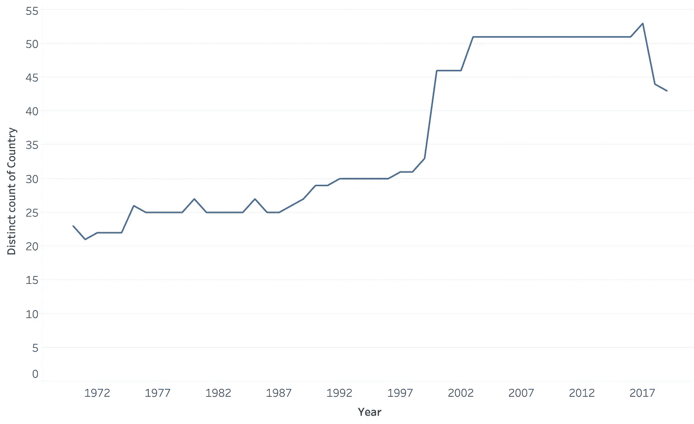
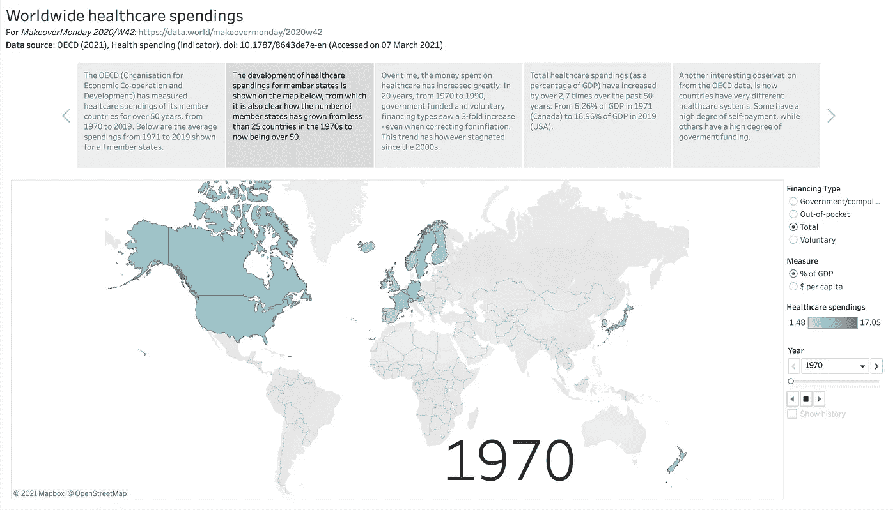
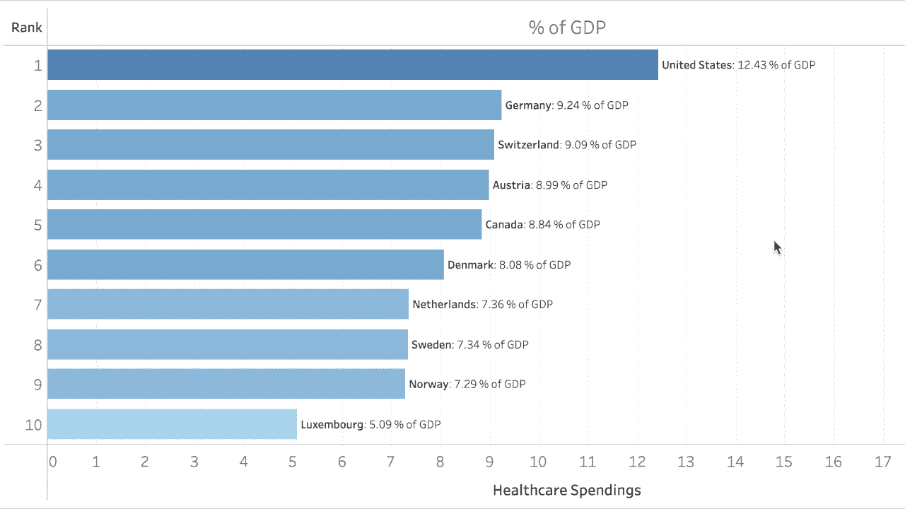
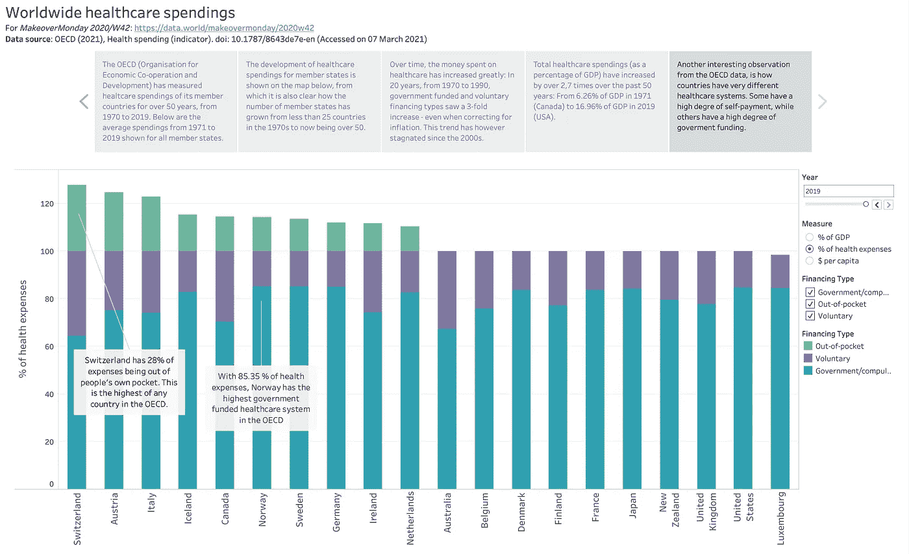

# 美女与野兽:如何把无聊的电子表格变成迷人的数据故事？

> 原文：<https://medium.com/nerd-for-tech/beauty-and-the-beast-how-to-turn-boring-spreadsheets-into-fascinating-data-storytellings-a87f870cfa25?source=collection_archive---------10----------------------->

## 一个真实的例子，说明如何使用 Tableau 故事来帮助你理解信息并防止读者睡着。

H 你有没有看过一个数据图，然后对自己说“**你到底想告诉我什么？”** 紧接着是另一个问题:“**那到底代表什么？”**

> 收集数据是一回事。一个完全不同，但同样重要和具有挑战性的任务是如何以有趣和有见地的方式呈现这些数据。

我想我们很多人都有过，尤其是在最近几年，数据收集、民意调查、测量、统计和其他类型的数据洞察层出不穷。然而，收集数据是一回事。一个完全不同，但同样重要和具有挑战性的任务是*如何以有趣和深刻的方式呈现这些数据*。

在这篇文章中，我将通过一个例子来说明如何使用 Tableau 故事将一组相当枯燥的数据转化为有趣的数据故事和见解。

# 原始数据和可视化

用于可视化的数据来自于“改头换面星期一”,这是一个社交数据项目，旨在改善我们可视化和分析数据的方式。

我选择了一个我觉得有趣的数据集，但也是一个原始可视化可以使用很多改进的数据集:2020 年[**/W42:医疗支出数据集**](https://data.world/makeovermonday/2020w42) ，原始数据来自[经合组织](https://data.oecd.org/healthres/health-spending.htm) **。下面可以看到经合组织的原始图像。**

来自 OECDs 网站的原始视觉化:看起来不是很有趣或吸引人，我不知道我应该关注什么。

现在，这种观想有什么问题？有几个:

*   首先，我发现很难掌握剧情中的所有数据点:要吸收的东西很多，不知道应该重点关注什么。
*   其次，不太清楚 Y 轴的单位是什么，因此我看到的到底是什么。
*   第三，但也是最重要的:我想知道那又怎样？ *这个数据的实际意义是什么？我应该从中获得什么启示？*

在接下来的部分，我将创造我自己的和改进的观想，这将有希望解决这些问题。所以让我们开始吧。

# 探险

在我看来，任何数据可视化的第一部分都是探索阶段。在这里，我对数据有了一种感觉，并绘制了各种参数，以了解什么是有趣的故事。

探索阶段从导入和清理数据开始，这样数据就可以被实际利用。对于该数据集，导入和清理过程包括以下步骤:

1.  从[https://data.world/makeovermonday/2020w42](https://data.world/makeovermonday/2020w42)下载数据
2.  导入到 [Tableau](https://public.tableau.com/s/) (我使用 Tableau 是因为它使用起来简单快捷，而且只要你愿意公开你的数据，它还有一个免费版本)
3.  注意到地理数据(3 个字母的国家代码)不能被 Tableau 解释
4.  使用 [Alpha-3 国家代码](https://gist.github.com/tadast/8827699)执行内部连接，以获得完整的国家名称，可由 Tableau 解释。
5.  探索数据！

## 玩耍的总体结果

该数据有 2 组主要的独立变量:国家**(经合组织成员国的卫生数据)和年份**(从 1970 年到 2019 年跟踪数据)。****

对于因变量，我们有**医疗支出**，分布在三个不同的类别中，称为**融资类型**:

*   政府和强制健康保险
*   自愿健康保险
*   家庭直接支付(称为自付费)[ [1](https://data.oecd.org/healthres/health-spending.htm) ]

还有第四种类型， **Total** 似乎等于**Total = government+voluntary**(关于这一点的更多信息，请参见“限制”)。

使用 3 种不同的方法对支出进行量化:

*   国内生产总值的百分比
*   卫生费用的百分比(除了*总数*类别之外的所有类别)
*   人均美元。

有两个独立变量(国家和时间)和一个因变量(医疗支出)，我们有三维数据，但只有一个 2D 表面来绘制(注:*这并不完全正确，因为 Tableau 允许使用页面进行数据的时间演变，而颜色、大小等。也可以用于可视化的维度。然而，在静态的 2D 屏幕上绘制 2D 地图和时间是行不通的。因此，我们需要减少至少一个维度。这为我们提供了两种绘制数据的直接方法:*

通过取一段时间的平均值，我们可以在地图上绘制出每个国家的医疗支出，如下图所示。

在探索包含地理数据的数据集时，我喜欢做的第一件事就是简单地制作一张地图，显示感兴趣的要素的平均值。

另一种选择是取所有国家的平均值，绘制出一段时间内的医疗支出。这产生了如下图所示的图，其中我已经排除了*总计*类别。

一段时间内的医疗支出，取所有国家的平均值。

当然，这不是绘制这些数据的唯一方法:例如，我可以挑出一个特定的国家，绘制该国一段时间内的支出，而不是取所有国家的平均值。我还可以选择制作地图动画来展示随时间的演变——这实际上是我们稍后要做的。

# 局限性和偏见

处理数据的一个重要部分是考虑到局限性和偏见。它们可能被认为没有必要呈现给最终观众(这取决于上下文)，但是它们对结论有效性的影响仍然应该被考虑。

由于数据集处理经合组织收集的医疗保健数据，我将假设收集的数据是真实有效的。作为宣传计划的一部分，人们当然可以质疑这一数据的有效性，但对于经合组织成员国，我不认为这是一个现实的问题。

不过，我确实发现了数据缺失的问题。看着*总*类别，我想知道它的总确切是什么。所以我把其他三种支出类型的总和(*强制支出、自愿支出*和*自付支出*)画在每个国家的*总额*类别旁边。对大多数国家来说，这些完全匹配，但对少数国家，如瑞士，有差异。我还没有找到原因，所以如果你发现了，不要犹豫，写信告诉我！

实际上，这意味着我们应该避免将其他三项支出与总数进行比较——所以对于每一个想象，我*或者*使用总数或者其他三项。

相同颜色的条形应该长度相等。大多数国家都是如此，但并非所有国家都是如此，这表明国家之间在这些计算中存在数据缺失或差异。

我观察到的另一个大的限制与作为数据集一部分的国家数量有关。随着时间的推移，越来越多的国家加入了经合组织(或者只是更多的成员国报告了他们的医疗支出)，在记录时间内，国家的数量实际上增加了一倍多，如下图所示。

这不一定是一个问题，只是在一段时间内比较国家时需要注意的一点，因为我们对一些国家的时间跨度要小得多。此外，并非所有国家都报告了所有年份的所有融资类型:特别是在 70 年代和 80 年代，许多国家没有列入*自付费*类别。

随着时间的推移，医疗支出数据集中的国家数量:注意这个数字是如何从 1971 年的 21 个增加到 2017 年的 53 个，增加了一倍多。

有了这些考虑，我们可以通过将我们的发现汇编成一个简洁的故事来完成这个项目。

# 讲故事

现在来点有趣的！去创造一个有趣的数据故事！在这一部分，我们要决定我们想要讲述什么故事，我们想要传达哪些关键的见解，以便回答那个至关重要的“**那又怎样？”**我在开头提到过。让我们开始吃吧。

## 总体思路

当然，从这些数据中有数百个潜在的故事可以讲述，这取决于每个人创造一个可视化来决定她想要突出什么。

在这种情况下，我选择了一种更具探索性的方法，没有明确的目标，因为我没有任何想要传达的特定议程，将大部分分析和解释留给了读者。然而，视觉化的设计是通过创造多个情节来帮助读者，每个情节都有自己清晰的焦点。

请注意，在某个经合组织国家的卫生部工作的人最有可能根据她认为与利益相关者分享的重要内容，创建一个具有更强焦点和特定亮点的故事。但由于这不是我的案例，我决定选择更通用的故事方法。

## 创建故事点

好消息是，在这一点上，在我的探索过程中，我实际上已经做了大量创建故事点的工作。在这里，我在数据中发现了几个很好的故事，比如随着时间的发展和国家之间的比较。

因此，尽管我最终在下面制作了一些新的图表(受到网上其他人所做的启发)，但在这一点上，主要是调整我现有的探索性可视化，使它们更加用户友好，并真正带出关键点。

我最终创作的故事可以在 Tableau Public 上看到，[这里](https://public.tableau.com/profile/rasmusgs#!/vizhome/HealthSpending-MakeoverMonday2020W42/WorldwideHealthcareSpendings):

 [## 全球医疗保健支出| Tableau Public

### 经合组织卫生支出数据集可视化改造周一

public.tableau.com](https://public.tableau.com/profile/rasmusgs#!/vizhome/HealthSpending-MakeoverMonday2020W42/WorldwideHealthcareSpendings) 

然而，我在下面附上了最后一个故事的一些截图，给那些喜欢呆在 Medium 上的人。

以下是我在 Tableau 中创建故事点的过程:

1.  就像我喜欢从我正在处理的数据的地图开始一样，我假设读者是志同道合的，并且喜欢得到一个概述。因此，第一个故事点是我们之前看到的平均总支出图。
2.  现在，我们可以通过展示这张地图是如何随着时间的推移而变化的来更深入地研究数据。通过这样做，我们也清楚地表明了国家的数量是如何增加的，从而含蓄地提到了这种偏见。地图是交互式的，因此读者可以选择查看哪种措施类型和融资类型。我在下面附上了这张图片。
3.  作为第三个故事页，我把随着时间的演变，如上所述。上面显示的一个和 Tableau 故事中的情节之间的主要区别是，后者已经进行了通货膨胀校正。这使得支出的增长看起来小得多，但它也给出了这种演变的更现实的图像。
    我的通胀修正只针对*总计*类别，实际上并不完全正确，因此引入了另一个偏差。这是因为我用相同的数额(3.96% [ [2](https://smartasset.com/investing/inflation-calculator) )来修正每一年和每一个国家，而不是用某一年某一个国家的通货膨胀率。

显示医疗支出随时间演变的交互式地图。虽然这里不动，既然只是截图，傻。

4.对于第四个数据洞察，我发现[这是一个非常酷的赛车条形图](https://public.tableau.com/profile/james.strachan#!/vizhome/MOM-2020-W42-HealthcareSpend/HealthcareSpend)，显示了医疗支出最高的国家随着时间的推移而发生的变化。我只是用*和*做了一些类似的东西，我是用[ [3](https://greatified.com/2019/12/16/how-to-build-a-bar-chart-race-in-tableau-software-2020-x-with-viz-animations/) ]做的。你可以在下面看到我的图表的 GIF(它远没有原来的那么棒，所以也请检查一下):

动画图表看起来很酷。赛车条形图是让读者猜测谁会“赢”从而建立兴奋感和参与度的好方法。

5.我的最后一个故事点是一个简单的条形图，显示了每个国家医疗费用的分布情况。这允许对国家间的医疗保健系统进行更深入的比较，我觉得这很有趣。
我决定添加一些注释，指出一些关于瑞士和挪威的有趣发现，如下图所示。
读者还可以选择查看哪一年，以及使用何种方法进行比较。

注释对传达信息有很大的帮助，并帮助读者决定关注什么。

这样，我们就完成了！我们已经成功地在 Tableau 中创建了一个数据故事，以帮助传达一组有趣的数据见解，使用与相当枯燥和难以理解的原始图表相同的数据集。

# 结论

在这篇文章中，我讲述了我如何将一个没有任何明确信息的枯燥数据集转化为一个有趣的数据故事的过程，突出了关键的发现。

特别是，我谈到了:

*   探索数据集以理解它并揭示有趣发现的重要性
*   考虑限制和偏见，因为它们可能会影响你从数据中得出的结论
*   如何将数据集转换成一些有趣的故事点

我希望这个演练有深刻的见解，并启发您创建或改进自己的数据可视化。*快乐 vizzin！*

# ***来源:***

*[1][https://data.oecd.org/healthres/health-spending.htm](https://data.oecd.org/healthres/health-spending.htm)*

*[https://smartasset.com/investing/inflation-calculator](https://smartasset.com/investing/inflation-calculator)*

*[3][https://greatized . com/2019/12/16/how-to-build-a-bar-chart-race-in-tableau-software-2020-x-with-viz-animations/](https://greatified.com/2019/12/16/how-to-build-a-bar-chart-race-in-tableau-software-2020-x-with-viz-animations/)*