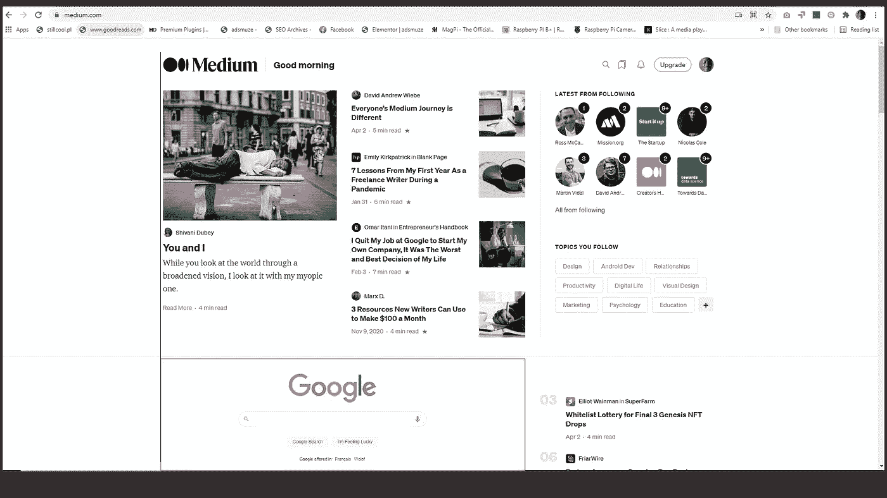
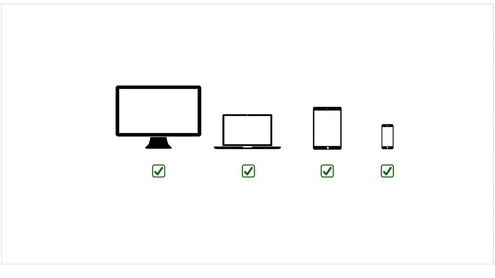

# 因为谷歌

> 原文：<https://medium.com/nerd-for-tech/because-of-google-cb94f6fd488?source=collection_archive---------19----------------------->

因为我认为，对于访问者和读者以及所有的网站所有者来说，在所有制作并发布到互联网上的网页的底部总是有一扇谷歌之门是值得的，也是有益的，因为我们每个人都可以随时进行搜索。

所以这个第三方应用是为了访问者、读者、网站所有者的利益。

您可以通过访问者阅读器的类型或用户的设备类型使其可用

这是一个透明的体验层，设计用于所有网站，如 [plug push](https://www.youtube.com/watch?v=TVh5fYDWUOQ&list=PLQnorOW-sRum_i-A72RE1MMawOIPYCaT_) 。

如果我们可以选择我们想要的搜索引擎呢

