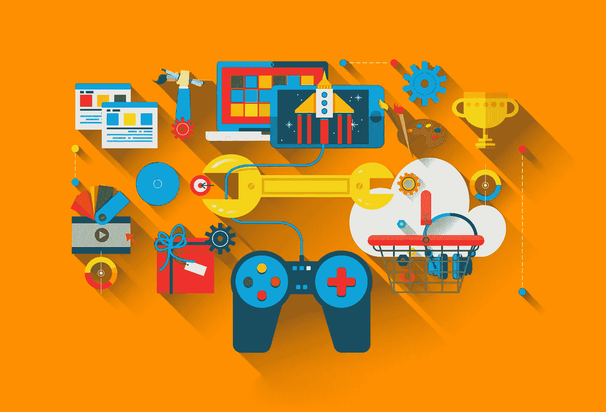
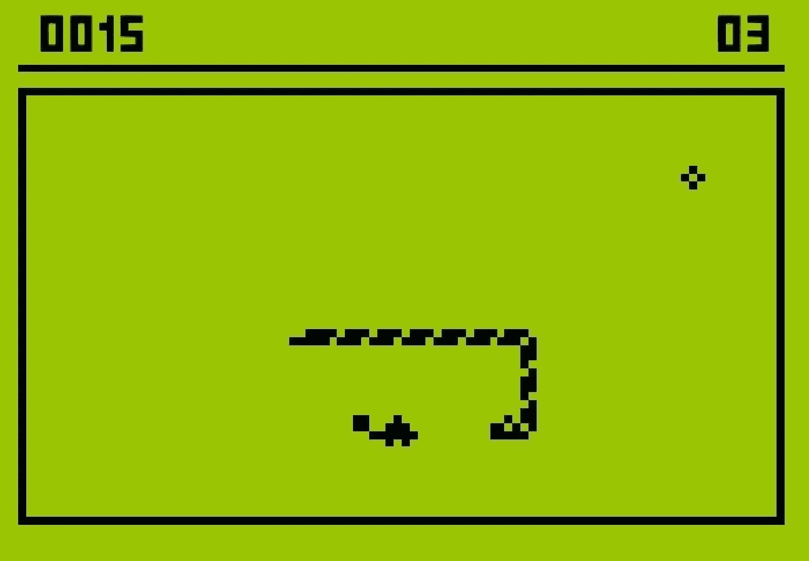
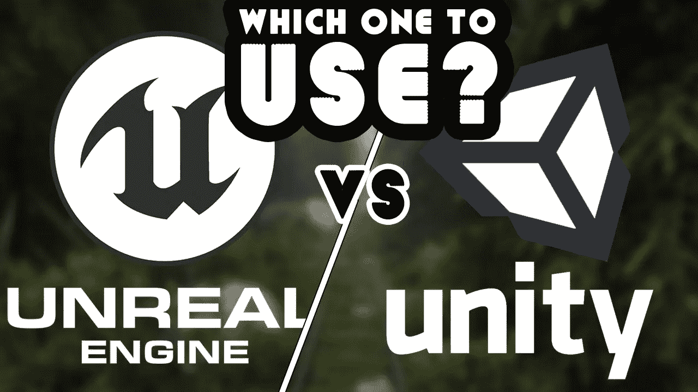

# 游戏开发路线图

> 原文：<https://medium.com/nerd-for-tech/begin-with-game-development-102b6e09eddd?source=collection_archive---------0----------------------->

> 我一直相信，当你不再是一个用户而成为一个创造者时，爱好就会变成一种技能。

这就是我开始探索游戏开发领域的动机。当我进入我的 B.Tech 时，我对任何技术领域都不太了解，但我对游戏非常感兴趣，并且总是很好奇这些游戏是如何创作的。 ***如果我爱上了某样东西，我想学会如何亲手制作它。***

游戏开发很有挑战性，但并不像你想象的那么有挑战性。那是因为如今你所需要的只是坐在你的电脑前，在 YouTube 上打开一系列随意的视频，或者花两便士上一个在线课程，你就可以开始创造任何你想要的生活地狱。

## 介绍

我没有不诚实地说我是游戏编程大师。我还是一个初学者，正在努力学习更多的东西。但是我希望这能给你足够的理由开始你的旅程如果你在人生的任何阶段都在考虑游戏编程的话。

**首先，你需要为你想要达到的目标设定一个明确的目标**。不一定非要从中赚钱。这可能是一种爱好，就像我一样。也许你想在接下来的六个月里学习如何使用 Unity。不管你的愿望是什么，遵循这个计划，直到你满意为止。另外，我不喜欢严格的任务清单，**但是你可以列出一个目标清单来帮助**。只要采取任何你认为对你有用的方法，我相信你会有一个好的开始。

> 玩这个游戏让它看起来很简单，但是创造它，让你变得清晰。

让我说说我是如何开始创作游戏的。我创作的第一个游戏是一个贪吃蛇游戏，这个游戏已经出名几十年了。我是用 python 的***【py game】****和* ***海龟*** *模块、* *开发的，这是一个 Python 框架，专门为游戏开发*做的。但我也面临一些困难。

最后，在 YouTube 上看了一堆教程并跟进了文档之后，我成功地创建了这个游戏。当我成功完成时，我感到更有信心，我开始制作更多的游戏，如*太空入侵者，你好兔子，马里奥*等。

虽然 Pygame 的效率没有 Unity 或其他游戏引擎高，但它是一个原始的过程，很可能会教你游戏设计的基本结构——动画如何工作，如何在屏幕上绘制图像，如何导入资源。

## 先决条件

每个人都应该知道的一件事是数学。做游戏程序员不需要懂高等数学。但是，是的，你需要逻辑思考。*懂数学有帮助。*

我还建议你至少精通一门编程语言，因为这将帮助你清楚语法、结构和非常有用的类概念。**我建议开始用 Python 编码，**不仅仅是因为它的语法看起来很简单，很容易理解，而且它是一种成长良好的语言，拥有大量的模块，可以帮助你开始游戏开发。最终选择权在你。

## 语言

这次旅行后不久，我发现 Python 并不是最完美的游戏编程语言。

C#和 C++都源于 C，C 是一种强大而复杂的编程语言。虽然这是一种简化，但你需要知道的是，两者之间的主要区别在于它们如何处理类、对象等。

C++是公认的行业标准。如果你打算用虚幻引擎编程，这也是你需要学习的语言。 **C#** 另一方面，**对于初学者来说非常优秀，并且得到了 Unity 引擎**的全面支持。

## 选哪个发动机？

**Unity，Unreal，Godot** 都是游戏编程引擎。 **Unity 比 Unreal** 用户友好多了，但是它处理图形的方式不一样。Unity 现在正在努力改变其渲染管道，使其更容易处理照片级真实感图形，因此与 Unreal 的差异可能很快就会变小。尽管如此，**虚幻有助于大型游戏**的稳定性和性能，而 **Unity 则非常适合更小更轻的游戏**，包括移动游戏。实际上，你构建第一个游戏的引擎可能并不重要，所以我的建议是选择一个并使用它。

## 我选了什么？

**我用 C#选了 Unity。我认为它对这个领域的新手来说已经足够了，原因有二:它有大量的资源和一个很棒的社区；第二，它使用的 C#不仅可以用来创建游戏，还可以用来创建许多其他应用程序。**

Unity 是一个很好的工具，可以原型化从游戏到交互式可视化的所有东西。它给你一个非常原始的现成产品，但是高度灵活，文档完善，高度可扩展，可以构建你能想到的几乎任何类型的游戏。Unity 完全支持 VR 和 AR，因此可以成为与客户一起探索架构、自动化和模拟的伟大工具。

但是使用引擎最好的方面是它为你处理大部分基本原理的方式。当我用 Python 编程时，我必须在途中编写自己的引擎，自己设置碰撞和动画。Unity 为你做了大部分的工作，你只需要知道如何按照你想要的方式设置一切。

当然，这个界面可能一开始看起来很模糊，**并准备好面对陡峭的学习曲线**。任何 Unity 项目都是从一个*游戏摄像头*开始的——只有开发者可以添加所有其他的东西。而那张*空白画布*可能就像 Word 中的一张空白页一样令人恐惧。但是克服第一种恐惧是很容易的。

## 如何开发你的第一个游戏

做完这一切后，你将拥有工具，可能还有技能，最终是时候跳到令人兴奋的事情上了。**你如何制作你的第一个游戏？**

嗯，有几件事要考虑。如果你很有创造力，此时你可能会有很多想法，你的手可能会渴望独自完成一个关于团结的大游戏。但是现在还不要把目标定在月球上。*从小做起。非常小。*用非常简单的资产做非常简单的项目(甚至基本的形状都可以)。

> 每个人都会告诉你学习编程就像盖房子一样。你需要把所有的基础和地板放在适当的位置，然后才能想到顶层公寓和屋顶花园。

不要从一开始就选择随机生成的 RPG。从一个简单的想法开始,然后在此基础上发展你的技能。你的第一个项目将帮助你练习，当你一行接一行地敲打代码时，没有什么比看到你的游戏成形更好的了。**即使是好的单屏街机游戏，也能激励你不断前进。**

***只要心态正确，任何想法都可以变成游戏。*** 如果你不是艺术家，**不用担心资产**。**总能从** [**Unity 自有资产商店**](https://www.google.com/url?sa=t&rct=j&q=&esrc=s&source=web&cd=1&ved=2ahUKEwjEqrqJuc3kAhWiRBUIHW_9DasQFjAAegQIBRAC&url=https%3A%2F%2Fassetstore.unity.com%2F&usg=AOvVaw2yuOguWwX96rCdNCFDJyu1) 获得一些。如果出现最坏的情况，你总是可以考虑 P **像素艺术**。只要稍加练习，创造一些让你引以为豪的东西并不难。

## 给新人的建议

> 要制作一个游戏，你必须经历游戏开发的 5 个阶段:设计。艺术代码。音频。波兰人。

如果你打算写你的第一个游戏，不要低估编写哪怕是最琐碎的游戏的复杂性和时间。请记住，Steam 上的大多数游戏都有团队全职开发多年！

选择一个简单的概念，把它分解成小的可实现的里程碑。强烈建议将你的游戏分成尽可能小的独立组件，因为如果你保持组件简单而不是单一的代码块，你就不太可能遇到错误。

我还有很多东西要学，我的游戏编程之旅还远没有结束。**但是，当我回顾一年前我所做的事情时，我几乎不知道什么是循环的*…天哪，如果现在这一切感觉都不一样了。***

我现在正在开发我的第一个游戏。我本打算告诉你更多，但现在可能不是合适的时间和地点。只知道**多亏了互联网和相当固执的毅力，**我现在有了一些开发游戏的基本经验。

感谢阅读！如果你喜欢这个教程，不要忘记为它鼓掌，如果你想在未来看到更多，请在 Medium 上跟随我！