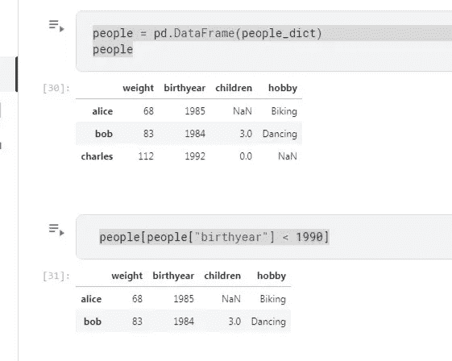
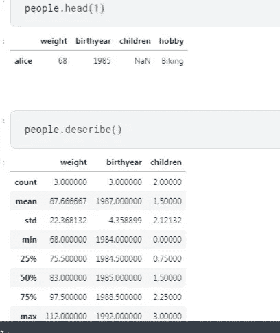

# 五分钟后从熊猫开始

> 原文：<https://medium.com/nerd-for-tech/begin-with-pandas-in-5mins-553b635063cf?source=collection_archive---------27----------------------->

Pandas 是一个构建在 NumPy 库之上的开源库。它是一个 Python 包，提供了各种数据结构和操作来操作数字数据和时间序列。

它主要是因为更容易导入和分析数据而流行。熊猫速度快，对用户来说，它有很高的性能和生产力。

NumPy 库为多维数组提供了对象，pandas 将提供一个名为 Dataframe 的内存 2d 表对象。所以熊猫将会有很多额外的功能，比如绘制图表，创建数据透视表。

使用列表创建数据帧:可以使用单个列表或一系列列表创建数据帧。

数据帧可以被看作是一系列的字典。数据帧将以行和列、数据

新的列和行可以很容易地添加到数据框中。除了基本功能之外，熊猫的数据框还可以按特定的列进行排序。

head():返回数据框对象中的前 5 行

tail():返回数据框中底部的 5 行

info():打印数据帧的摘要

describe():很好地概述了每一列的主要聚合值

所以这是一个关于熊猫概念的小演练，每次当我们开始学习熊猫时，你都有可能在熊猫中走神，比如索引、函数、NumPy 等等。，但我们应该了解概念基础知识，不要让混淆影响到我们。

最后，我们必须明白的是，Pandas 是一个可视化工具，可以更深入地了解您的数据。

下面是我的 Kaggle 笔记本的链接，以便开始使用

【https://www.kaggle.com/deepikabhandarkar/pandas/edit 号

参考资料:

【https://www.geeksforgeeks.org/pandas-tutorial/ 

[https://pandasguide.readthedocs.io/en/latest/](https://pandasguide.readthedocs.io/en/latest/)

*原载于 2021 年 5 月 17 日 https://www.numpyninja.com**的* [*。*](https://www.numpyninja.com/post/begin-with-pandas-in-5mins)