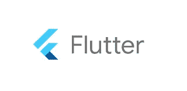
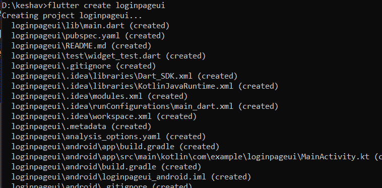
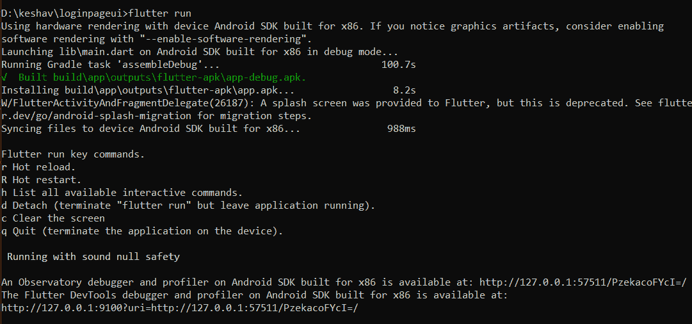
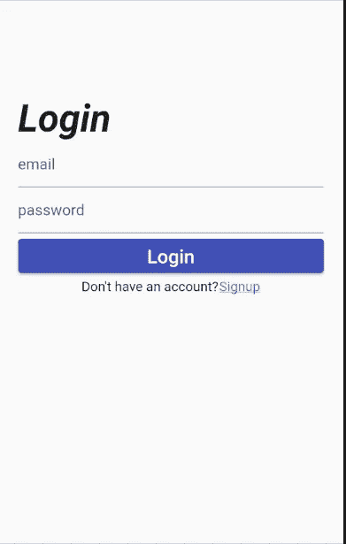

# 颤振初学者指南。

> 原文：<https://medium.com/nerd-for-tech/beginners-guide-for-flutter-dc27ee7d78a3?source=collection_archive---------1----------------------->

# 什么是颤振？

Flutter 于 2017 年 5 月由谷歌发布。Flutter 不是一种编程语言，它是一个软件开发工具包(SDK ),包含预先编写的代码，以及随时可用和可定制的小部件、库、工具和文档。

Flutter 可以用来制作跨平台的 app:Android，IOS，web。这是一个专门为前端设计的框架。

Flutter 使用 Dart，因为它允许 Flutter 避免像 JSK 和 XML 那样需要单独的声明性布局。Flutter apps 是用 Dart 语言编写的，Flutter 自带 Flutter DevTools(也叫 Dart Dev tools)。这就是为什么要先学镖再学扑的原因。

# 颤振的优点:

## **1。开源**

Flutter 是一个开源软件开发工具包。它提供了发布问题和访问来自开放开发人员论坛的文档的便利。

## **2。单一代码库**

Flutter 是一个跨平台的框架，一个应用程序的单一版本可以在 android、IOS 和 web 上运行。因此，它防止开发人员为不同的平台编写不同的代码。

## **3。热重装和开发**

在 flutter 中，开发人员可以立即看到对代码所做的更改。开发人员不必等待更新，并可以继续使用框架，没有中断。

## **4。类似原生应用的功能**

由于 flutter 使用的 Dart 可以很容易地编译成本机代码，futter 应用程序可以在任何平台上运行。

## **5。自定义部件的使用**

Flutter 提供了不计其数的小部件，供开发人员在创建过程中使用。它使得设计一个基本的用户界面更加容易。在 flutter 中，你可以创建一个 UI 元素，它将适应不同的屏幕尺寸。

现在，让我们使用 Flutter 创建一个简单的登录页面。声明一下，这是个教程。如果你对学习 Flutter 感兴趣，请查看 [Flutter:在创纪录的时间内使用漂亮的原生应用](https://flutter.dev/)。

**一些术语:**

*   **有状态小部件:**它是一个动态小部件，可以在运行时根据用户动作或数据变化进行更新。
*   **Scaffold:** 这是一个帮助构建基本材料设计布局的小部件。
*   **容器:**它是一个父小部件，可以包含多个子小部件。

**创建颤振项目:**

**运行项目:**

## 最终产品:

看，用 Flutter 做一个登录页面是多么容易。

你坚持到了最后。

 [## @SRKeshav | Linktree

### 19 岁的男孩，喜欢学习、创造、发展和写作。

linktr.ee](https://linktr.ee/SRKeshav) 

跟我来:

[https://www.instagram.com/sr.keshav/](https://www.instagram.com/sr.keshav/?hl=en)