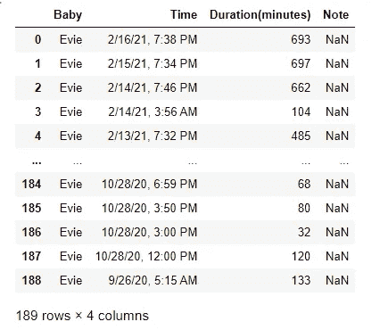
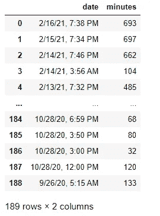
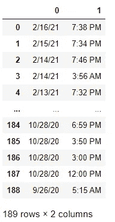
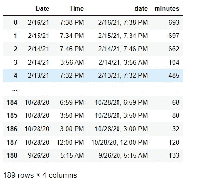
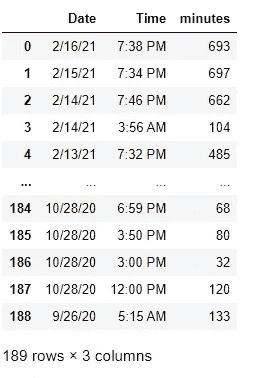
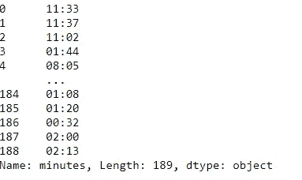
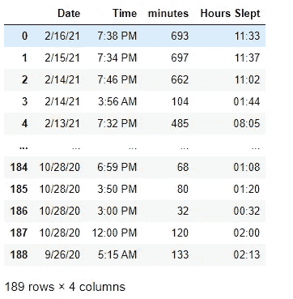

# 熊猫数据框清洁初学者指南。

> 原文：<https://medium.com/nerd-for-tech/beginners-guide-to-pandas-dataframe-cleaning-8712a6e3e63a?source=collection_archive---------10----------------------->

第 1 部分:从我的宝宝的睡眠跟踪应用程序中清理一个. csv 文件。


照片由[徐世洋](https://unsplash.com/@ltmonster?utm_source=unsplash&utm_medium=referral&utm_content=creditCopyText)在 [Unsplash](https://unsplash.com/?utm_source=unsplash&utm_medium=referral&utm_content=creditCopyText) 上拍摄

除了带着新生儿熬过一天，每个新父母的目标都是晚上能够再次入睡。优选地，一次超过两小时。

我丈夫和我使用一个应用程序来跟踪从睡眠、食物到便便的一切，因为缺乏睡眠更容易忘记她上次吃饭的时间。

我们使用的应用程序允许我将数据下载到一个. csv 文件中。在这篇文章中，我将使用 Pandas 展示一些基本的组织和数据清理功能，这些功能总会派上用场。

## 导入库和创建数据框架

```
#importing libraries we will useimport numpy as np
import pandas as pd
from datetime import time#The app I used allowed me to download the data into a csv file
#open the file into a dataframe and named it dfdf = pd.read_csv('Evie_sleep.csv')
df
```



数据帧导入后的外观。

导入数据帧后，我开始思考我希望它是什么样子，以及我需要做哪些更改。

1.  首先,“时间”列包含日期和时间，因此我们将把该列分成两个单独的列。
2.  睡觉的时间是以分钟为单位的，我宁愿以小时为单位。
3.  去掉‘注意’和‘宝宝’之类不必要的栏目(我知道我宝宝的名字 lol)。

## 删除列和行

放下一个有熊猫的专栏。可以使用 drop()函数。还有一些其他部分需要添加到代码中。

分解代码:在穿刺中，您将添加要删除的列的名称。

```
df.drop(['baby', 'note'], axis=1, inplace=True)
df
```

`axis=1`告诉 python 这是一个将被删除的列。

`inplace=True`选项更新数据帧。

如果未选择 True，则默认为`inplace=False`。它返回对象的一个副本。关于更详细的解释，我推荐这篇[文章](https://jman4190.medium.com/explaining-the-inplace-parameter-for-beginners-5de7ffa18d2e):



放下婴儿和注释栏后，我们只剩下日期和分钟。接下来，我们将拆分日期列。

## 拆分列

日期栏在同一栏中有日期和就寝时间，我希望它们分开。

我创建了一个名为`df_split`的变量，这样以后更容易连接到数据帧。

```
df_split= df['date'].str.split(",", expand=True)
df_split
```



日期列拆分。

现在日期列变成了两个独立的列，一个表示日期，另一个表示就寝时间。

## 命名列

让我们通过在变量中使用`.columns`来添加列名，这是一种简单的更改名称的方法。

```
df_split.columns = ['Date', 'Time']
df_split
```


列现在有了名称。

## 使用 Concatenate 合并数据帧

我们准备使用`pd.concat`来组合数据帧，以进行更改。

```
df2 = pd.concat([df_split, df], axis=1)
df2
```



现在我们将使用删除旧的“日期”列。丢弃()。



最后要做的修改是把分钟变成小时，以便于阅读。

## 时间—几分钟到几小时

对于熊猫，有几种方法可以改变约会时间。对于其他的方法，这篇文章详细介绍了不同的方法。

为了将分钟转换成小时，我选择用最少的代码来完成。

```
hours = pd.to_datetime(df2.minutes, unit='m').dt.strftime('%H:%M')
hours
```

这里有我们正在使用的 df 和被调用的列。

`(unit='m)`表示当前时间以分钟为单位。

剩下的代码:`.dt.strftime('%H:%M')`输入时间小时和分钟，运行后，结果如下。



## 将数据添加到现有列中

最后一步是将新的时间格式添加到数据帧中。

```
df2.insert(3, 'Hours Slept', hours)
```

我用了方便的`insert`来添加时间。

```
(3, 'Hours Slept', hours)
```

括号中的“3”表示该列的位置。在第三列之后，我想添加“睡眠时间”列，包含数据的变量叫做`hours`。



我也将删除分钟列，因为它是不必要的，看看新的 df。

```
df2.drop(['minutes'], axis=1, inplace=True)
df2
```


最终数据帧

我们完事了。数据帧被格式化并准备好用于创建一些可视化。

## 摘要

我想把一些使用熊猫的最有用的数据框清理方法的参考放在一起，希望这个指南是有帮助的。请随意分享任何其他对你有效的方法；我很乐意学习其他方法。

## 资源

[](https://towardsdatascience.com/sorting-data-frames-in-pandas-a5a3af6f346a) [## 对熊猫中的数据框进行排序

### 如何快速有效地排序数据帧

towardsdatascience.com](https://towardsdatascience.com/sorting-data-frames-in-pandas-a5a3af6f346a) [](https://towardsdatascience.com/4-methods-for-adding-columns-to-pandas-dataframes-dd0696863c16) [## 向 Pandas 数据框架添加列的 4 种方法

### 举例说明

towardsdatascience.com](https://towardsdatascience.com/4-methods-for-adding-columns-to-pandas-dataframes-dd0696863c16) 

[https://towards data science . com/working-with-datetime-in-pandas-data frame-663 f 7 a F6 c 587](https://towardsdatascience.com/working-with-datetime-in-pandas-dataframe-663f7af6c587)