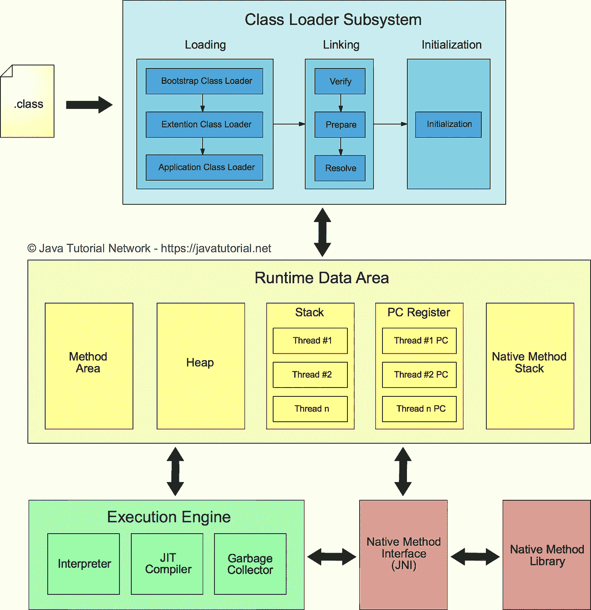

# JVM 的幕后

> 原文：<https://medium.com/nerd-for-tech/behind-the-scene-of-jvm-5698267a439a?source=collection_archive---------6----------------------->

约纳斯·勒普在 [Unsplash](https://unsplash.com?utm_source=medium&utm_medium=referral) 上拍摄的照片

尽管大多数 Java 开发人员对 JVM 有基本的了解，但他们几乎不知道在这个 JVM 下到底发生了什么。你可能已经知道这个神奇的短语，即*“JVM 是为了把你的字节码转换成机器码”*。虽然没有错，但是 JVM 不仅仅是为了将字节码转换成机器码。因此，在这篇文章中，我将讨论 JVM 架构以及它是如何工作的。

在进入 JVM 之前，您需要知道有两种类型的虚拟机。分别是**基于系统的虚拟机(SVM** )和**基于应用的虚拟机(AVM)** 。

🔹**基于系统的虚拟机(SVM)**

支持向量机需要一个或多个硬件组件，它可以创建多个工作环境。这些环境彼此完全独立。

示例:VMWare、VirtualBox

🔹**基于应用的虚拟机(AVM)**

AVM 也称为基于进程的虚拟机。AVM 不需要任何硬件组件，它基本上是一个软件/过程，帮助您创建运行其他程序的平台。

例如:Java 程序的 JVM，Java 程序的 CLR。网络程序

如上所述，JVM 是一个基于应用的虚拟机，它完全是一个规范。那么我们怎样才能让 JVM 进入我们的机器呢？您只是不能将 JVM 下载或安装到您的机器上。记住 JVM 只是一个进程，它在你开始运行 Java 程序之前是不存在的。那么当你执行一个 Java 程序时，JVM 是如何存在的呢？这就是 JRE 的由来。

Java 运行时环境(JRE)，是运行 Java 应用程序所需的最小环境。当您将 JRE 下载并安装到您的机器上时，它会部署一个特定的代码，该代码需要在任何时候创建一个 JVM 实例。

## 创建 JVM 的实例

那么 JRE 如何知道何时创建 JVM 的实例呢？在您的机器上，您可以使用终端或特定的 IDE(例如 IntelliJ IDEA，Eclipse)编写 Java 程序。在这个场景中，我将使用终端创建一个名为“Student”的 Java 文件。

创建 Java 文件后，您必须使用 Java 编译器将这个 Java 文件编译成一个类文件。转到 Java 文件目录并简单地输入，

> **" Javac student . Java "***在终端上点击回车。*

它会把你的 java 文件编译成一个类文件。现在您可以使用下面的命令运行这个类文件，

> **【Java Student】***在终端上点击回车。*

因此，此时它要求您的操作系统提供一个 JVM 实例来运行这个类文件。然后它创建一个非 demon 线程，并从初始类(带有 main 方法的类)开始执行。JVM 的实例将一直存在，直到最后一个非 demon 线程存在。

# JVM 架构内部

在 JVM 体系结构中，有 3 个主要组件，分别命名为，**类加载器，存储区，执行引擎。**

JVM 架构(图片:【https://javatutorial.net/jvm-explained】T2

# **1。类别加载器**

每当我们运行一个 java 程序时，那些编译好的类文件就会被加载到类加载器中。JVM 中有 3 个内置的类装入器，

*   引导类装入器
*   扩展类加载器
*   系统类装入器

除了这些内置的类加载器之外，你还可以在 Java 中直接创建一个**“用户定义的类加载器”**。

类加载器有 3 个子组件，分别称为**加载、链接和初始化。**

## **1.1 加载**

这个加载阶段的主要职责是将编译好的类加载到内存区域。通常，加载过程从主类开始(带有 Main 方法的类)。在将每个类加载到内存区域之前，这个加载阶段将执行以下任务:

*   读取完全限定的类名
*   读取直接父类信息
*   读取可变信息
*   检查它是否与类/接口/枚举相关

每当一个类第一次加载时，JVM 从一个类类型创建一个对象。这个类类型对象只为每个类创建 1 个，并将存储在堆区域中。

## **1.2 链接**

链接分为三个部分，即**验证、准备和解决。**

🔹 ***验证***

在这个验证阶段，它使用一个名为“**字节码验证器**的子程序来验证类，并确保它可以安全执行。因此，它验证类是否由有效的编译器编译，以及类文件是否根据正确的 java 结构/格式编写。

如果在这个阶段验证失败，JVM 抛出一个异常(java.lang.VerifyError)并终止 java 应用程序。

🔹 ***准备***

在这个阶段，它为类文件中的所有变量分配默认值。每种数据类型都有特定的默认值。例如，对于布尔变量，它会将“false”指定为默认值，而“0”是整数变量的默认值。

🔹**决议*决议*决议**

所以，在程序中，我们创建对象并频繁使用它们。创建对象时，我们用不同的名称定义它们。但是 JVM 不能理解这些特定于域的名称。所以，为了让机器理解它，JVM 用它替换了一个符号引用/链接。

## 1.3 初始化

初始化是类装入器的最后一个阶段，在这个阶段，它分配我们在 java 文件中定义的所有实数值。此外，如果类有任何静态块，将在初始化阶段执行。

# 2.存储区(运行时数据区)

内存区有 5 个子区，分别命名为:**方法区、堆区、栈、PC 寄存器、**和**本机方法区**。

前两个区域*(方法区，堆区)*每个 JVM 只创建 1 个。这意味着它不关心你的程序是否有多个线程，那些线程必须在它们之间共享这两个线程。但是其他三个区域*(堆栈、PC 寄存器、本地方法区域)*是为每个线程创建的。

***2.1)方法区*** —方法区保存所有类级别的信息和数据，如变量信息，包括静态变量。

***2.2)堆区*** —堆区保存所有对象及其信息。

***2.3)堆栈*** —堆栈存储方法及其信息。如上所述，每个线程创建一个堆栈。如果一个线程有几个方法，那么在堆栈中为每个方法创建一个堆栈框架。

***2.4) PC 寄存器*** —它保存关于非本机方法下一次执行的信息。如果下一次执行是关于本地方法的，那么 PC 寄存器会变得未定义。在本地方法执行之后，PC 寄存器获取关于非本地方法下一次执行的信息。

***2.5)原生方法区*** —如果你程序加载了一个原生方法，该原生方法的信息将被存储在这里。

> 提示:java 中的本地方法基本上就是方法，但是是用其他语言编写的，比如 C 和 C++。

# 3.执行引擎

这是字节码实际执行的地方。执行引擎下有 3 个组件，解释器、JIT 编译器和垃圾收集器。

***3.1)解释器***

解释器将字节码解释(转换)成机器代码，并逐行执行。它可以快速解释字节代码行，但是如果有一个方法调用了多次，那么每个方法调用都需要一个新的解释。这使得执行速度慢了很多。

***3.2) JIT 编译器***

每当有一个方法被多次调用时，解释器就面临一个问题。这就是 JIT 编译器拯救世界的地方。JIT 编译器所做的是，将整个字节码编译成机器码。那么这个机器码将直接用于那些“重复的方法调用”。通过这种方式，它比解释器快得多。

***3.3)垃圾收集器***

垃圾收集器是一个总是在后台运行的恶魔线程。垃圾收集器的主要任务是检查堆区域中任何“未使用的对象”并销毁它们。因此，它通过销毁那些未使用/不可到达的对象来从堆区域释放内存。

## 参考

*Java 虚拟机*。2016.[视频]导演 K. Dinesh。[https://www.youtube.com/playlist?list = PLD-myte BG 3 x-RF 1 Hu 16 AC 3 RF 9 e-maak XJ:](https://www.youtube.com/playlist?list=PLD-mYtebG3X-rF1hU16AC3Rf9E-mAAkXJ:)YouTube。