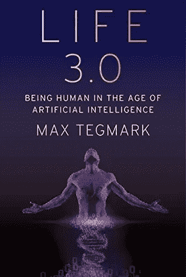
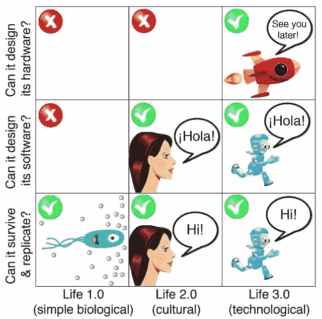

# 人工智能时代的人类

> 原文：<https://medium.com/nerd-for-tech/being-human-in-the-age-of-ai-aecd5bb28ac6?source=collection_archive---------8----------------------->

## 生活 3.0——成为人工智能时代的人类。
by —最大标记

生活 3.0——图片来源——谷歌(书的封面)

> “如果你听到关于 2050 年世界的情景，听起来像科幻小说，那很可能是错的；但你听到的 2050 年世界的情景听起来不像科幻小说，这肯定是错误的。”
> 
> ~尤瓦尔·诺亚·哈拉里

众所周知，人工智能(AI)是 21 世纪最具争议但又最迷人的话题之一。

对于技术世界来说，曾经似乎是科幻小说和难以实现的梦想现在几乎变成了现实。
从“Siri”和“Alexa”这样的个人语音助手到自动驾驶汽车，人类正在见证技术的惊人进步，这种进步正以前所未有的速度加速，这一切都是因为可用数据的稳定增长，不断改进的算法和日益
高效的计算能力，这使得人工智能在最近十年变得更加强大。

在媒体、会议和不同的活动中，每个人都在谈论人工智能。它变成了人们讨论的一个普遍话题。不同的人对此持有不同的观点，事实上，人工智能是一个使流行观点两极分化的领域，但我们都从我们的技术进化史中知道一件事，那就是
**【技术永远不是确定性的】**——它可以用来创造一个非常不同的社会，大多数人甚至难以想象。我认为关于人工智能的未来，一些最热门和最有争议的问题是:

*   人工智能的这种不可逾越的进步会走多远？
*   当机器完全能够在广泛的环境中独立思考和学习，并像我们人类一样解决所有复杂的任务时，会发生什么？
*   是我们控制智能机器还是它们控制我们？

你有没有注意到所有这些关于人类心理学的问题的共同点？
有人说过——***“人类最古老最强烈的情感是恐惧，最古老最强烈的恐惧是对未知的恐惧”。我认为我们可以强烈地联想到我们人类对未知的恐惧，当计算机比我们更聪明时，我们根本不知道未来会发生什么，在这个假设的时间点上，不可能预测接下来会发生什么或事情会如何发展，这就是所谓的— ***“技术奇点”。******

***马克斯·泰格马克的*** (一位瑞典裔美国物理学家、宇宙学家和机器学习研究者)的书**“生活 3.0——成为人工智能时代的人类”**是我认为探索所有可能的争论和问题的最佳地方，这些争论和问题存在于人工智能内部或与之相关，如果我们
想要创造一个尽可能好的未来，人类必须意识到这些。在本书中，Max 试图澄清基本术语和所有炒作和有争议的话题，并消除了所有与人工智能相关的常见神话，并提供了一个非常广泛的人工智能未来的可能场景。
Max 没有急于得出任何结论或任何议程，而是试图尽可能覆盖更多领域，主要是避免使用技术术语，并以非常容易理解的方式编写这本书，不仅针对技术专家或人工智能爱好者，还针对真正想了解人类未来的普通公众，并探索和讨论关于人工智能对我们的社会(如经济、就业市场、媒体和政治系统)影响的各种场景。

## 进化的三个阶段——什么是生活 3.0？

**进化的三个阶段**

如上图所示，作者将生命的发展分为三个阶段

首先，他简单地将生命广义地定义为任何能够保持其复杂性和繁殖的过程。

***生命 1.0(生物进化)-*** 硬件和软件都是进化出来的而不是设计出来的(比如细菌)。
而人类则是 ***生命 2.0(文化进化)——***生命的例子，硬件是进化出来的，但软件很大程度上是设计出来的。软件 Tegmark 指的是我们用来处理来自感官的信息并决定做什么的所有算法和知识——从识别事物的能力到行走、阅读、书写、计算等等，硬件简单地指的是身体。
最后， ***生命 3.0(技术进化)***——设计并升级其软件和硬件。

马克斯以一个虚构但可能的场景开始了他的书，即一个名为 Omega 的科学家和工程师团队如何秘密建造一个名为“普罗米修斯”的人工智能机器，它可以学习任何东西，甚至设计其他机器，以及它如何创造了世界历史上最戏剧性的转变。

> *“没有任何物理定律说我们不能制造比我们聪明得多的机器”~马克斯·泰格马克*

## 一些发人深省的问题

随着这本书的进展，他探索了人工智能的一些广泛影响，并清楚地对它们进行了公正的讨论，还讨论了当前的研究和该领域的一些突破。他还试图解决许多发人深省的问题，比如:

*   如何让 AI 造福人类？
*   我们想要什么样的未来？
*   工作自动化会给我们带来什么？
*   在人工智能时代，做一个人类将意味着什么？
*   智能机器会取代我们，与我们共存还是与我们融合？
*   我们如何通过自动化发展我们的繁荣，而不使人们缺乏收入或目标？
*   我们如何才能让未来的人工智能系统更加强大，让它们做我们想要的事情，而不会崩溃、出现故障或被黑客攻击？
*   随着人工智能系统变得越来越聪明，你如何让它们理解我们的目标？

## 意识

然后，他探讨了意识和智能的主题，并讨论了他自己对这个概念的看法，比如“活着、有意识等等意味着什么？”，“意识是否超越科学？”、“关于意识的实验线索是什么，对理论最常见的批评是什么？”和“如果我们能把我们的意识转换成计算机，我们还需要有肉有骨的人类吗？”

> 他将意识描述为一种主观体验。**“它是信息在一定条件下被处理时的感觉”。对我来说，这是这本书最有趣的部分。**

## **未来生活研究所(FLI)**

最后但并非最不重要的是，他乐观地描述了他在由他创建的**未来生命研究所(FLI)** 从事人工智能安全研究的工作。
未来生命研究所是波士顿地区的一家非营利性研究机构和外联组织，致力于减轻人类面临的生存风险，特别是高级人工智能带来的生存风险。
主要观点是**“技术赋予生命前所未有的繁荣发展的潜力……或者自我毁灭的潜力。让我们有所作为吧！”**

想了解更多关于 FLI 的信息，你可以点击这个链接👉[**https://futureoflife.org/**](https://futureoflife.org/)

我们现在生活在世界变革的非凡时代，像人工智能这样的最新技术发展如此之快，以至于我认为我们没有为这一点及其对人类的深远影响做好准备。这本书实际上让我大开眼界，让我意识到许多发人深省的问题，如果我们想要有一个积极的未来，人类必须探索这些问题。我知道有这么多书涉及这个主题，我不知道他们所有人，但 Max Tegmak 的书最好和独特的地方是，他不只是提出对人工智能黑暗面的关注，而是试图做一些事情，以便创造一个更美好的人工智能未来，他对事物的物理学观点也使这本书更有趣。这本书的重点是让人们明白👉“ [***如何获得授权，而不是被人工智能***](https://www.youtube.com/watch?v=2LRwvU6gEbA&t=868s) ”以及为什么成为我们这个时代最重要的对话的一部分如此重要。

以下是一些链接👇您可以关注以了解更多关于该主题的信息:

*   **Max Tegmark Talk at Google**——[***https://www.youtube.com/watch?v=oYmKOgeoOz4&t = 351s***](https://www.youtube.com/watch?v=oYmKOgeoOz4&t=351s)
*   **存在主义风险心理学:关于人类灭绝的道德判断—**[***https://futureo flife . org/2019/10/30/The-Psychology-of-existing-Risk/***](https://futureoflife.org/2019/10/30/the-psychology-of-existential-risk/)
*   [***https://www.youtube.com/watch?v=Gi8LUnhP5yU***](https://www.youtube.com/watch?v=Gi8LUnhP5yU)

无论我们是否希望，技术都将继续发展，并随着时间呈指数级增长。现在，反思我们如何能够用机器智能来增强我们自己的智能，以创造一个更美好的世界，这真的很重要。正如史蒂芬·霍金所说，这确实是我们这个时代最重要的对话，马克斯·泰格马克的这本紧张而发人深省的书将帮助你加入其中。