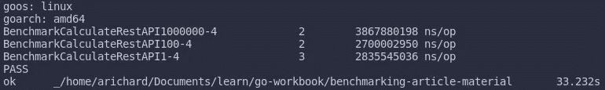
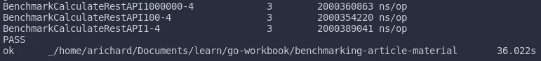

# 在 Go 中对您的解决方案进行基准测试

> 原文：<https://medium.com/nerd-for-tech/benchmarking-your-solution-in-go-940b528416c?source=collection_archive---------1----------------------->

让我们不加猜测地对您的解决方案进行基准测试吧！然后看有没有实质的改善？

Ryan Quintal 在 [Unsplash](https://unsplash.com?utm_source=medium&utm_medium=referral) 上拍摄的照片

在我们的系统启动并运行之后……在所有的重构会议之后，以确保我们的代码是干净的、可读的和可维护的。那么现在是我们改进这个系统并使它变得更好的时候了。

通常，有几种方法可以获得更好的性能，其中大多数是通过实验实现的。会有这样的问题，如果我使用这个算法，我会得到更好的性能吗？或者如果我用这个库代替另一个库，会有什么显著的区别吗？这些问题可以通过进行基准测试来回答，而无需猜测或手动测试。

有了基准测试，我们的解决方案就有了证据。如果它没有做得更好，那么我们将转移到另一个解决方案。然后所有这些解决方案可以相互比较，这将是我们更容易选择最好的一个。

# 从基本的开始

让我们从一个简单的例子开始。将此代码写入`main.go`文件。

我们定义了一个简单的函数来模拟某个需要时间来完成的操作，在这个例子中，它是 0 到 100 毫秒之间的随机持续时间。简单易行！

现在，让我们进入基准测试代码。你可以把这个写在`main_test.go`文件里。请记住，基准测试就像任何其他测试代码一样。

你可以通过输入`go test -bench=.`来运行测试。但是通过这样做，您不仅运行了基准测试代码，还运行了测试代码(如果您有测试代码的话)。

您可以过滤掉测试，确保它只通过运行`go test -bench=Bench`来运行基准测试代码。因为所有的基准函数都需要用`Bench`启动。就像您定义测试函数时在函数名的开头使用单词`Test`一样。如果你想更具体一点，那么你可以用你的基准函数的名字来提供标志`-bench`，例如`go test -bench=BenchmarkCalculate`。

默认情况下，基准函数至少运行 1 秒钟。如果基准函数返回时没有经过第二秒，b.N 的值将按 1、2、5、10、20、50…的顺序增加，函数将再次运行。

您可以使用命令`go test -bench=. -benchtime=20s`指定基准测试持续时间。这个命令使得基准测试会话需要 20 秒才能完成。

# 基准 RestAPI 应用程序

我们将继续使用旧的`Calculate`函数，并在 RestAPI 应用程序中使用它。另外，将会有一个额外的函数模拟一个名为`CalculateSlow`的繁重操作。现在，让我们改变我们的`main.go`文件。

这个应用程序非常简单。它只包含一个使用`Calculate`和`CalculateSlow`的端点。我们必须将`x`和`y`指定为查询字符串，然后我们将得到结果。

标杆代码怎么样？

当然，与我们之前的代码相比，这段代码更长。这个我一点一点解释。

*   您可以像以前一样运行代码。但是现在我们有 3 个基准函数。通过运行命令`go test -bench=Bench -benchtime=5s`。您将得到类似于以下内容的内容:

*   使用标志`-benchtime=5s`，每个基准函数将至少运行 5 秒钟。
*   注意，我们已经定义了一个包级变量`result`来存储我们从 API 得到的结果。所有这些都是为了避免编译器优化和消除测试中的函数，这会人为地降低基准的运行时间。
*   如果你切换基准函数的顺序，例如，`BenchmarkCalculateRestAPI1`被首先定义，你会得到同样的结果。您会看到第一个基准函数和第二个之间的巨大差异是由一个随机整数造成的。
*   看到这个结果，100 万、100 万和 100 万的输入没有任何显著的不同。通过移除`Calculate`函数中的随机整数，您会更好地看到这一点。

就这样吗？我们能让代码变得更好吗？让我们寻找一个解决方案，比如用一个`goroutine`大概？

# 让它变得更好

我们能不能利用 Go 给我们提供的牛逼功能让我们的代码变得更好，这个功能就是`goroutine`。让我们找出答案。

通过运行命令`go test -bench=Bench -benchtime=5s`，您将得到类似的结果:

看，因为`Calculate`和`CalculateSlow`同时运行，我们得到了更好的结果。注意，对于每个基准函数，我们得到大约 2 秒，这是我们在`CalculateSlow`中定义的睡眠持续时间。这绝对是一个很好的解决方案。

# 结论

我们从一个简单的例子开始，然后用一个更好的解决方案改进了前面的代码。

我们必须记住的是，性能调整必须在系统启动并运行之后进行。在此之前不能，否则我们将陷入过早优化。

一些解决方案可能需要我们从袖子里拿出一些技巧，这可能会使我们的代码不那么明显和可读。这将是我们通过实现解决方案而得到的一个缺点。但是，工程就是要知道我们拥有的解决方案利大于弊。

感谢您的阅读和快乐编码！

与本文相似的其他文章:

 [## 使用 Locust.io 进行负载测试

### 在我们的应用程序或服务运行后，有一段时间我们想知道性能和负载…

medium.com](/nerd-for-tech/load-testing-using-locust-io-f3e6e247c74e)  [## 测试 REST API 在 Go 中的验证和模拟

### "当低价的甜蜜被遗忘后，劣质的苦涩依然久久不散."—本杰明·富兰克林

medium.com](/nerd-for-tech/testing-rest-api-in-go-with-testify-and-mockery-c31ea2cc88f9)  [## Go 中的设置和拆卸单元测试

### 使用 Go 的标准库进行单元测试

medium.com](/nerd-for-tech/setup-and-teardown-unit-test-in-go-bd6fa1b785cd)