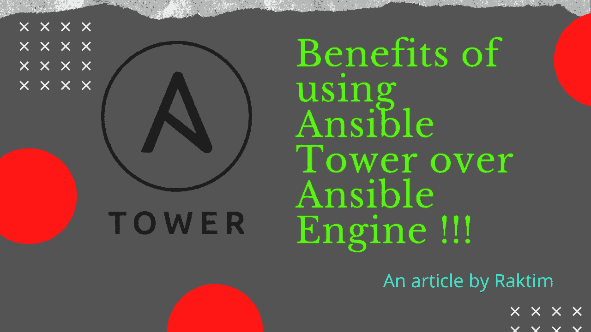
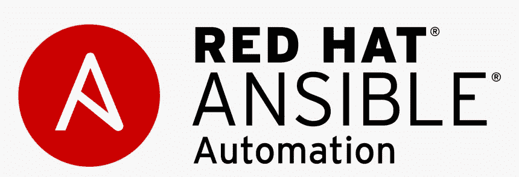
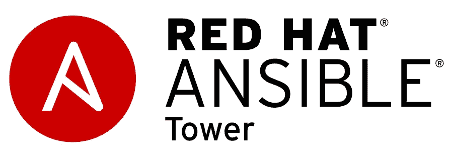
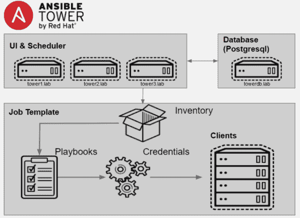
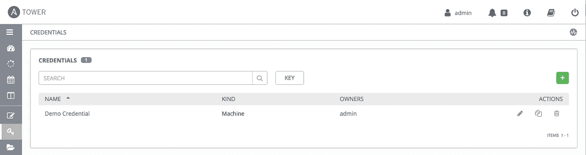
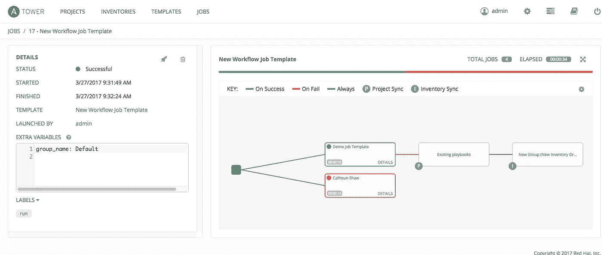
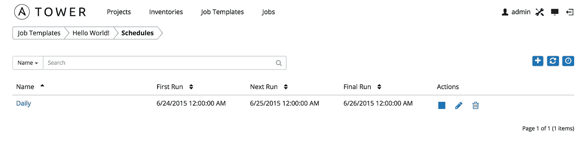
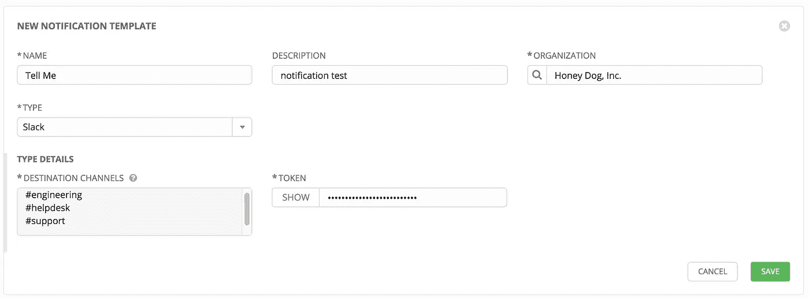
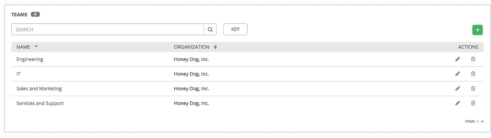
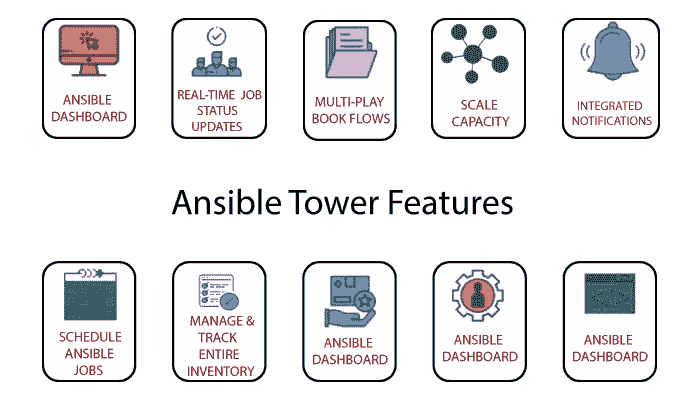

# 使用 Ansible 塔比 Ansible 发动机的好处！！！

> 原文：<https://medium.com/nerd-for-tech/benefits-of-using-ansible-tower-over-ansible-engine-b4a26dc740c7?source=collection_archive---------0----------------------->

由 Raktim 创建

当我第一次开始学习要求最苛刻的自动化工具之一— **Ansible** 时，我发现它非常有用和有趣。但是在深入研究之后，问题来了—

> "如果可变控制器节点失败了怎么办？"然后，您可以如何维护您的受管节点。

**这个问题的答案非常简单。使用 Ansible 塔，**因为它在 Ansible 上面提供了很多设施。**在本文中，我将通过一些实例来讨论这些好处。🙌**

# 什么是可回答的:

来源:谷歌

*   Ansible 是一款开源软件供应、配置管理和应用部署工具，支持基础设施代码化。它运行在许多类 Unix 系统上，既可以配置类 Unix 系统，也可以配置 Microsoft Windows。
*   在 Ansible 中，我们在名为 Playbook 的 YAML 文件中编写**配置，Ansible 代表 admin **从控制器节点通过 SSH** (对于 Linux)或 WinRM(对于 Windows)协议访问受管节点，并执行所需的任务。**
*   Ansible 最大的特点是无代理。它还具有**幂等的能力**意味着 Ansible 知道需要在被管理节点上执行的任务的状态。此外，在 **Ansible 中，我们还支持 Ansible Vault，**这是一种存储我们凭证的加密方法。
*   ***了解更多 Ansible:***[***https://www.ansible.com/overview/how-ansible-works***](https://www.ansible.com/overview/how-ansible-works)

到目前为止听起来不错，那么**我们在 Ansible** 中有哪些不足，或者更准确地说**为什么在行业中 Ansible 不足以解决所有的挑战**。或者说**为什么我们要使用易变塔？**🤨让我们从了解开始——

# 什么是可旋转塔:

来源:谷歌

*   **Ansible Tower 是一个 REST API、web 服务和基于 web 的控制台，旨在使 Ansible 更适用于拥有不同技术水平和技能的 IT 团队**。它是自动化任务的中心。
*   Ansible Tower 允许您控制谁可以访问什么，甚至**允许共享 SSH 凭证，而没有人能够转移这些凭证。**库存可以图形化管理，也可以与各种云资源同步。
*   它记录你所有的工作，很好地与 LDAP 集成，并且有一个令人惊奇的可浏览的 REST API。命令行工具也很容易**与 Jenkins** 集成。供应回调为自动伸缩拓扑提供了强大的支持。
*   ***了解更多安塞塔:***[***https://docs.ansible.com/ansible-tower/***](https://docs.ansible.com/ansible-tower/)

# 顶部可旋转塔的优点:

## **1。集群环境支持:**

来源:谷歌

*   正如我们在上面提到的图**中注意到的，我们有多个“UI &调度程序”。这些是我们独立的 Ansible 塔节点**运行在 Ansible 引擎之上。所有的塔都与一个集中共享的 PostgreSQL 数据库相连。这意味着所有的塔在每个时间点都有相同的信息。此外，我们在所有塔节点上都有相同的库存详细信息。
*   现在**在 Ansible 中，我们使用我们的控制器节点在我们的受管节点**上配置一些东西，但是在任何时间点，如果**控制器节点关闭，那么我们将无法管理我们的受管节点**。或者，假设您运行一个剧本，突然**在操作过程中，您的控制器节点关闭，**那么就没有人执行回滚。
*   安西布尔塔的戏来了。由于 Tower 在集群环境中工作，因此如果某个 Tower 节点出现故障，我们可以使用其他节点来处理这种情况。还因为它们访问的是跨越所有塔节点的同一个数据库，所以我们不需要担心数据丢失。

## 2.以智能方式存储和使用凭据:

来源:Ansible 文档

*   如果您曾经使用任何行动手册来使用 Ansible 在云上提供一些东西，那么在大多数情况下，您会注意到我们正在使用**“ansi ble Vault”来安全地存储我们的云登录凭证。**现在，在每个任务中，我们都需要使用这些凭证，为此，我们使用存储在 Vault 中的变量。
*   **例如，如果我们希望使用一个行动手册来调配 AWS VPC、子网和 SG，那么在每个任务中，我们都需要提及我们的凭据。**如果我们仔细观察，就会发现**这使得我们的代码变得更加沉重**。这也是一种不必要的时间浪费。
*   为了解决这一挑战，我们使用了 **Ansible Tower，它以安全加密的格式将我们的凭证存储在集中式数据库**中，以后我们不需要在剧本中提及凭证。因为**当我们在 Ansible Tower 中创建工作模板时，我们只需要在相应的字段**中添加我们的剧本和凭证，Tower 会自动将凭证放在需要的地方。

## 3.CI/CD 工作流支持:

来源:Ansible 文档

*   **使用 Ansible 如果我们想创建一个工作流，那么我们的代码会有很多异常处理和条件语句。这将使我们的代码变得复杂和庞大，从而降低性能。**
*   为了解决这个问题**,我们总是建议创建许多简单的&小行动手册，最后使用 Tower 我们可以创建一个工作流**,我们可以在其中添加这些小行动手册来一个接一个地执行我们的任务。
*   **工作流的最大好处是我们可以建立一个合适的 CI/CD(持续集成&持续部署)管道**，我们可以有一个更好的开发过程。此外，如果工作流的某个部分失败，我们还可以支持回滚。

## 4.作业调度和通知支持:

来源:Ansible 文档

*   如果我们希望**每天、每周或在两者之间的任何时间定期运行我们的剧本，那么我们可以使用 Ansible Tower 中的作业调度选项来实现。**这个功能我们 Ansible 上没有。
*   接下来，假设您想**通过电子邮件、slack 或任何类型的基于 API 的通知工具向管理员**发送有关作业的更新，那么**您可以使用 Ansible 中的模块，**但是在当今的自动化世界中，我们不需要任何手动过程。

来源:Ansible 文档

*   在这里，我们可以使用 **Ansible Tower，它内置了向大多数著名的基于 API 的通知工具(如 email、Slack、HipChat 等)发送通知的支持。**

## 5.在团队中工作:

如果我们看到任何云提供商，我们知道他们有**支持创建具有特定权限集的特定用户。因此，在这个行业中，每个团队都可以在各自的领域内从事相同的项目，而不会妨碍其他团队的工作。我们在 Ansible Tower 上也有类似的支架。**

来源:Ansible 文档

*   在这里，在一个 **Ansible 塔式集群下，我们可以创建许多团队，在每个团队下，我们可以有多个用户使用他们自己的凭证**登录。我们还可以为每个团队设置特定的权限。
*   团队提供了一种实现基于角色的访问控制方案和跨组织委派职责的方法。例如，**许可可以授予整个团队，而不是团队中的每个用户。**

## 最后的话:

来源:谷歌

*   类似地，使用 Ansible Tower 有很多好处，比如我们在图形 WebUI 上获得了**高级实时监控支持。此外，Ansible Tower 支持大多数标准 API，并可以对它们进行配置。**它更安全，而且有 RedHat 的直接支持，因为我们需要官方订阅才能使用这个塔。****
*   ***了解更多 Ansible Tower 特性:***[***https://docs . ansi ble . com/ansi ble-Tower/latest/html/user guide/index . html***](https://docs.ansible.com/ansible-tower/latest/html/userguide/index.html)

# 最后…

*   **学习安色尔塔有无限的未来可能。**工业一直在采用那些能使其发展更快、更自动化的技术。Ansible & Ansible 塔就是其中之一。
*   我试图让它尽可能简单。希望你从这里学到了一些东西。请随意查看下面提到的我的 LinkedIn 个人资料，当然也可以随意发表评论。我写 DevOps，云计算，机器学习等等。博客，所以请随时关注我的媒体。

 [## Raktim Midya -微软学习学生大使(Alpha) -微软学习学生大使…

### ★我是一名技术爱好者，致力于更好地理解不同热门技术领域背后的核心概念…

www.linkedin.com](https://www.linkedin.com/in/raktim00/) 

感谢大家的阅读。就这样…结束…😊

