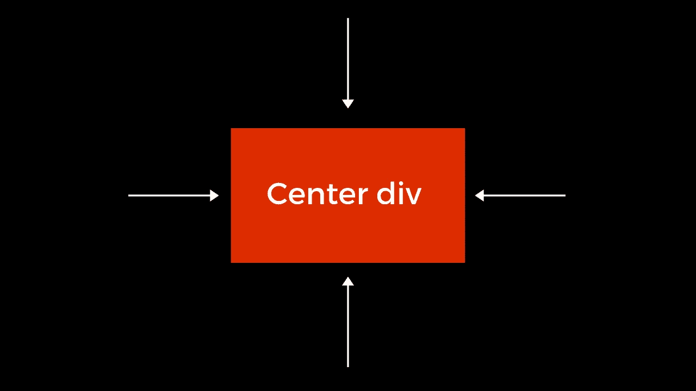

# 用 CSS 居中 Div 的 3 种最佳方法

> 原文：<https://medium.com/nerd-for-tech/best-3-ways-to-center-a-div-with-css-1668b66c9891?source=collection_archive---------3----------------------->

## 半铸钢ˌ钢性铸铁(Cast Semi-Steel)

## 一个初学者总是面临网页上的中心 div 的问题。

我正面临很多麻烦，也许你也是。当我在网页中居中 div 时，一个浏览器正确地居中 div，而其他浏览器不能正常工作。这就是为什么 CSS 对初学者来说非常混乱。您可以尝试使用其他 CSS 属性来居中 div。但是你失败了。

在本文中，我们将介绍使用 CSS 居中 div 的三种方法。我们不使用任何先进的 CSS。我们只使用基本的 CSS 属性来居中 div。



用 CSS 将 Div 居中

## 我们开始吧。

1.  第一种方式
2.  第二种方式
3.  第三种方式

## 第一种方式

首先，我们使用 CSS 位置属性。这是在 CSS 中将 div 居中的一种常见方式。很多时候，我使用位置属性来居中 div。这是一个非常容易和古老的技术来中心 div。

**HTML 代码**

```
<div class="center">
```

**CSS 代码**

```
.center{
  position: absolute;
  top:50%;
  left: 50%;
  transform: translate(-50% , -50%)
}
```

## 演示

第一种方式示例

## 第二种方式

其次，我们使用 flexbox 在 web 浏览器中将 div 居中。Flexbox 在功能上有助于非常容易地将 div 居中。这些是使 div 居中的新方法。

Flexbox 在您的浏览器中设计一维布局。Bootstrap 还使用 flexbox 属性在 web 浏览器中将 div 居中。

**HTML 代码**

```
<div class="flex">
  <div class="center" > </div>
</div>
```

**CSS 代码**

```
.flex{
  display: flex;
  align-items:center;
  justify-content: center;
}*/* center class for add style in div */*.center{
  background-color: black;
  width:250px;
  height: 250px;
}
```

## 演示

第二种方式示例

## 第三种方式

第三，我们使用网格布局在 web 浏览器中将 div 居中。网格布局新的方式来集中你的 div。网格系统很酷，也很好用。网格系统非常有效地设计了 3D 网站布局。我也被建议在网站中使用网格系统，而不是使用任何 CSS 框架。

**HTML 代码**

```
<div class="grid">
  <div class="center" > </div>
</div>
```

**CSS 代码**

```
.grid{
  display: grid;
  place-items:center;
}*/* center class for add style in inner div */*.center{
  background-color: black;
  width:250px;
  height: 250px;
}
```

## 演示

第三种方式示例

## 参考

 [## CSS 中使 Div 或 Div 中的文本居中的 11 种方法

### 无论你是从零开始建立一个网站，还是使用引导 CSS 框架，你都需要有一个基本的…

blog.hubspot.com。](https://blog.hubspot.com/website/center-div-css) [](https://stackoverflow.com/questions/356809/best-way-to-center-a-div-on-a-page-vertically-and-horizontally) [## 将页面垂直和水平居中的最佳方法？

### 我将使用 translate:将 div 的左上角第一个定位在页面的中心(使用 position:fixed；顶部…

stackoverflow.com。](https://stackoverflow.com/questions/356809/best-way-to-center-a-div-on-a-page-vertically-and-horizontally) [](https://css-tricks.com/snippets/css/a-guide-to-flexbox/) [## Flexbox | CSS-技巧完全指南

### 我们的 CSS flexbox 布局综合指南。这份完整的指南解释了 flexbox 的一切，重点是所有…

css-tricks.com。](https://css-tricks.com/snippets/css/a-guide-to-flexbox/) [](https://stackoverflow.com/questions/tagged/css) [## 最新的“css”问题

### CSS(层叠样式表)是一种表示样式表语言，用于描述…

stackoverflow.com](https://stackoverflow.com/questions/tagged/css) 

## 结论

有很多方法可以让你的 div 在浏览器中居中。在本文中，我只讨论 CSS 中的通用方法。如果你有兴趣了解更多与中心 div 相关的知识。然后跟随我的参考文章，也跟随 [StackOverflow](https://stackoverflow.com/questions/tagged/css)