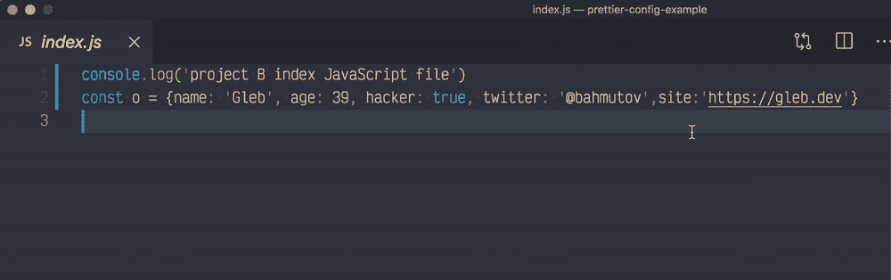
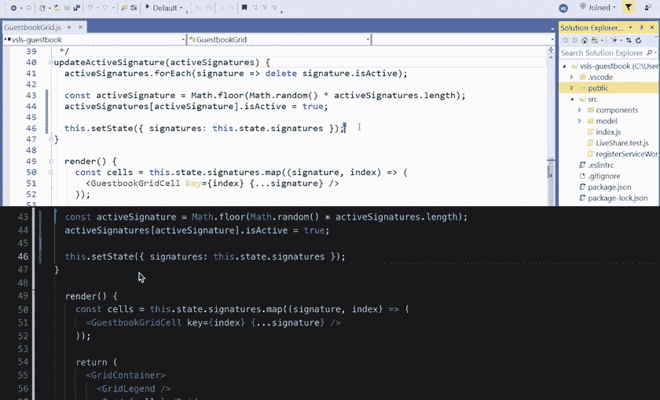
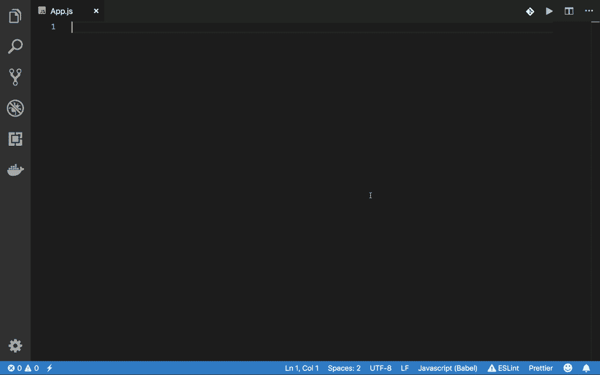
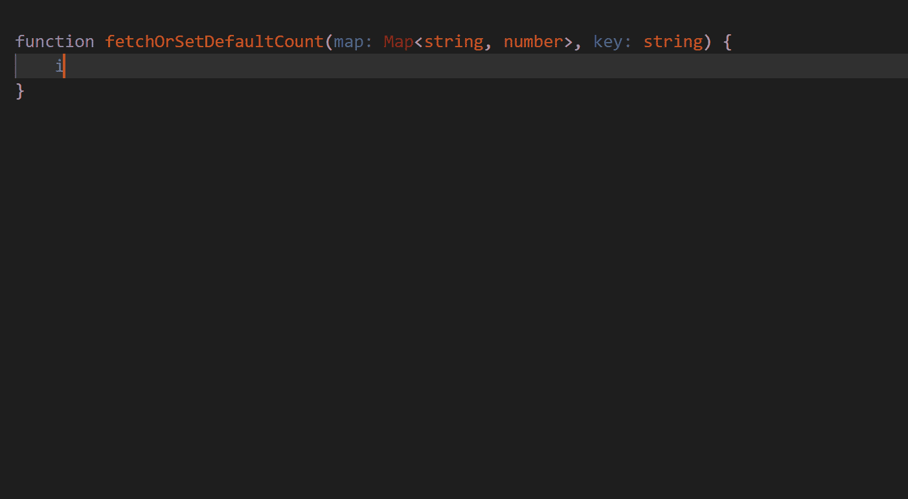

# 全栈开发人员的最佳 5 个 VsCode 扩展

> 原文：<https://medium.com/nerd-for-tech/best-5-vscode-extensions-for-a-full-stack-developer-c4c88f39dff0?source=collection_archive---------2----------------------->

为什么要使用扩展？

可视代码的主要特点是扩展的好处。这就是 VS 代码被开发者广泛使用的原因。对于任何类型的开发人员来说，扩展都使工作变得非常容易。在本文中，我推荐我的 VS 代码的 5 大扩展。

[05。Pretier](https://marketplace.visualstudio.com/items?itemName=esbenp.prettier-vscode)

不要浪费你的时间甚至格式化代码。显然，格式化的输出是使用这个扩展的结果。重要的是，当我保存代码时，它会自动格式化。这节省了时间，让我不必重写任何错误的代码。

[04**。直播服务器**](https://marketplace.visualstudio.com/items?itemName=ritwickdey.LiveServer)

这个扩展是运行 web 应用程序和获得现有代码的实时预览的一个超级简单的方法。运行文件应该已被重命名为 index.html，这是必要的扩展。

[**03。直播分享**](https://marketplace.visualstudio.com/items?itemName=MS-vsliveshare.vsliveshare)

对于每个程序员来说，协同工作是一件非常普遍和重要的事情。所以通过这个扩展，我们可以在不同的地方共享和编辑代码。相信我，用这个延伸，从这个延伸中获得享受。

[**02。片段**](https://marketplace.visualstudio.com/items?itemName=GoBystrokReactJS.gobystrok)

相信这个会让你超快的。这让我比以前的编码速度快了 5 倍。如果你是一个 react 开发人员，你应该知道重复输入相同内容的痛苦，比如函数或类组件副本。所以解决办法在这里。如果你需要一个类组件。简单的输入 ***rse*** 然后回车。我知道你会爆炸的。

[**01。智能代码**](https://marketplace.visualstudio.com/items?itemName=VisualStudioExptTeam.vscodeintellicode)

我对 IntelliCode 的体验非常棒。这是因为，作为一个全栈开发人员，我们需要熟悉各种各样的语法。然而，这个扩展预测我们将要键入的内容，并在我们键入时提供完成建议。

这是我在 web 开发中使用的前 5 个扩展。我真的希望你在这里学到了新的东西，我很快会在下一篇博客中见到你。编码快乐！！！