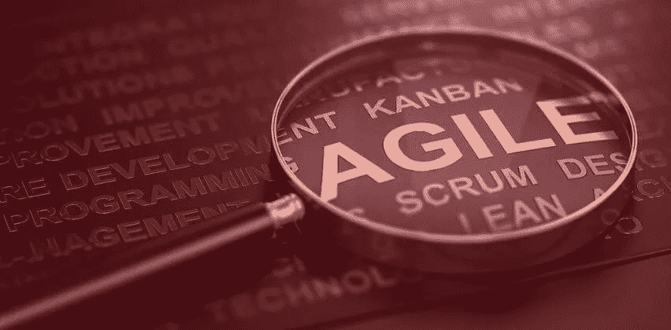

# 2021 年 RoR 应用程序开发最佳敏捷项目管理方法

> 原文：<https://medium.com/nerd-for-tech/best-agile-project-management-methodology-for-ror-app-development-in-2021-800f3bfec8a6?source=collection_archive---------10----------------------->

任何开发人员、项目经理或技术主管都理解项目管理方法的重要性。对于初创公司和跨国公司来说，RoR 应用开发都是快速、可扩展和强大的。因此，选择正确的项目管理方法至关重要。否则，即使你雇佣了 RoR 最好的应用程序开发公司，你的 web 应用程序也会有质量差的代码、冗长的时间表和严重的复杂性——这都是因为你选择了错误的方法。

开发过程现在正在演变。公司正专注于快速应用程序开发。他们需要及时、可靠、代码质量最好的高效 web 应用程序。由于每个项目的复杂性随着激烈的竞争而成倍增加，项目管理现在正在成为更快的应用程序开发和落后的流程之间的游戏规则改变者。

[敏捷软件项目管理](https://www.agileprogrammers.com)正在成为经理和开发人员的热门选择。本文将强调它对于 Ruby on Rails 快速应用程序开发的重要性，并解决以下问题

*   **2021 年项目管理的相关性**
*   Rails 应用的 5 种项目管理方法
*   **为什么敏捷方法非常适合 RoR 应用**

> **结帐** [**为什么你的企业需要敏捷开发**](https://www.botreetechnologies.com/blog/why-your-business-needs-agile-development-today/)

让我们更深入地了解这三者的细节。

# **2021 年项目管理的相关性**

技术工作不断地与知识工作相结合。如果我们谈论 Ruby on Rails 应用程序，项目现在变得越来越复杂。由于该框架具有强大的功能，因此您可以针对不同类型的动态应用程序轻松扩展其限制。

日益增加的复杂性呼唤高质量的项目管理。将工作项目化，为完成工作排序，并监控及时交付现在比以往任何时候都更重要。面对激烈的竞争，人们更加关注项目管理。

PMI 最近的研究显示，到 2027 年，基于项目的工作将需要 8800 万人。项目经理不仅仅局限于忽略任务的完成，他们还扮演着更重要的角色，作为战略领导者，他们可以调整正确的资源并监控它们以成功完成项目。

因此，大多数公司正在将他们的项目管理转变为敏捷过程。他们希望快速见效，并注重质量。但是在我们深入研究敏捷方法项目管理之前，让我们先了解项目管理的不同方法。

> **如果你在敏捷开发中失败了，你需要** [**阅读这个**](https://www.botreetechnologies.com/blog/if-youre-failing-in-agile-development-you-need-to-read-this/)

# Rails 应用的 5 种项目管理方法

虽然大多数企业关注两个常用的哲学——瀑布和敏捷，但是还有许多其他的哲学来帮助开发过程。除了敏捷软件项目管理，这里还有 5 种管理 Ruby on Rails 应用程序项目的不同方法

1.  **瀑布** 也称为软件开发生命周期(SDLC)，瀑布是项目管理的系统哲学，不同于敏捷方法。有一个清晰的蓝图，不需要任何迭代就可以完成。重点是一次性完成活动，并以正确的方式完成，在过程之间没有任何反馈。开发周期通常漫长而耗时。
2.  **PRINCE2** 基于瀑布项目管理方法论，PRINCE2 对于[全栈 RoR app 开发服务](https://www.rorexpertsindia.com)非常有用。首字母缩写代表受控环境中的项目。这是一种顺序方法，从初始阶段就定义了输入和输出，消除了过程中的任何不确定性。团队有一个清晰的结构，而项目经理监控底层的日常任务。
3.  **精益方法论** 在 [Ruby on Rails web 开发](https://www.rordevelopmentindia.com)圈子里迅速引起轰动，精益方法论只关注效率。目的是消除浪费，用可用资源实现最大效果。精益方法的三个原则包括——大木(消除所有浪费)、Mura(消除变化或迭代)和 Muli(消除能力过载)。
4.  Scrum ban
    Scrum 和看板的结合，[软件开发](https://www.botreetechnologies.com)方法论提供了看板一样的灵活性，同时提供了 Scrum 一样的完整结构。有限时冲刺，使团队能够在任务出现时完成任务。重点是完成手头的任务，而不是从一开始就强调整个冲刺。召开会议来了解每个项目的改进范围。
5.  **敏捷方法** 敏捷是 RoR 应用开发公司最常用的方法之一，是高效软件开发的新面孔。焦点在于不同利益相关者之间的协作，提高代码质量，并对变更做出快速而有利的响应。敏捷方法拥有项目管理工具，可以通过及时交付高质量的产品来超越低效。让我们看看为什么 Ruby on Rails 开发者和公司更喜欢敏捷方法。

# 为什么敏捷方法非常适合 Ruby on Rails 应用

敏捷方法过程适合 Ruby on Rails web 应用程序，因为它具有协作性。Rails 开发提供了快速的应用程序开发——敏捷增加了灵活性。以下是敏捷项目管理方法非常适合 RoR 应用程序开发的几个原因

1.  **更好的代码质量** 敏捷专注于持续测试，使得 [Ruby on Rails 开发人员](https://www.botreetechnologies.com/hire-ruby-on-rails-developers)能够持续检查 bug 和错误。他们可以在每次冲刺中修复错误和问题，然后继续下一次冲刺。这导致了更好的代码质量，因为改进是在持续的基础上完成的。
2.  **快速 MVP 开发** 结合 Ruby on Rails，敏捷是快速应用开发的完美解决方案。您可以在每个 sprint 中构建原型，然后在每个版本中添加新特性。它消除了项目失败的可能性，因为产品从初始阶段就开始运行了。
3.  更高的生产力大多数开发人员认为敏捷是项目管理的最佳方法，因为它具有更高的生产力。因为迭代很容易完成，而且协作是无缝的，所以没有时间浪费在讨论和计划上。敏捷团队从一开始就构建快速、可伸缩和强大的产品。他们最终会在更短的时间内交付更多的产出。
4.  提高可预测性
    敏捷项目管理方法的另一个好处是它提供了提高的可预测性。由于项目被划分为冲刺阶段，项目经理可以很容易地预测完成每项活动所需的时间表、成本和资源。可预测性的提高也减少了浪费，并提高了评估的成功率。

> **阅读更多:有哪些** [**敏捷软件开发经理负责**](https://www.botreetechnologies.com/blog/what-are-agile-software-development-managers-responsible-for/) **？**

## **结论:敏捷非常适合 2021 年的 RoR 网络开发**

敏捷正在证明自己在 2021 年是一种非常自信的项目管理方法。对于需要快速开发的可靠且可伸缩的应用程序来说，这已经足够了。从本质上讲，敏捷软件开发的快速反馈和响应特性使其成为快速获得可销售的 Ruby on Rails 应用程序的完美方法。

**有关敏捷专家团队的快速原型制作，请咨询 BoTree Technologies。我们会在您期望的时间框架内交付高质量的产品，并且不会超出预算！**

[**现在联系我们**](https://www.botreetechnologies.com/contact) **。**