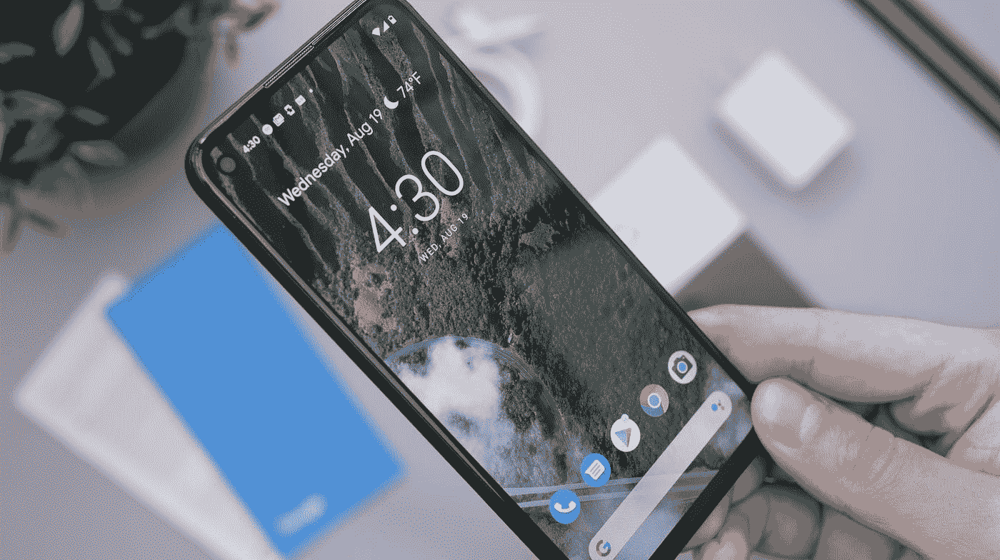
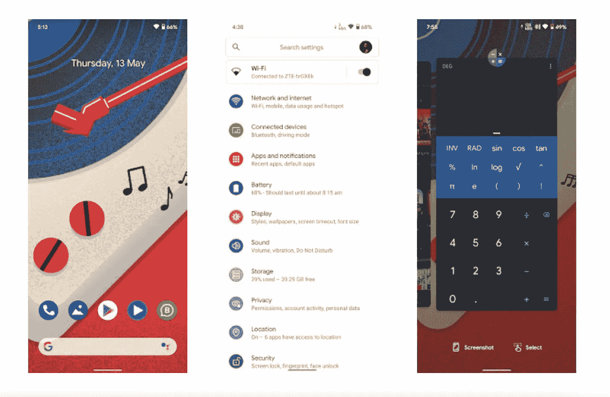
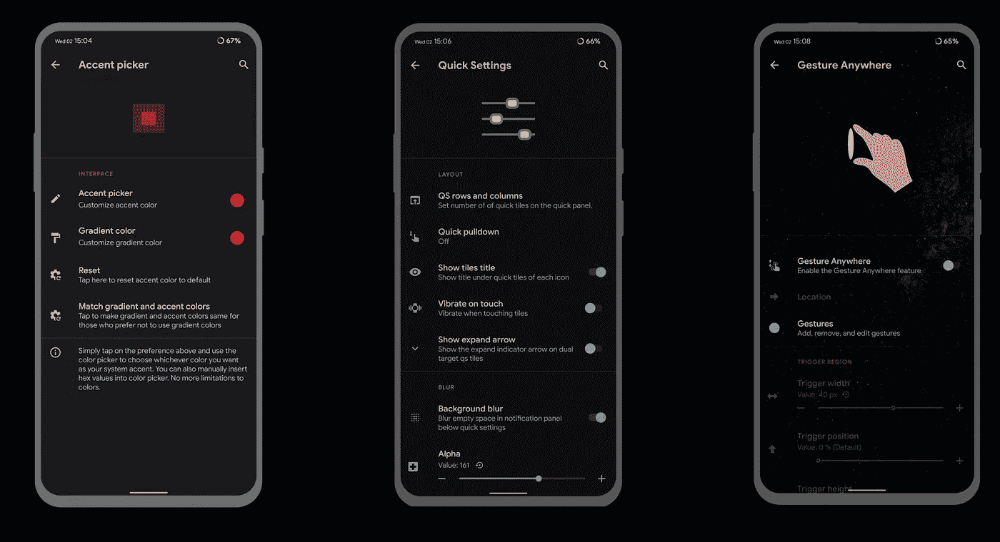
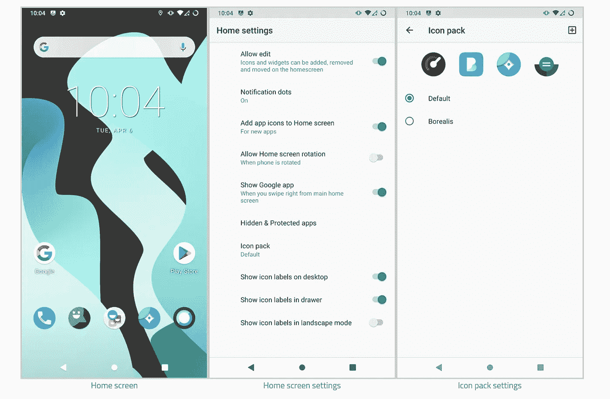
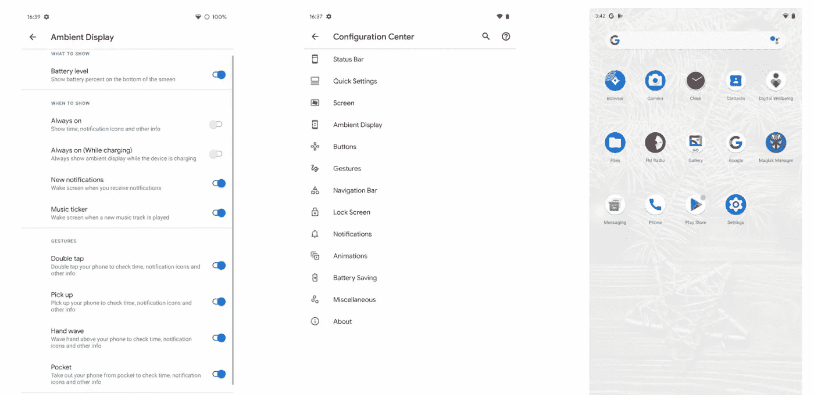
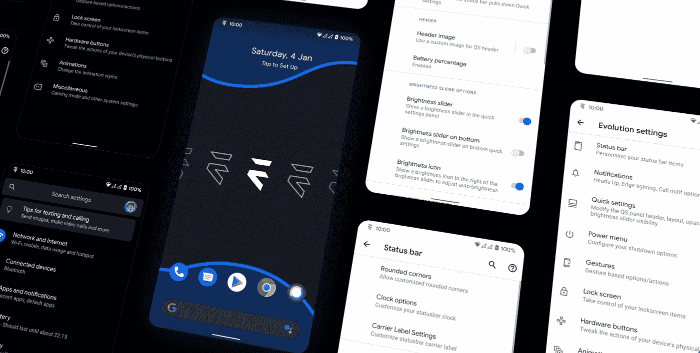
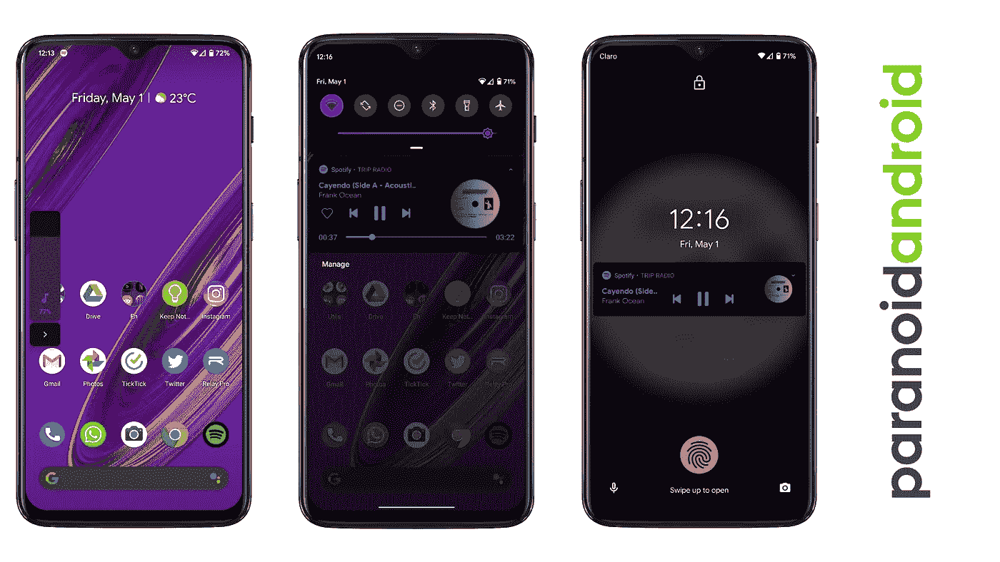
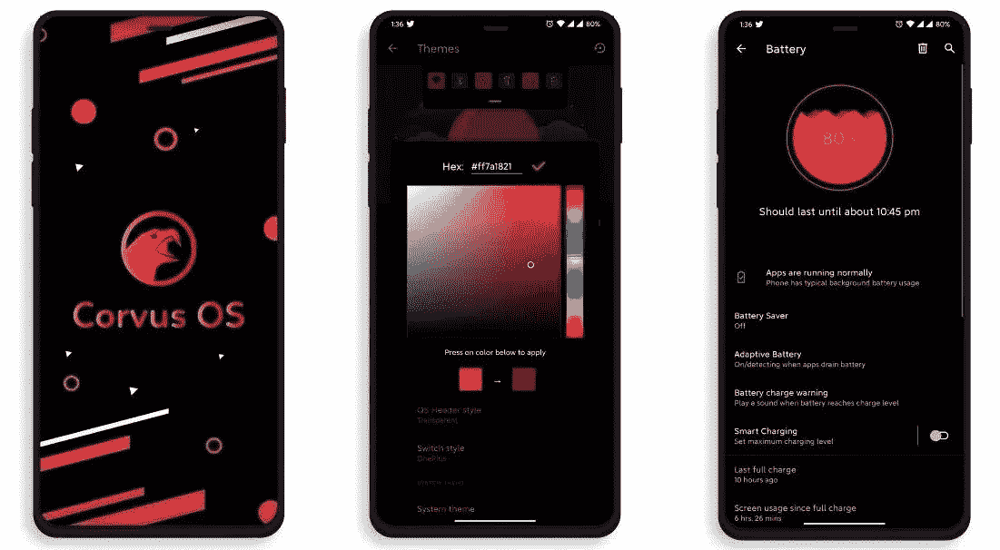
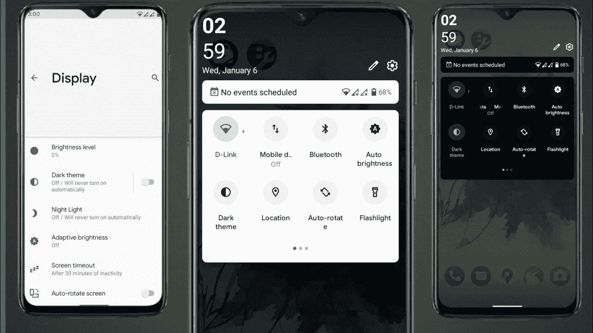
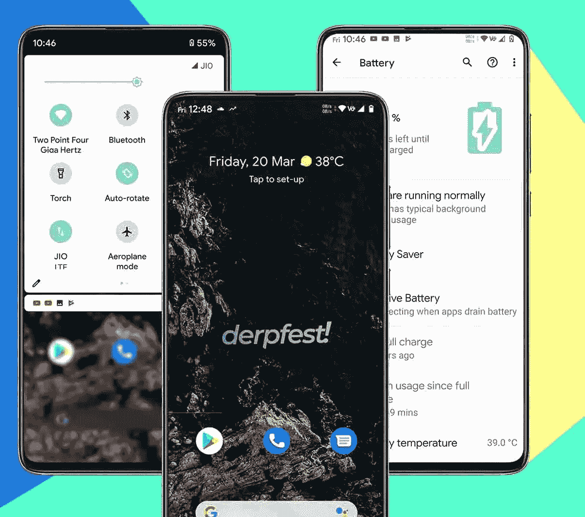

# 最佳安卓定制 ROM 值得一试。！

> 原文：<https://medium.com/nerd-for-tech/best-android-custom-roms-worth-a-try-ada79418fea9?source=collection_archive---------1----------------------->

> "为了不可替代，一个人必须永远与众不同."——***可可·香奈儿***

由[丹尼尔·罗梅罗](https://unsplash.com/@rmrdnl?utm_source=medium&utm_medium=referral)在 [Unsplash](https://unsplash.com?utm_source=medium&utm_medium=referral) 上拍摄

**为什么需要定制 rom。？定制的 rom 让你能够以一种更有趣的方式自由使用你的 android 设备。它将定制提升到一个全新的水平，一个在外观上完全美学化的水平。在安装定制 rom 之前，请确保您已经解锁了引导加载程序并启动了设备。我以前写过一篇关于生根的文章，提供了更多关于这个主题的信息。请花点时间读一下—[https://medium . com/nerd-for-tech/what-is-root-in-Android-are-any-benefits-8ae 71 dbb 4b 57](/nerd-for-tech/what-is-rooting-in-android-are-there-any-benefits-8ae71dbb4b57)**

在亲自使用了下面列出的所有 rom 之后，我可以告诉你，任何真正想体验不同的看待事物的方式的人肯定会喜欢定制 rom 提供的控制水平。

## [像素体验](https://download.pixelexperience.org/)

PixelExperienceUI — [一切安卓](https://1.bp.blogspot.com/-WvHbbo68QgA/YJ0877mQMqI/AAAAAAAAjWc/AvgsPOPcEjAO35mLaDqiwt7-h7TDQSZCACLcBGAsYHQ/s1280/settings.jpg)

这是我迄今为止最喜欢的定制 rom，因为与我们在谷歌 Pixel 上观察到的相比，它是最纯粹的 Android 版本。PixelExperience 是一个基于 AOSP 的 ROM，拥有所有的 Pixel 好东西(启动器、壁纸、图标、字体、启动动画)。ROM 为非像素设备带来了所有像素特性。Pixel experience rom 还是能让我感受到滑动的流畅度。另一件好事是，它支持多种设备，此外还有一些设备的版本，有一些额外的调整。该平台的一个重要特点是其稳定性，从电池寿命到银行服务。

## [复活混音 OS](https://resurrectionremix.com/#top)

Ui — [RR OS](https://resurrectionremix.com/)

复活混音，俗称 RR OS，提供了最大程度的定制任何自定义 ROM。我认为它是我最喜欢的五个定制 Android 操作系统之一。添加一些个性化的调整会带来不错的体验，比如装饰食物。特别是对于新用户来说，这会让他们大吃一惊。在 android 社区中，它是迄今为止最古老的开源定制 rom 之一。

## [血统 OS](https://lineageos.org/)

linegeos UI—[科尔宾·达文波特](https://www.xda-developers.com/author/corbin/)

沿袭 OS 是最古老的定制 ROM，原名 Cyanogen Mod。在 cyanogen mod 被取消后，该团队继续以天堂操作系统的名义开发该操作系统。这可能是最好的稳定的 rom 之一，可以很好地优化电池寿命。与所有定制 rom 相比，天堂操作系统在安全性和隐私性方面仍然处于领先地位。开发者社区支持 200 多种设备。沿袭操作系统的一个好处是每周更新，所以问题应该很快得到解决。

## [浩劫 OS](https://havoc-os.com/)

HavocOS 接口— [fonearena](https://www.google.com/url?sa=i&url=https%3A%2F%2Fen.gizchina.it%2F2020%2F03%2Frealme-xt-comes-havoc-os-new-custom-rom%2F&psig=AOvVaw0WvcruDWGrZHDyMwEPNUfx&ust=1629026799879000&source=images&cd=vfe&ved=0CAsQjRxqFwoTCOCG2vGzsPICFQAAAAAdAAAAABAD)

有时候，我们在第一次尝试时，无法发现操作系统到底是为什么而设计的。浩劫操作系统属于这一家族，因为即使它看起来非常类似于许多其他定制的 rom，使用一个星期后，你就能发现这种氛围。基于 Android 的开源项目，多受谷歌的 Pixel 启发。有 150 多种设备可用于 rom，并且每个月都会有来自不同维护者的新设备加入。浩劫 os 的特色是材料设计 2.0，OTA 更新就像股票 rom，和社区支持。

## [进化 X](https://evolution-x.org/)

EvolutionX UI—[EvolutionX](https://evolution-x.org/)

Evolution X 是在定制方面更接近复活 remix 的定制 rom 之一。Evolution X 是一款可闪存的定制 ROM，旨在为您的 Android 设备带来真正的像素感，并提供许多附加配置选项。构建将定期发布，每月从最新的 AOS 来源安全补丁！这个光盘最好的特点是，它包含了 Gcam 和股票相机应用程序，这是一个非常独特的功能。

## [偏执的安卓](https://paranoidandroid.co/)

[ParanoidAndroid UI](https://www.google.com/url?sa=i&url=https%3A%2F%2Fwww.reddit.com%2Fr%2FOnePlus6t%2Fcomments%2Fgbni3t%2Fparanoid_android_smoothest_custom_rom_ive_ever%2F&psig=AOvVaw29KeLLAVmb4mcFiFKRE3_3&ust=1629027594364000&source=images&cd=vfe&ved=0CAsQjRxqFwoTCKiP6u22sPICFQAAAAAdAAAAABAJ)

在长时间的中断后，偏执的 Android 又回来了。开发团队致力于用最少的资源带来精致和完美的体验。虽然偏执的 Android 不提供其他 rom 的各种功能和定制选项，但就整体用户体验而言，它仍然是好的。就定制 rom 而言，偏执狂有单独的粉丝群。

## [Corvous OS](https://www.corvusrom.com/)

CorvousUI — [Fossybytes](https://www.google.com/url?sa=i&url=https%3A%2F%2Ffossbytes.com%2Fandroid-custom-roms%2F&psig=AOvVaw2HKAE7FwKXj-oESMgsOxeL&ust=1629027963553000&source=images&cd=vfe&ved=0CAsQjRxqFwoTCPjl3Z64sPICFQAAAAAdAAAAABAD)

PUBG 爱好者一定会喜欢 corvous OS。Corvus 操作系统是基于 AOSP 的，包括了它需要的所有特性。他们软件的目标是稳定性和功能丰富性。凭借其强大的功能，这款操作系统迎合了游戏社区的需求。这个操作系统提供了比股票更高的帧速率，游戏性能非常流畅。最重要的是，它支持各种定制内核，并能很好地提高性能。

## [后裔 OS](https://descendant.me/)

后裔— [布莱克德夫](https://www.google.com/url?sa=i&url=https%3A%2F%2Fwww.youtube.com%2Fwatch%3Fv%3DhSyUb9dEhpc&psig=AOvVaw3PAld69GwNSct8v76KM-LK&ust=1629028225386000&source=images&cd=vfe&ved=0CAsQjRxqFwoTCPjUvJq5sPICFQAAAAAdAAAAABAJ)

《后裔》是一款旨在革新安卓 AOSP 体验的游戏。此外，GSI[通用系统映像]文件可用于刷新不支持该版本的其他设备。此外，除了看起来像三星 One UI 之外，它还有一些独特的功能。通知面板、设置布局和音量栏与三星设备类似，但具有流畅的 Android 体验。

## [Derpfest 操作系统](https://derpfest.org/)

德普菲斯托斯— [XtremeDroid](https://www.google.com/url?sa=i&url=https%3A%2F%2Fxtremedroid.com%2Fderpfest-os%2F&psig=AOvVaw30_5kwtBMETsZFVEzi5wSu&ust=1629027723552000&source=images&cd=vfe&ved=0CAsQjRxqFwoTCPDLl6m3sPICFQAAAAAdAAAAABAD)

该项目的原始版本是使用 Android 9.0 为 OnePlus 5T 开发的。一些用户和维护者开始对支持这个项目感兴趣。它的目标是为初学者提供一个平台，并支持自定义 ROM 社区。分享是关怀。这就是为什么 DerpFest 的源代码可以在 Github 上找到。有了 DerpFest，您总能获得最新的 Android 功能和安全补丁，它们支持各种设备

我提到过一些我用过的定制 Rom，但我也用过 OmniRom、BlissRom、MSM extended、dot os、arrow os、pixy os、crdroid rom、revenge os、AOSP、AICP 等。但是我几乎不能使用 1 个月，因为我们在某个地方会遇到一些问题，一些公司/银行的应用程序甚至不允许使用 magisk 模块。我们最终决定购买我们的存货。尽管如此，这种经历会让你学到很多东西，所以你只需要简单地闪现一下就能体验到。

> 感谢我所有亲爱的读者，请随时留下反馈或建议&虚拟鼓掌不会让你筋疲力尽😇— [纳伦德拉·贾纳帕提](https://linkedin.com/in/narendraj3)