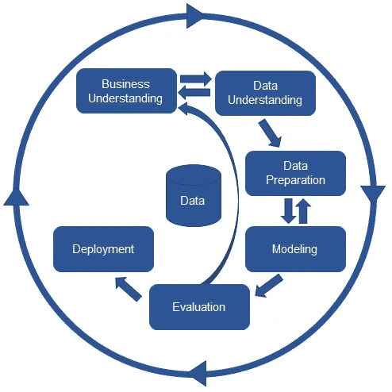
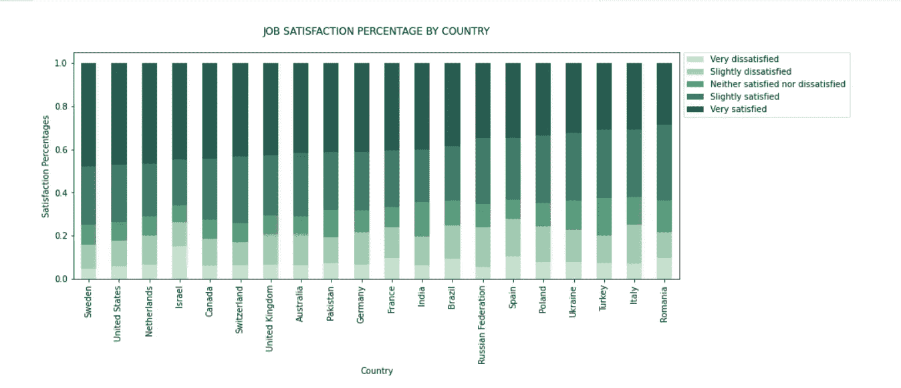
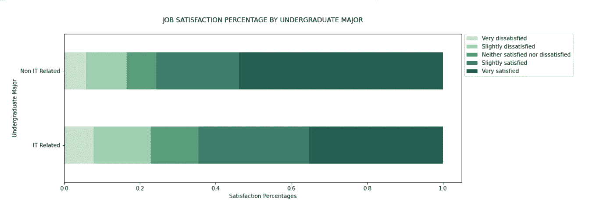
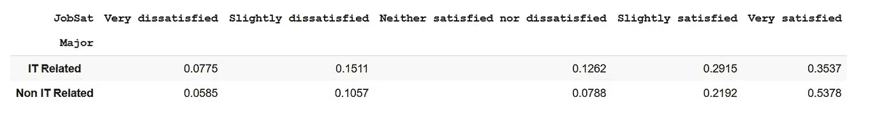
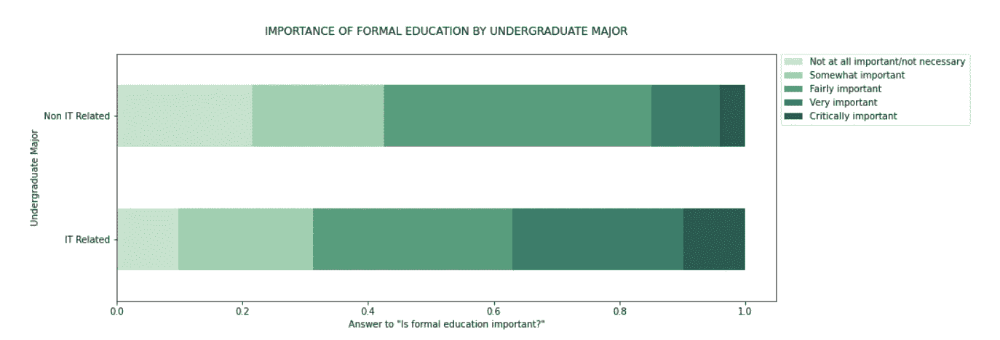

# 堆栈溢出调查 2020 的探索性数据分析(EDA)

> 原文：<https://medium.com/nerd-for-tech/best-country-to-work-in-2020-15a790b00904?source=collection_archive---------14----------------------->

## 数据科学矿

## 看看我探索性的数据分析结果，自己多发现一些相关性！

📸— [凯利·西克玛](https://unsplash.com/@kellysikkema?utm_source=unsplash&utm_medium=referral&utm_content=creditCopyText)

自 2011 年以来，Stack Overflow 每年都会进行一项调查，以了解其用户群以及全球 IT 环境。

**2020 结果近日出炉**。你可以从栈溢出网站[这里](https://insights.stackoverflow.com/survey)下载数据集。CSV 文件'*survey _ results _ public . CSV*'包含主要调查结果。我建议在继续之前先浏览一下数据集。

通过一些基本的数据探索技术，我发现了一些非常有趣的相关性。这篇文章旨在解释我根据 CRISP-DM 原则从收集、评估、清理、分析、建模和可视化调查数据中获得的结果。

为了获得互动体验，请查看我的 [Google Colab](https://colab.research.google.com/drive/1Xqh_Obd0xeg8yzp6U-KrVHLqiAan-Hqr#scrollTo=znpYHV1hVd0F) 中的代码。

> ***边注:什么是 CRISP-DM？***
> 
> *跨行业数据挖掘标准流程(CRISP-DM)是描述数据科学生命周期的流程模型。它包括以下主要步骤:*

*   业务理解—业务需要什么？
*   数据理解—我们拥有/需要什么数据？干净吗？
*   数据准备——我们如何组织用于建模的数据？
*   建模——我们应该应用什么建模技术？
*   评估—哪种模式最符合业务目标？
*   部署—利益相关者如何获得结果？

📸— [KDnuggets](https://www.kdnuggets.com/2017/01/four-problems-crisp-dm-fix.html)

# 分析概要

虽然调查本身是详尽的，人们可以发现其属性之间的多种相关性，但在本次分析中，我主要关注以下三个问题:

> 1.哪个国家的开发者工作满意度最高？
> 
> 2.拥有 IT 相关本科专业的开发人员和没有 IT 相关本科专业的开发人员在工作满意度上有区别吗？
> 
> 3.非 IT 背景的开发人员对正规教育的重要性有不同的看法吗，比如计算机科学的大学学位？

# 步骤 1:数据采集和准备

最初的调查包含 64460 名受访者的 61 个属性的数据。我对数据集进行了过滤，只考虑了那些自称为“开发人员”的受访者(从而排除了任何学生程序员和仅将编程作为爱好的人)。结果，这个子集现在只包含 47192 名受访者的数据。

接下来，我必须管理空值。因为 *JobSat* 和 *NEWEdImpt* 列都包含分类数据，所以我用各自的模式值填充了它们所有的空单元格。

然后，我在 *ConvertedComp* 列的所有空值中填入了开发人员所在国家的平均工资(因为工资在很大程度上取决于开发人员所在的国家)。

完成上述操作后， *ConvertedComp* 列中仍有一些空值。这是因为某些国家的 converted comp 平均值等于 NaN(也就是说，这些国家的所有受访者都没有回答薪资问题)。所以我扔掉了那些唱片。

# 步骤 2:数据探索

## **2.1 开发人员工作满意度最高的国家**

因为该调查包含来自 180 多个国家的受访者的数据，所以我根据每个国家的受访者总数将其缩小到前 20 名。这是可取的，因为现在前 20 名中的每个国家都至少有 400 名受访者(这个数字对我的分析来说已经足够好了)。

我发现瑞典高居榜首，几乎 50%的开发者感到“非常满意”。美国第二，荷兰第三。

## 2.2 **本科专业和工作满意度**

我将*本科生*一栏分成两栏——“it 相关”和“非 IT 相关”。Stack Overflow 上的大多数开发人员(大约 65%)拥有 IT 相关的本科专业。然后，我计算了每种价值在 *JobSat* 中所占的百分比，以衡量每种专业的工作满意度，至少可以说，结果很有趣。

我发现，与那些有“IT 相关”背景的人相比，本科专业为“非 IT 相关”的开发人员有更好的工作满意度，分别有 53%和 35%的受访者感到非常满意。我认为差别大得难以想象，这激起了我的兴趣。(旁注:你是 IT 相关背景的吗？你对你的工作满意吗？为什么/为什么不？想想吧！)

## 2.3 **正规教育的重要性**

我发现有 IT 相关背景的开发人员更认同正规教育的重要性，比如计算机科学的大学学位。对于没有 IT 背景的开发人员来说，情况正好相反。我发现这一结果很直观，因为尽管来自非 IT 背景，但工作满意度较高的那一组人，也是不太重视正规 IT 教育的那一组人——这一切都很合理！

# 结论

下面是我对 2020 年堆栈溢出年度开发者调查数据分析的简要总结:

1.  我测量了每个国家的工作满意度，发现瑞典高居榜首。美国第二，荷兰第三。
2.  我查看了**的本科专业**，发现非 IT 背景的开发人员工作满意度更高。
3.  我发现来自非 IT 领域的开发人员认为**接受过正规教育**对他们的职业生涯并不重要。尽管没有 IT 背景，但这些受访者不仅从事开发工作，而且工作满意度也更高，这一事实支持了他们的观点。

仅此而已！我鼓励你更深入地挖掘数据集，并从中得出更多的分析。你也可以在这里看看我的 [GitHub 里的代码。放心叉吧，踏上自己的数据探索之旅！](https://github.com/nazianafis/StackOverflow-Data-Analysis)

我希望这篇文章对你有用。可以在 LinkedIn *上和我* [*联系，或者关注我的著作*](https://www.linkedin.com/in/nazianafis/) [*这里*](/@nazianafis) *。*

*下次见！*(∫･‿･)ﾉ゛