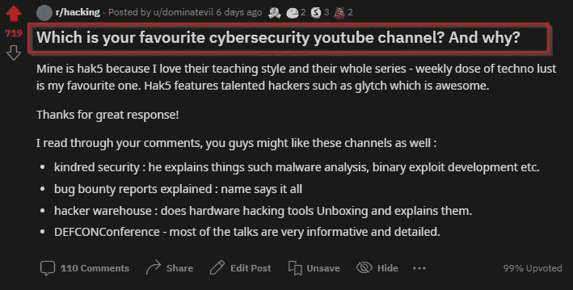
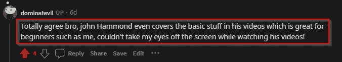
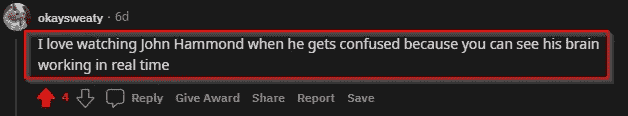
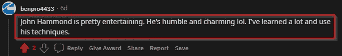
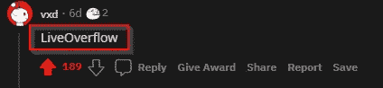
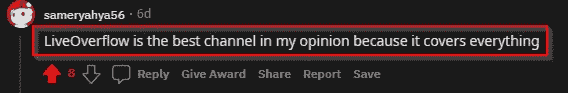
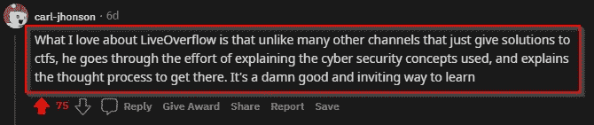
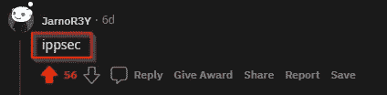
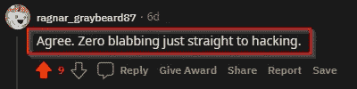
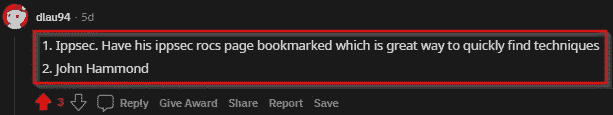

# 2021 年最佳网络安全 youtube 频道

> 原文：<https://medium.com/nerd-for-tech/best-cybersecurity-youtube-channel-of-2021-c7d93840b2dd?source=collection_archive---------3----------------------->

[src](https://www.reddit.com/r/hacking/comments/nj68g2/which_is_your_favourite_cybersecurity_youtube/?utm_source=share&utm_medium=web2x&context=3)

这些顶级网络安全频道名单不是基于订户或他们制作的内容数量，而是基于这些令人敬畏的人提供的才华和价值。频道列表是 Reddit 上专业黑客精心研究推荐的。

由于这些渠道是由其他黑客推荐的，因此不可能涉及 McAfee、Sophos 或 Kaspersky 等供应商的特定渠道，因为这些渠道只专注于销售某些东西。

我们生活在一个时代，在这个时代，我们终于开始重视学习安全，安全相关的内容可以通过 youtube 等平台免费获取。我们应该感谢那些花时间为我们制作内容的人。

所以像往常一样，我在 Reddit 上冲浪，偶然发现了[的这篇文章](https://www.reddit.com/r/hacking/comments/nj68g2/which_is_your_favourite_cybersecurity_youtube/?utm_source=share&utm_medium=web2x&context=3)，在那里我找到了大量最好的网络安全 youtube 频道，并认为它可能对开始网络安全之旅的人有所帮助。我不会按顺序排列这些频道，因为我发现每个频道都有价值。

# 约翰·哈蒙德

封面:尝试黑客室，各种 CTF，黑客马拉松挑战。

约翰·哈蒙德主要负责 TryHackme 房间，他的演示和教学技能非常棒，他的视频很有趣，因为这个人说他搞不清楚状况，你可以看到他的大脑实时工作，这是一个很好的学习方式，你可以看到他找到了出路。

*状元*

这些是我个人最喜欢的照片，希望你也喜欢。

# 直播溢出

我同意 carl 所说的，“LiveOverlfow 努力解释非常技术性的安全概念，不仅如此，还经历了实现这些概念的过程”，我个人认为这个频道非常有帮助，对初学者非常友好，因为他指导您完成了整个过程。

这是一个对他的频道很有帮助的介绍视频，请慢慢看。

# IppSec

IppSec 是最好的频道，他主要负责 CTFs 和 TryHackme 房间。这是最值得推荐的频道。他的演示直截了当，并有令人敬畏的教学技巧。

我发现这些视频很有帮助，会让你也链接到他的频道。

# 网络导师

他的频道非常有帮助，并提供了对网络安全社区的见解。

*状元*

这些是我个人最喜欢的中医视频，希望你也喜欢。

# 哲学博士

*状元*

# 电脑爱好者

*顶级精选*

# **空字节**

这是最值得推荐的频道，他们也包括硬件！

*热门图片*

# **黑客帝国**

*最佳照片*

有很多好的网络安全渠道，我会在下面把它们链接起来。

# 学习道德黑客的最佳渠道:

*   他解释了诸如恶意软件分析、二进制漏洞开发等内容。
*   **bug 赏金报告解释:**名字说明了一切
*   **黑客仓:**做硬件黑客工具拆箱，讲解。
*   **DEFCONConference:** 大部分的讲座都非常翔实详细。
*   **Bugcrowd**
*   纳哈姆塞
*   **塞托尼克**
*   **XSS 鼠**
*   **康达**
*   **黑客日**
*   **黑帽子**
*   **杨亮意向书**
*   大卫·邦巴尔
*   **Cryptocat**
*   **第[0]天**
*   **斯托克**
*   **单纯的赛博**
*   **黑客攻击简化版**
*   **网络卡盘**
*   **黑客攻击**
*   **techraj**

如果您知道任何没有提到的网络安全渠道，请在下面评论。

感谢您阅读我的文章，我也有一个 youtube 频道，我在那里发布与网络安全相关的内容。我的使命是尽我所能为这个社区提供更多的价值，所以请确保您保持联系。

YouTube:[https://bit.ly/2TuS5Aj](https://bit.ly/2TuS5Aj)

insta gram:[instagram.com/0xdom/](https://www.instagram.com/0xdom/)

播客:[https://spoti.fi/2RVTEXu](https://spoti.fi/2RVTEXu)