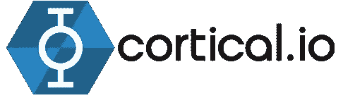
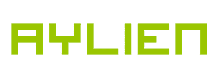
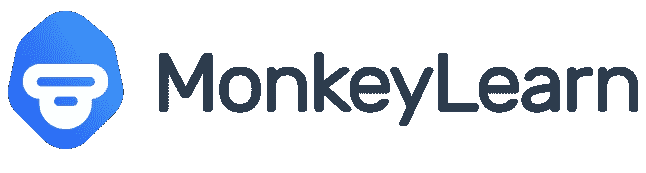
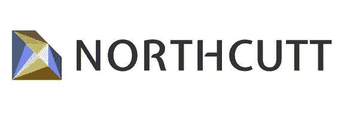

# 最适合您业务的关键词提取 API

> 原文：<https://medium.com/nerd-for-tech/best-keyword-extraction-apis-for-your-business-991fe930fc3b?source=collection_archive---------4----------------------->

[关键词提取](https://www.bytesview.com/keyword-extraction)是一种文本分析方法，有助于从任何非结构化文本中提取最常用的相关单词和短语。它有助于你总结书面材料并确定所呈现的重要主题。

它从各种文本来源收集关键词，包括社交网络互动、政府文件、新闻故事、商业报告、论坛和评论等。

您可以轻松地在海量数据集中找到最重要的术语和短语，并披露关于您的消费者正在谈论的问题的有价值的信息，例如-

***他们中有多少人要求降价？***

***消费者反馈中有多少与质量有关？***

***您的消费者对您的客户服务有什么样的反馈？***

这种洞察力可以帮助你制定一个更加以数据为导向的营销计划，方法是确定客户喜欢什么，你的产品需要增强什么功能，以及消费者对你的竞争对手有什么看法。

# 最适合您业务的关键词提取 API

[BytesView 的关键词提取工具](https://www.bytesview.com/keyword-extraction)可以分析非结构化文本，包括客户反馈、电子邮件、调查、社交媒体帖子等。预定义标签以识别热门内容、商业智能、客户意见和重复票据。

[Cortical.io](https://www.cortical.io/) 允许您从几乎任何非结构化文本中搜索、提取和分析关键词。他们的模型可以用适合你所在行业的词汇快速教授。

AYLIEN 的新闻 API 是一个现成的关键词提取工具，用于分析文档和网络资料中的文本数据。

MonkeyLearn 是一个简单的 SaaS 平台，可以让你直接从任何来源提取关键词。您可以创建自己的模型或使用这个预先训练好的模型。

使用 Northcut 关键字工具，你只需输入任何你喜欢的 URL，然后利用结果来扩展你自己的列表，检查对手短语的搜索性能，或者对关键术语进行额外的研究。

[ParallelDot](https://www.paralleldots.com/) 关键字提取器可用于索引数据，构建标签云，并缩短搜索时间。它会生成一长串相关的关键词和短语来帮助缩小搜索范围。

***希望这能有帮助***