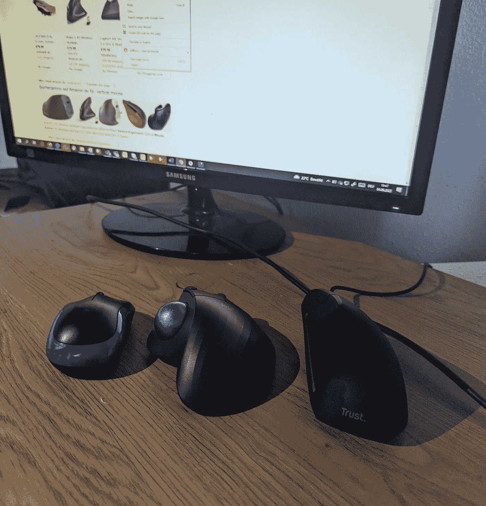

# 预防腕管的最佳鼠标

> 原文：<https://medium.com/nerd-for-tech/best-mouse-to-prevent-carpal-tunnel-19703a1c993c?source=collection_archive---------1----------------------->

## 垂直鼠标与带轨迹球的静态鼠标以及普通鼠标。

三只小老鼠。作者照片。从左到右、普通鼠标、轨迹球鼠标和垂直鼠标。

我的手很敏感。经过一整天的工作，我的手似乎减轻了“紧张感”,我感觉需要不断地伸展前臂和手腕。

我想要一款耐用的符合人体工程学的鼠标，它不会让我的手掌感觉像是“挂”在…