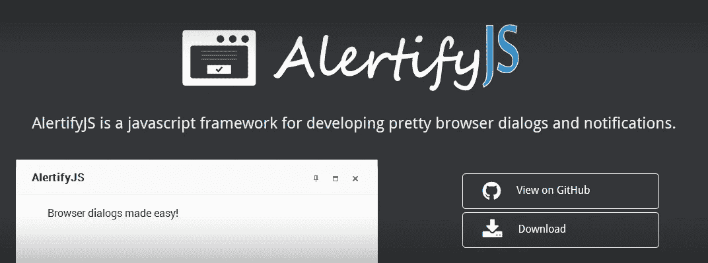
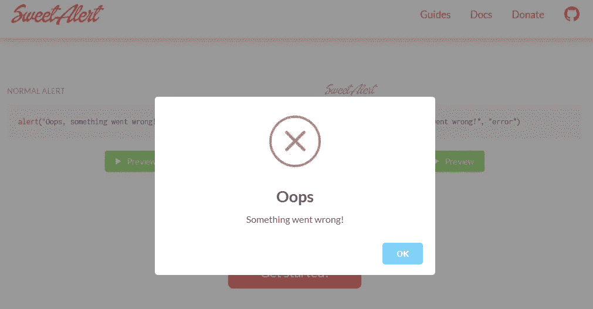
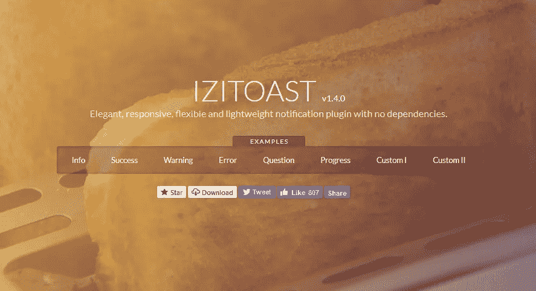
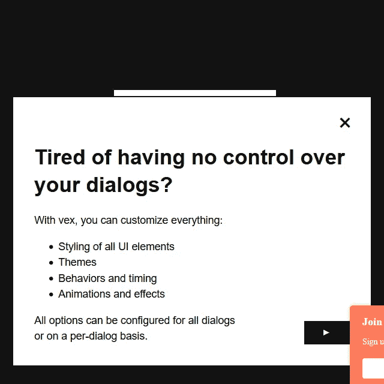
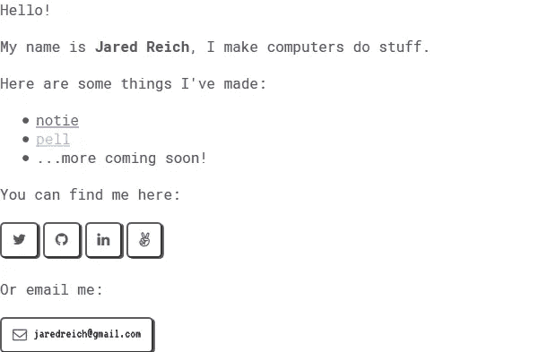
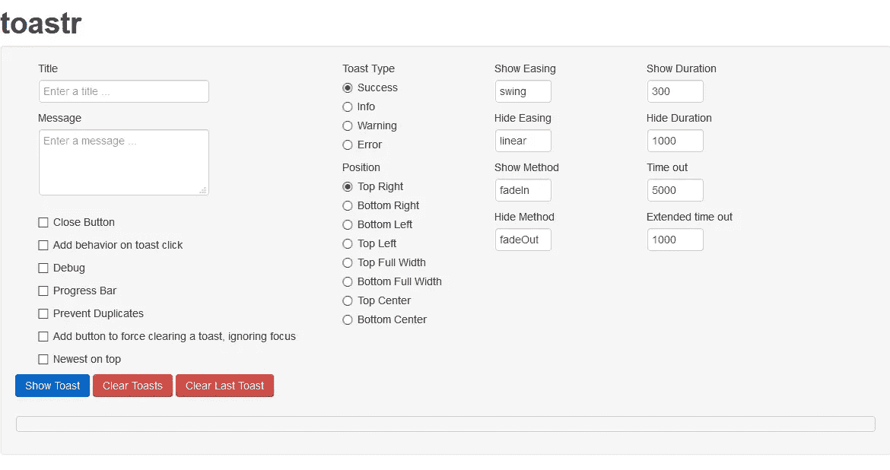
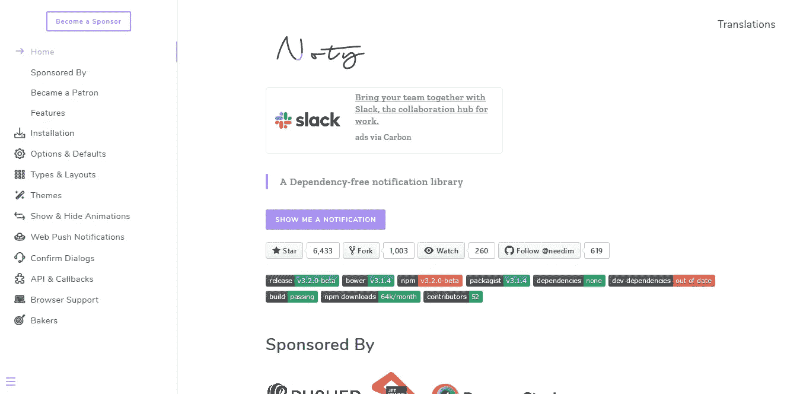
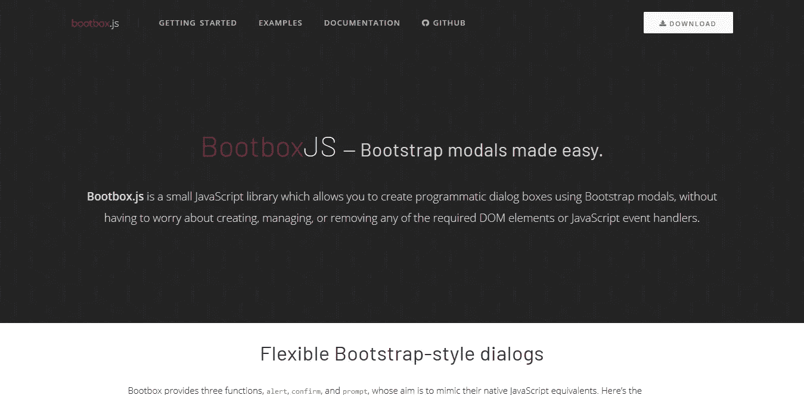

# Javascript 和 jQuery 的最佳通知库和插件

> 原文：<https://medium.com/nerd-for-tech/best-notification-libraries-and-plugins-for-javascript-and-jquery-c457e50eeddd?source=collection_archive---------0----------------------->

作为一名开发人员，我们希望为客户提供一个完美的产品。当然，我们不能忽视应用程序的风格。在网上你会发现很多通知插件，它们会帮你完成繁重的工作，大大简化了开发时间。

甚至寻找一个适合你需要的插件也不是一件容易的事情，需要时间。为了让您的生活更轻松，我们在 top 中为您的 web 应用程序收集了 javascript 和 jQuery 中最有用、最漂亮的通知插件。

# **1。Alertify.js**

[源代码](https://github.com/MohammadYounes/AlertifyJS) | [演示](https://alertifyjs.com/)

首先，我们有 Alertify.js，这个插件在我们看来是最完整、最有用、最优化和最酷的通知插件之一，你可以在互联网上免费找到它。然而这个**不仅仅是一个插件**，还是一个用于开发漂亮的浏览器对话框和通知的 javascript 框架。代码很容易理解，实现也很容易，插件非常简单

# 2.**甜蜜警报**

[源代码](https://github.com/t4t5/sweetalert) | [演示](https://sweetalert.js.org/)

Sweet alert 是 javascript 默认提醒功能的一个漂亮且非常棒的替代品。流畅的动画，酷炫的设计和简单的实现。

# 3. **iziToast**

[源代码](https://github.com/marcelodolza/iziToast) | [演示](http://izitoast.marcelodolza.com/)

优雅、灵敏、灵活和轻量级的通知插件，支持无依赖的拖拽/触摸支持。所有现代浏览器都支持它

# 4.**凸**

VEX 是由 [HubSpot](https://github.com/HubSpot) 开发的一个高度可配置且易于风格化的现代对话库。很酷的设计。

# 5. **Notie.js**

Notie.js 有一个有趣的设计，非常灵活和可定制。它包括确认和输入功能。

# 6. [Toastr](http://codeseven.github.io/toastr/demo.html)

Toastr 是一个 jQuery 插件，目标是创建一个简单的核心库，可以很容易地定制和扩展。

# 7. [Noty](http://ned.im/noty/#/about)

NOTY 是一个 jQuery 插件，它可以很容易地创建警报— **成功** — **错误** — **警告** — **信息** —确认消息作为标准警报对话框的替代。每个通知都会添加到一个队列中。(可选)通知可以位于:顶部—顶部左侧—顶部中心—顶部右侧—中心—中心左侧—中心右侧—底部—底部左侧—底部中心—底部右侧

# 8.[鞋盒](http://bootboxjs.com/)

我们每个人都喜欢 bootstrap，你呢？js 是一个小的 JavaScript 库，它允许你使用 Bootstrap 模式创建编程对话框，而不必担心创建、管理或删除任何必需的 DOM 元素或 JS 事件处理程序。很明显，你需要之前项目中包含的引导程序。

