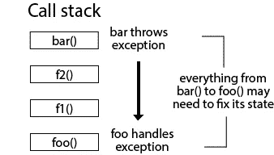

# 错误捕获和处理的最佳实践

> 原文：<https://medium.com/nerd-for-tech/best-practices-for-error-catching-and-handling-2247325042c9?source=collection_archive---------18----------------------->


捕捉和处理错误是[错误处理](https://programmingduck.com/articles/errors)的重要组成部分。

以下是一些最佳实践。一般来说，最好:

*   非常彻底地检查你的错误
*   首先进行错误检查
*   尽早在适当的地方处理错误
*   (例外情况)尽可能在 try 块中使用最少的代码
*   还原状态和资源，以便程序可以继续正确执行

以下是更详细的最佳实践。

(注:对于本文，“错误”在[术语中定义——错误和非错误](https://programmingduck.com/articles/error-meaning)。这意味着你可能抛出一个异常或者返回一个错误值。它不仅仅意味着“不可恢复的错误”。)

# 非常彻底地检查你的错误

不幸的是，程序员并不完美。我们制造 bug，犯错误。事实上，我们经常这样做。这就是为什么我们有这么多的纠错工具来帮助我们。

所以，一般来说，你应该假设程序中所有可能失败的东西都会失败。其他你没有想到的事情也会失败。

为了最小化这个问题，你应该非常彻底地检查你的错误。总是捕捉所有可能的异常并检查所有的错误值。然后，适当地处理它们。

# 首先检查错误

这是一个文体惯例。

在你的代码中，最好先做错误检查。将正常的程序执行留到以后。

例如，在抛出异常的方法中，尝试检查错误并尽早抛出异常。

下面是一个代码示例:

```
class Example
{
    public void Foo(string a)
    {
        if (a.Length === 0)
        {
            throw new InvalidArgumentException("Parameter {a} must not be the empty string.");
        }
        // normal program execution
    }
}
```

方法`Foo`从错误检查开始。之后是正常的代码执行。

避免做这样的事情:

```
class Example
{
    public void Foo(string a)
    {
        // do some "normal program execution" that doesn't need parameter `a`

        // check parameter `a` right before you need it
        if (a.Length === 0)
        {
            throw new InvalidArgumentException("Parameter {a} must not be the empty string.");
        }
        // more normal program execution
    }
}
```

在这段代码中，`Foo`执行一些代码。然后，它对参数`a`进行一些错误检查。

同样的原理也适用于检查错误值。在继续正常程序执行之前，请尝试检查错误。

下面是一个代码示例:

```
function foo() {
  const result = bar();

  if (result.error) {
    // handle error
  }

  else {
    // normal code execution
  }
}
```

上面的代码首先检查错误。然后，它继续正常的程序执行。

这将你的代码组织成可识别的块。首先是错误，然后是正常代码。它使你的代码更容易浏览和理解。

这也有助于调试。当抛出一个错误时，将会运行不太正常的代码。这减少了调试时必须检查的代码量。


# 在第一个适当的地方处理错误

有时候，你不能立即处理错误。您可能需要将它们传播到更高级别的代码中。

为了展示这一点，考虑这个例子:您有一个在文件系统中搜索文件的函数。如果它找到了，就读取它的内容。否则，它将引发异常。代码应该如何处理这个异常？它应该:

*   让程序崩溃？
*   创建新文件？
*   在不同的位置搜索备份文件？
*   通知用户找不到文件并要求他们尝试不同的文件？

文件系统代码不知道。如果文件找不到，不同的程序想要不同的行为。这意味着文件系统代码不能有硬编码的行为来处理异常。

相反，应该在更合适的地方处理异常。能决定如何应对的地方。通常，这意味着调用堆栈中的某些代码位置更高。因此，异常(或错误值)需要传播到那个地方。

对于异常，这意味着您应该让异常冒泡。然后，在你要处理它的地方放一个 try / catch 块。

对于错误值，您必须手动返回它们，直到它们到达调用堆栈中的正确位置。

说到这里，你要在**第一**适当的地方处理错误。不要把它们传播到不必要的高度。您越早处理错误，它们就越接近引发它们的代码。这使得代码的执行流更容易跟踪和理解。

下面是一个代码示例，我们在数据库中搜索一条记录:

```
// server.js
import { getSpriteById } from './myDatabase.js';

app.get('/:spriteId', async (req, res) => {
  const spriteId = req.spriteId;
  try {
    await getSpriteById(spriteId);
  } catch (error) {
    // exception from database is handled here.
    // In this case, it responds with a 404.
    res.sendStatus(404);
    return;
  }
  res.send('Sprite found');
});

app.post('/foo', async (req, res) => {
  const spriteId = req.body.spriteId;
  try {
    await getSpriteById(spriteId);
  } catch (error) {
    // exception from database is handled here.
    // In this case, it redirects
    // to another page for the user to fill in correct information
    res.redirect('/form');
    return;
  }
  res.send('Data accepted');
});

// myDatabase.js
const db = await connectToDatabase('connectionString');

const getSpriteById = async (spriteId) => {
  // throws exception if it doesn't find the record
  const sprite = await db.findById(spriteId);
  return sprite;
};

export { getSpriteById };
```

(顺便说一下，代码是伪代码，如果你真的运行它，就不要指望它能工作。然而，它展示了这一点。)

在这个例子中，函数`getSpriteById`搜索数据库。如果它没有找到它正在寻找的记录，它将抛出一个异常。它本身不处理错误。相反，`server.js`中的处理程序决定如何处理错误。这两个处理程序都有 try / catch 块，它们根据需要以不同的方式处理异常。

# (例外情况)注意在 try 块中放了多少代码

在每个 try / catch 块中放置尽可能少的代码被认为是最佳实践。这意味着您可能需要多个 try / catch 块，而不是一个。

这样做的好处是:

*   很容易看出哪些代码引发了哪些异常(以及哪些代码没有引发异常)
*   它更清楚地“分离关注点”。每个 try / catch 块都是一个独立的功能块。这使得将它重构为一个独立的函数更加容易。
*   它可以防止意外吞掉异常。如果你想都没想就在`try`中放了一些代码，就会发生这种情况。该代码可能会抛出一个您没有准备好处理的异常。但是，它会被夹在`catch`中(并可能被错误处理)。然后，程序将继续执行，可能会产生错误的结果。

当某些代码行可能抛出相同类型的异常时，这也是一种解决方案，但是每种情况都需要不同的处理。

另一方面，使用小的 try / catch 块会使代码更加冗长。

最后，你需要务实。记住好处和坏处。然后，做出你的决定。通常，正确性和清晰性更重要，即使它们更冗长。但是，有时候让代码更简洁也是可以的，尤其是如果你觉得正确性和清晰性不会受到太大影响的话。

例如，这段代码可以进一步分离，但仍然相当不错:

```
BufferedReader bufferedReader = null;
try {
    bufferedReader = new BufferedReader(new FileReader("path"));
    String line = bufferedReader.readLine();
    while (line != null) {
        doSomething(line);
        line = bufferedReader.readLine();
    }
} catch (FileNotFoundException | IOException e) {
    e.printStackTrace();
} finally {
    try {
        bufferedReader.close();
    } catch (IOException e) {
        e.printStackTrace();
    }
}
```

下面是同一个例子分开更多:

```
BufferedReader bufferedReader = null;
try {
    bufferedReader = new BufferedReader(new FileReader("path"));

    try {
        String line = bufferedReader.readLine();
        while (line != null) {
            doSomething(line);
            line = bufferedReader.readLine();
        }
    } catch (IOException e) {
        e.printStackTrace();
    }

} catch (FileNotFoundException e) {
    e.printStackTrace();
} finally {
    try {
        bufferedReader.close();
    } catch (IOException e) {
        e.printStackTrace();
    }
}
```

如果每个`catch`块需要不同的代码，那么第二个版本是必要的。否则，您可以选择任何一个版本。

(最好的解决方案可能是使用一个`with` / `using` / `try-with-resources`语句，或者你的编程语言的等效语句。它会在结束时自动关闭`bufferedReader`。上面的代码只是为了展示这一点。)


# 还原状态和资源

如果您成功地处理了一个错误，那么程序应该能够继续正确地执行。它应该继续运行，就好像错误从未发生过一样。

这意味着您需要:

*   将状态恢复到正确的状态
*   关闭任何由错误代码引起的副作用

# 恢复状态

从错误中恢复后，您的程序需要有正确的状态。如果没有，那你还没有真正恢复。

这意味着您可能需要在错误处理代码中修复或恢复程序的状态。

这里有一个例子。

假设你有一个布尔变量。布尔变量应该以`false`开始。然而，当一些代码正在运行时，您将其设置为`true`。最后，你再把它设置成`false`。

但是，如果程序在某一点出错，变量不会被重置。这将使您的程序处于不良状态，即使错误已经得到处理。

以下是一些“危险代码”的示例，如果发生错误，这些代码将具有无效状态:

```
let isBusy = false;

async function handleUserEvent(event) {
  if (!isBusy) {
    isBusy = true;
    // do something asynchronous which may throw an exception, for example:
    // await doSomething()
    isBusy = false;
  }
}
```

如果`handleUserEvent`出错，`isBusy`的值将永远保持`false`。`handleUserEvent`将无法再次正常运行。

因此，如果出现错误，您需要手动重置状态。

下面是一个代码示例:

```
let isBusy = false;

async function handleUserEvent(event) {
  if (!isBusy) {
    isBusy = true;
    try {
      // do something asynchronous which may throw an exception, for example:
      // await doSomething()
    } finally {
      isBusy = false; // fix the state
      // exception is sent higher up because there's no catch block
    }
  }
}

// equivalent example
async function handleUserEvent(event) {
  if (!isBusy) {
    isBusy = true;
    try {
      // do something asynchronous which may throw an exception, for example:
      // await doSomething()
    } catch (error) {
      isBusy = false; // fix the state
      throw error;
    }
    isBusy = false;
  }
}
```

在本例中，如果在`handleUserEvent`中出现错误，则没有问题。状态恢复，之后`handleUserEvent`将正确执行。

同样的原则适用于调用堆栈中的所有代码。假设函数`bar`出现错误。但是，您处理函数`foo`中的错误，这是调用堆栈中的第 5 个函数调用。为了让程序处于有效状态，您需要确保您已经修复了从`bar`到`foo`的所有状态。



基本上，这意味着您可能需要调用堆栈中不同函数的许多中间 try / catch 块。你在每一个中修正状态。这样，如果错误被更高层处理，所有中间代码的状态都已被修复。他们可以再次运行，就好像什么都没发生。

例如:

```
// handleUserEvent
import foo from './foo.js';

// this is the top-level function
async function handleUserEvent() {
  try {
    await foo();
  } catch (error) { // handle the error at the top level
    // record error
    // display message to user that action didn't work
  }
}

// foo.js
import bar from './bar.js';

let isBusy = false;

async function foo() {
  if (isBusy) {
    return;
  }
  isBusy = true;
  try {
    await bar();
  } finally {
    isBusy = false; // restore this module's state
    // exception is sent further up because there is no catch block
  }
}

export default foo;

// bar.js
let isBusy = false;

async function bar() {
  if (isBusy) {
    return;
  }
  try {
    // do something asynchronous which may throw an exception, for example:
    // await doSomething()
  } finally {
    isBusy = false; // restore this module's state
    // exception is sent further up because there is no catch block
  }
}

export default bar;
```

(是的，我知道例子中的代码很不自然，但希望它能说明问题😅)

# 密切的副作用

有些副作用是成对出现的。例如，如果你打开一个文件，你也应该关闭它。让它开着可能不安全。

所以，确保这样的资源被适当地释放。

如果使用异常:

*   使用`with`积木。如果发生错误，它们会自动关闭资源。一些例子是 Python 中的`with`、Java 中的`try-with-resources`或 C#中的`using`。
*   否则，使用`finally`块(或不同编程语言中的等效块)

如果使用错误值，将“关闭”代码放在适当的地方。它应该在错误情况和非错误情况下都运行。

这里有一个关于`finally`的例子:

```
// pseudocode

let file;
try {
  file = openFile('foo.txt'); // open the resource
  writeToFile(file, 'bar');
} catch (error) {
  // code to handle exceptions
} finally {
  close(file); // close the resource
}
```

以下是一个带有错误值的示例:

```
// pseudocode

const [fileError, file] = openFile('foo.txt');
if (fileError) {
  // handle error
  close(file);
  return;
}
const [writeError, _] = writeToFile(file.value, 'bar');
if (writeError) {
  // handle error
}
close(file);
```

# 最终注释

所以这就是这篇文章。我希望你觉得有用。

一如既往，如果有任何遗漏，或者有任何异议，或者有任何意见或反馈，请在下面留下您的评论。

对于接下来的步骤，我建议看看[错误处理系列](https://programmingduck.com/articles/errors)中的其他文章。

好的，谢谢，下次见。

# 信用

图像制作者名单:

*   网络——照片由 Raghavendra Saralaya 在 Unsplash 上拍摄
*   箭头-照片由你好我是尼克在 Unsplash
*   树屋中的松鼠——照片由 Joakim Honkasalo 在 Unsplash 上拍摄

*原载于 2021 年 7 月 26 日 https://programmingduck.com*[](https://programmingduck.com/articles/error-catching-handling)**。**