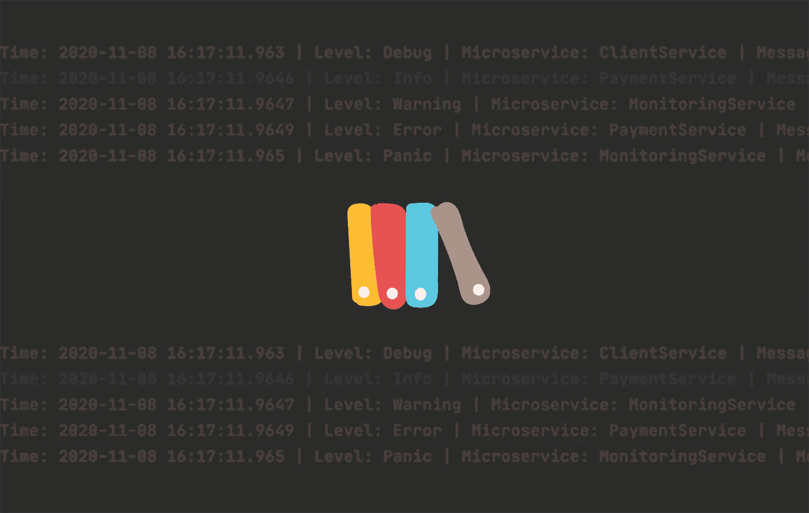
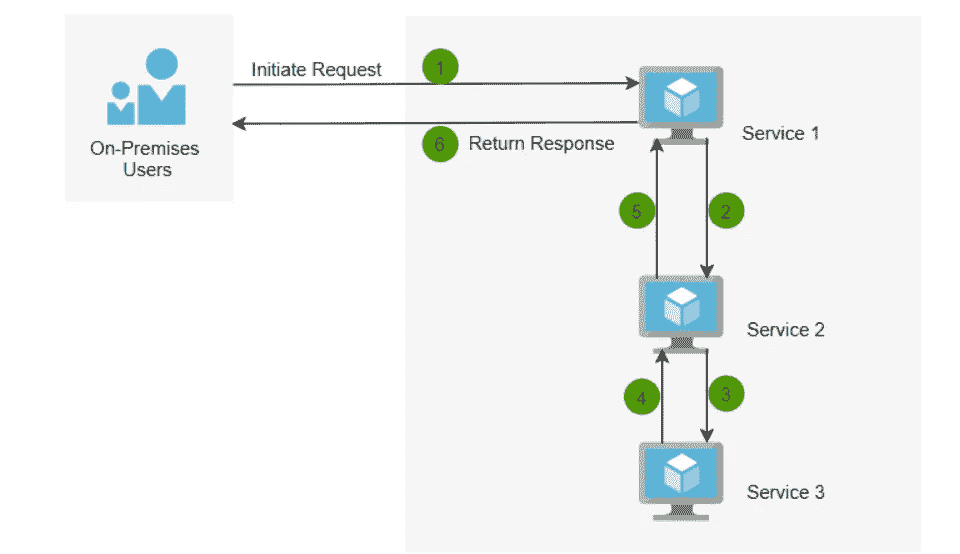
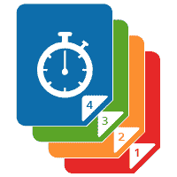
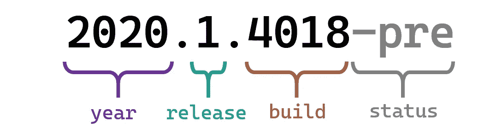
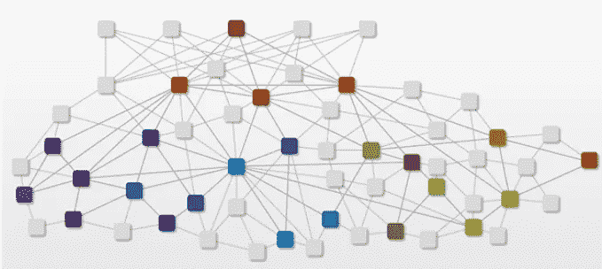

# 微服务的最佳实践

> 原文：<https://medium.com/nerd-for-tech/best-practices-for-microservices-ac05938c2a7d?source=collection_archive---------2----------------------->

通过这篇文章，我们将讨论在实现微服务架构时应该遵循的最佳实践。我们将要讨论的主题如下。

1.  设计
2.  硬编码值
3.  记录
4.  版本控制
5.  授权和认证机制
6.  属国
7.  签订可执行的合同
8.  容错
9.  证明文件

# 1.设计

参赛:https://images.app.goo.gl/b35PjF4wqz9YYYMh7

●设计应该是领域驱动的(DDD)

## 练习:

> ***总是尽可能地尝试重新开始。你可能不需要从头开始写所有的东西。反思！！！如果你的服务中有与你的服务不相关的东西，把它去掉。在这种情况下，我们不需要重新设计或重写一切，但我们可以做一些小的调整，隔离并使服务独立于您的领域。***

**举例:**让我们以一个租车应用为例。

客户可以代表两种不同的服务，但在两个不同的方面。客户注册/帐户管理服务可以包含创建部分。当您实现支持服务或其他服务时，同一个客户可以在该模块中以不同方式表示。该服务的主要范围是客户支持。在另一种服务中，主要目的是金融/账户/支付等。

●所以，当你设计一个服务，当你考虑迁移到微服务时，你需要确保你有一个全新的领域驱动的设计。

●重写一个系统，要看一个公司能承受多少。

假设您有一个相同的租车 web 应用程序，您有以下模块；

➣库存模块

➣利益相关方模块

➣搜索模块

➣租赁模块

➣财务模块

●把模块放在一起，创建一两个服务，说“我们用微服务！”是错误的做法。

# 2.硬编码值

参考:https://images.app.goo.gl/gMvbHUkEWT7zdVqb6

## 练习:

> 你不应该硬编码国外服务的地址。您应该使用服务发现工具来完成这项工作。

假设您的一个服务正在调用另一个服务。

**示例:**在向客户租赁车辆之前，您可以调用另一项服务来获取客户历史记录。让我们将 2 个服务命名为服务 A 和服务 B。假设服务 A 调用服务 B。为了做到这一点，您必须拥有服务 B 的地址。在这种情况下，大多数开发人员将主机名/URL/IP 地址硬编码在服务 A 上。现在服务 A 知道服务 B 在哪里。

**问题➜** 如果您的网络团队决定更改主机名/网络地址，您将需要更改代码并发送另一个部署。这是不正确的。

**如何克服** ➜

****服务发现机制是如何工作的？****

**假设服务 A 要去服务 B，同时服务 C 也需要服务 B。现在，服务 A 看到服务 B 离线。并且发现工具可以拥有表示服务 B 离线的一些标志。因此，服务 C 能够在调用它之前看到服务 B 离线。**

**✹你可以使用任何服务发现机制，不管它是不是代理。但是，如果您没有正确使用代理，它也会继承其他服务的问题。**

# **3.记录**

****

**参考号:[https://images.app.goo.gl/HS7Cz2XoWmTkqXSK7](https://images.app.goo.gl/HS7Cz2XoWmTkqXSK7)**

## **做法:**

> *****失败快，日志晚！如果失败了，马上回来。但是不要记录。*****
> 
> *****不要做太多的日志记录，因为调试会很困难。*****
> 
> *****不从各处记录。仅从您启动流程的位置记录日志。但是，您必须记录堆栈跟踪或一些信息，以了解这究竟发生在哪里。这样，当某个特定的错误实际上发生在存储库层时，您就不会被误导说它发生在服务层。*****
> 
> **对于一个特定的错误，你只需要记录一次，并确保在整个过程中没有丢失任何信息，以了解发生了什么。**
> 
> *****无论何时点击初始服务，都可以生成并调用唯一的关联 ID。在您访问服务层之前，您的 web 服务器也可以在某处生成一个关联 ID。*****

****

**ref:[https://www . c-sharp corner . com/article/logging-and-tracing-in-multiple-microservice-with-correlation-using-net-core/](https://www.c-sharpcorner.com/article/logging-and-tracing-in-multiple-microservice-with-correlation-using-net-core/)**

**✹您可以使用日志附加器(日志拦截器)将日志消息发送到某个目的地或介质，并将关联 ID 或您生成的任何 ID 与日志语句一起写入文件。日志将包括日期、时间、日志级别、ID 和日志语句。**

**日志管理框架示例:**

**📋Log4j**

**📋Logstash**

**📋Splunk**

**📋弹性的**

**✹日志对于解决任何应用程序问题都非常重要，必须正确维护。日志可以作为文本文件或控制台或云写入。**

**✹:如果日志管理得当，随时跟踪您的服务电话都很容易。您可以通过日志搜索服务，并可以找到以下信息:**

**它的发源地➣**

**➣目的地是哪里**

**➣从起点到终点之间的路径**

**例外发生的➣**

**➣它从哪里回来**

**✹确保你有某种日志聚合机制来搜索日志。**

# **4.版本控制**

****

**参赛:https://images.app.goo.gl/CwHoG4P6ADyMCHwd7**

## **练习:**

> *****使用版本控制进行重大变更*****

**版本控制中基本上有两种最流行的技术，即:**

1.  **语义版本控制**
2.  **日历版本控制**

## **语义版本控制**

**语义版本控制是一种很好的版本编号管理机制，它指定了哪个数字应该增加；**

**➣是一个 Bugfix。**

**➣新功能或功能变化。(但是如果它是向后兼容的，要改变哪个数字)**

**➣破坏了任何现有的功能。**

**它可以被认为是使用三部分版本号定义兼容性的正式约定。**

****格式:<专业>。<小调>。<补丁>补丁****

****

**参考:https://images.app.goo.gl/tofmZzMV8gwQnFPZA**

****Major:** 每当您的服务与以前的服务/版本不兼容时，您就会增加。(这是因为它的功能发生了变化)**

****Minor:** 当你有了新的功能，你就增加了，但是以前的功能也保持不变。如果用户愿意，用户可以更新。否则，用户可以使用以前的版本。**

****补丁:**你可以按照自己想要的方式递增。它并没有反映出一件多么严重的事情。**

## **日历版本控制**

**日历版本是基于发布日期而不是任意数字的约定。**

****

**参赛作品:[https://images.app.goo.gl/WZJW73xpTLPxs3r3A](https://images.app.goo.gl/WZJW73xpTLPxs3r3A)**

***年份*和*版本*编号一起反映了一个构建包含的特性。**

**可执行文件和容器映像将标有内部版本号和状态标签，以及年份和版本号。**

**内部版本号将会改变，以确定在一个版本中添加的错误修复或外观改进。**

**除了上面提到的技术，还有一个概念叫做“**强制升级。**”**

**让我们用一个例子来理解这个概念。**

**假设您有一个名为服务 A 的服务，这个服务 A 调用服务 B，您需要更新服务 B，在更新过程中，您将更改数据库结构。因此，服务请求会有所不同。当你推送新版本的服务 B 时，你的服务 A 就会中断。因此，您可以增加主版本号，并将其作为单独的版本进行部署。**

**现在，您有了两个版本的服务服务 b。但是，您的流量仍然采用服务 b 的前一版本。因此，您可以与客户沟通，告知其功能已发生变化，并要求客户在某个日期之前升级到新版本，因为现有服务器将在该日期后退役。一旦所有客户都迁移到新版本，您就可以关闭并停用以前的版本。**

**✹:你也可以使用弹性装置。让我们用一个例子来看看它是如何工作的。**

**假设您有 5 个消费者，并且运行 10 个先前版本的实例。当消费者转向新版本时，您可以增加新版本的实例，同时减少旧版本的实例。通过这种方式，您可以管理您的服务，而不会破坏任何消费者。**

# **5.认证和授权**

****

**参赛:https://images.app.goo.gl/VPepFTfXh3J1fNgf9**

**如果每个服务都试图验证用户，这将增加往返行程的延迟。**

****例如:**当用户试图在租车应用程序中为客户分配车辆时，它调用 3 个不同的服务。假设您使用 OAuth 令牌来验证消费者，并且验证一个 OAuth 令牌需要 20 毫秒。当这个请求到来时，如果它通过 3 个不同的服务试图分别验证 OAuth 令牌，那么它会带来麻烦，因为您要在往返过程中增加 60 毫秒。**

## **练习:**

> *****拥有独立的身份验证服务，并将到达您的服务层的任何请求定向到该身份服务。如果成功，您可以指向路径的其余部分。我们称之为“强制转发”。您将强制转发到特定的服务，这样可以避免一些延迟。*****

**✹:您可以根据您的算法或服务讨论在任何给定的时间更改此身份验证和授权过程。**

# **6.属国**

****

**ref:[https://www . a ternity . com/blogs/monitoring-a-micro services-based-application/](https://www.aternity.com/blogs/monitoring-a-microservices-based-application/)**

## **练习:**

> *****您应该避免对服务的任何依赖，服务应该独立部署。*****

****举例:**我们假设你有服务 A、B、C，当你想部署 A，同时部署其他 B、C 服务失败时，就会出现问题。**

**✹因此，独立是必须的。我们应该能够分别部署服务 A、B 或 C，而不用担心破坏其他服务。**

# **7.签订可执行的合同**

****

**参赛:https://images.app.goo.gl/dGF7cdqc8YLUQ4t48**

**让我们看一个普通的应用程序。有 UI/UX 机制来确保用户喜欢某个网站/应用程序。你的服务也有我们称为消费者的用户。开发人员有责任让服务变得简单，让消费者满意。在您的 A、B 和 C 服务结构中，如果您在部署其中一个服务时破坏了一些消费者，那么您就做得不好。**

## **练习:**

> *****你和你的消费者可以有一个契约(可能是一个 API 规范)，并且不惜任何代价确保契约不被破坏。为了确保这一点，您可以将此契约转换为可执行文件。可以准备一些测试用例/测试脚本/请求。每当您构建一个特定的服务时，这些测试都会自动执行。*****

**✹持续集成工具将执行这些测试。如果所有这些测试都成功通过，您可以确保没有破坏它们。如果测试失败了，你可以 100%确定当你把这些产品推向生产时，你正在破坏你的消费者。但你能这么快修好。**

**持续集成工具的示例:**

**🔧詹金斯**

**🔧好朋友**

**🔧特拉维斯**

**🔧GitLab CI**

**🔧代码船**

# **8.容错**

****

**参考号:[https://images.app.goo.gl/1ibtRFDxpyiDUUhw7](https://images.app.goo.gl/1ibtRFDxpyiDUUhw7)**

**维基百科定义:**

**"**容错**是一种属性，它使系统在其某些组件出现故障(或其中的一个或多个故障)时能够继续正常运行"**

**✹:因为在处理微服务时有多个服务，所以出现故障的可能性也很大。你需要恰当地管理它们。**

**现实生活中有几种模式可以实现容错。它们包括:**

**🔖超时设定**

**🔖断路器**

**🔖最后期限**

**🔖重试次数**

**等等。**

## **练习:**

> *****你需要有强大的容错机制。如果一个服务超时、失败缓慢或需要很长时间来响应，那么您需要确保快速失败，这样您就不会在等待服务响应时在后面创建一个队列。*****

# **9.证明文件**

****

**参赛:https://images.app.goo.gl/hCJUFtj7UNvChpwG9**

## **练习:**

> **无论你做什么，你都需要记录下来，因为另一个人应该能够理解你写的东西。**

**✹你可以使用 Swagger，它是一种接口描述语言，以一种技术的方式来编写文档。**

****

**参考:https://images.app.goo.gl/w9HoJ7fp7NE3eeWU7**

**✹·斯瓦格会把你在斯瓦格控制台上写的任何技术术语转换成非常漂亮和有吸引力的文档。**

**✹不仅有文档，它还为用户提供了一个用户界面，以便消费者可以参考并尝试一些服务。**

# **参考**

** [## 最佳架构设计的 10 项微服务最佳实践| Capital One

### 1.单一责任原则就像代码一样，一个类应该只有一个改变的理由…

www.capitalone.com](https://www.capitalone.com/tech/software-engineering/10-microservices-best-practices/)**