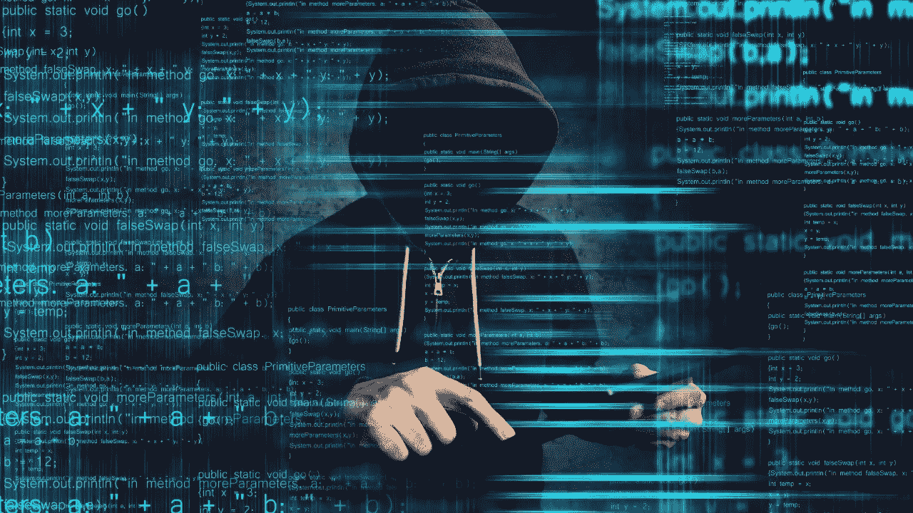

# 黑客的最佳编程语言？

> 原文：<https://medium.com/nerd-for-tech/best-programming-language-for-hacking-f1f9866a96b7?source=collection_archive---------14----------------------->

## 黑客攻击需要编码吗？

## 黑客攻击需要编码吗？

有一点很重要，你不需要学习编程就能成为一名优秀的黑客，学习编程实际上不会让你成为一名黑客。如果你学习编程，你将成为一名程序员，如果没有黑客技能，你将无法攻击任何东西或测试任何东西的安全性，相反，你应该把编程视为一种技能或一种附加技能，可以添加到你现有的黑客技能中。所以你可以结合这两种技能，在测试系统的安全性时，在编写黑客工具时，在利用这些系统时，使用你的编程知识，这样你就能够阅读现有的代码并发现其中的弱点，你就能够扩展现有的黑客工具并添加更多的功能，如果它们有任何错误，就修复它们的错误，或者编写你自己的黑客工具。所以，把编程看作是一种附加技能，可以增加你现有的黑客技能。这非常非常重要。

## ***黑客最好的编程语言是什么？***

你可能认为我会说 [Python](https://jeynadar23.medium.com/why-python-is-popular-336809dd4aba) 是黑客最好的编程语言，但在我看来，我并不认为 Python 是黑客最好的编程语言。是的，如果你想建立自己的黑客工具，python 是很棒的，因为首先 python 非常简单，作为一种编程语言，它非常强大，有很多库和插件可以帮助你利用个人数据和编写黑客工具进行黑客攻击，也有很多现有的用 python 编写的黑客程序。因此，如果你懂 python，你就能在这个工具上构建、扩展它们，给它们添加更多的特性，并修复一个 bug。像我说的，它们有任何 bug，但这并不意味着它是黑客攻击的最佳编程语言。

黑客是一个巨大的领域，这使它成为一种非常好的语言，在我看来，编写黑客工具的最佳语言，例如 Ruby，是另一种很好的语言，它也很容易使用，它非常适合构建黑客工具，你可以在其中构建整个利用框架。它的庞大框架是用来黑客攻击的，如果你学会了它，你就可以用它来修复错误，如果有任何错误，你就可以扩展它，为它构建和添加更多的功能，甚至可以编写自己的 Metasploit 模块，满足利用和后期利用模块等等。

现在，假设你实际上不想写黑客工具，你对学习开发感兴趣，那么你需要学习 C，因为 C 是一种非常强大的编程语言，它给我们提供了对系统资源的低级访问，使我们可以很容易地操纵和访问系统内存以及其他资源，这就是为什么它非常非常适合开发开发。这并不意味着你不能用 python 和 ruby 来访问这些资源，而是意味着 C 是最好的，它使之变得最简单，也是最强大的。

例如，如果你想学习逆向工程，那么汇编是一种非常重要的机器语言，汇编的版本或类型取决于目标处理器，因为 arm 的汇编不同于 x86 的汇编，等等。如果你的目标是对用 java 编写的程序进行逆向工程，那么你可能也需要学习 java，然后再学习其他语言。现在我知道我听起来很困惑，看起来我的答案是学习尽可能多的编程语言，这不是我想要你做的。我不认为这是正确的方法，相反，你应该专注于学习编程，而不是编程语言。

所以，把编程作为一种技能来学习，这样当你把编程作为一门学科作为一种技能来学习，并学习如何正确地设计程序，编写算法来处理数据结构和不同类型的语句，以及正确的编程概念时，你将能够把这些概念应用到任何程序和语言，以及你想要构建的任何项目中。因此，编程语言变得无关紧要，你学习的主要内容是正确的编程概念，你可以对任何程序员这样说，他们会说是的，我可以在一周内学会任何编程语言，我将能够轻松地用它编写程序，因为他们已经知道如何编程，他们已经知道如何解决问题， 他们已经知道如何编写算法，他们需要学习的是这个新程序和语言的正确语法，他们将能够使用它来编写程序，没有任何问题。

别忘了留下你的回答。✌

大家敬请关注！！为了把我的故事发到你的邮箱里，请订阅我的时事通讯。

感谢您的阅读！不要忘记给你的掌声，分享你的回答，并与朋友分享！！