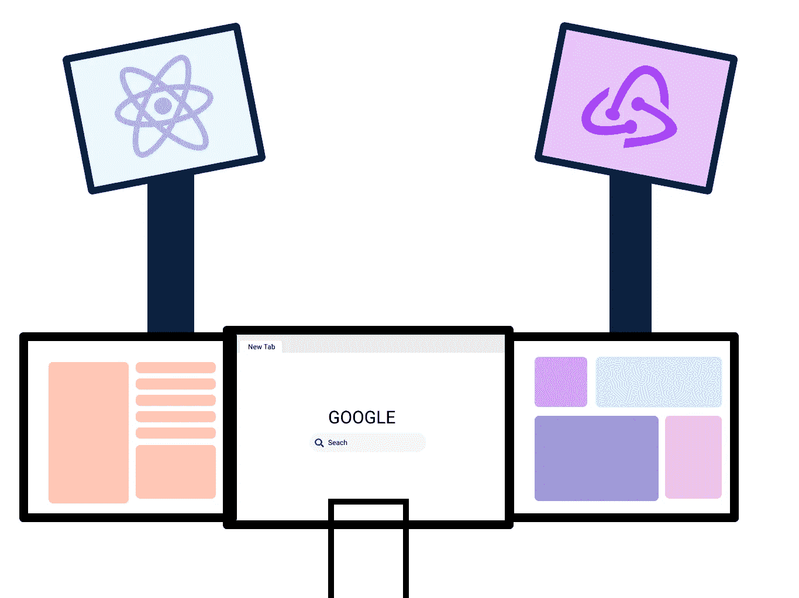

# 5 分钟解释最佳 Redux 架构。

> 原文：<https://medium.com/nerd-for-tech/best-redux-architecture-explained-in-5-minutes-9b993f0169c0?source=collection_archive---------14----------------------->

你每次都应该遵循的 Redux 架构。它具有高度的可伸缩性、可扩展性，并且易于在未来随时更换。

Redux 架构( [**iHateReading**](http://ihatereading.in/creativity) )

如果你还没有读过我的关于前端中**最佳可扩展 API 架构的文章，那么请去看看，这篇文章帮助你理解为什么你应该避免在 Redux 动作中调用 API。这里是文章的链接= > …**