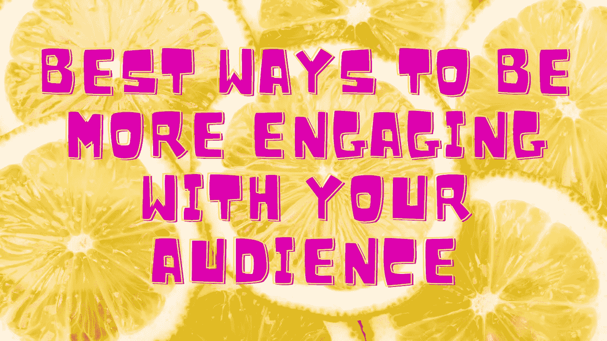

# 与观众互动的最佳方式

> 原文：<https://medium.com/nerd-for-tech/best-ways-to-be-more-engaging-with-your-audience-62bec1e926e1?source=collection_archive---------7----------------------->

图片作者来自 Canva

社交媒体为你的受众提供即时反馈，这些反馈可以是积极的和消极的。作为一名营销人员，你总是在倾听客户或潜在客户的反馈，包括赞、收藏、转发甚至 Instagram 评论。

如果你没有意识到你的观众没有在社交媒体平台上与你互动，那么是时候采取一些严肃的行动了。

# 基于位置的营销是对你的受众的回报

基于位置的营销在全球各行各业迅速流行起来。它之所以如此受欢迎，是因为它制作的内容能够更好地吸引观众关注当地的时事或趋势话题。

当人们参与社交媒体时，他们更有可能分享品牌知名度，这使得这项技术非常值得努力实施和完善。

# 你不必是 B2B 或 B2C

在市场营销中，所有的业务都由两种类型组成:**企业对企业(B2B)和企业对消费者(B2C)** 。

营销人员犯的最大错误是创建不直接面向受众的内容，这降低了他们参与的积极性。

当你的听众觉得他们被贬低或被排除在谈话之外时，他们就没有采取行动的动力了。

它应该是培养与客户的关系，而不仅仅是销售产品。您可以通过在个人层面上与客户联系，或根据您所在社区的趋势话题或时事举办本地活动来参与。

# 你必须知道你的观众在哪里

同时无处不在从来都不是一个好主意，当你在社交媒体上运行各种类型的营销或广告时就会发生这种情况。你不能仅仅因为有利于品牌，就指望你的观众参与他们不感兴趣的事情。

当你确切知道你的受众在社交媒体上的位置时，你将能够为他们量身定制完美的内容；无论是视频、竞赛甚至是赠品。

通过参与相关的对话，而不是在后台不断播放广告，你还会获得更多的关注者和喜欢。

# 营销方向漂移的七大警示信号

**1)** **没有明确的目标:**有一个长期吸引观众的使命很重要。如果你不能清楚地传达你的营销目标是什么，或者它与你的客户有什么关系，那么你将很难在社交媒体营销中取得成功。

**2)** **计划不周的营销活动:**当你没有时间在多个平台上策划经过深思熟虑的营销活动时，很有可能会在执行中失败。缺乏计划可能是有害的，因为它没有足够的时间来测试和从过去的错误中学习。

**3)不了解竞争:**当你与其他品牌竞争时，你如何知道自己的地位？通过回顾他们的内容和并排比较他们自己，营销人员可以确定他们在哪里需要额外的支持或新的想法。

**4)不跟踪关键绩效指标:**社交媒体指标是了解人口统计和在线区域覆盖的关键。如果没有适当的跟踪策略，您就无法正确估计未来营销目标的假设，这在没有必要的数据来支持决策的情况下浪费了宝贵的时间。

将受众视为理所当然:当营销人员将受众视为理所当然时，这将通过客户本身缺乏参与或兴趣表现出来。当品牌只在社交媒体平台上投放广告，但不花太多精力与他们当前的客户群互动时，这种情况很常见，这些客户群掌握着选择他们希望品牌在哪里互动的所有权力。

**6)出于错误的原因:**如果企业没有健全的社交媒体战略，那么很可能他们只是出于错误的原因参与社交媒体。

如果品牌参与对营销人员不重要，那么它会导致他们错过难以置信的机会，随着时间的推移，这将使他们更难看到社交媒体营销的成功。

**7)缺乏沟通策略:**如果没有强有力的沟通策略，营销人员不太可能以正确的方式吸引受众。

失去受众的时刻通常是你最不希望或最不想让他们离开的时候，因此拥有有效沟通的方式在任何在线营销计划中都至关重要。

了解客户希望何时以及如何被联系，可以让企业将精力集中在他们最受欢迎的地方，而不是未经允许就向用户发送垃圾邮件。

 [## 文案的一天。这是它的样子

### 在这篇文章中，你会发现一个文案典型的一天是怎样的——从寻找博客帖子的灵感…

jamesjdavis.medium.com](https://jamesjdavis.medium.com/a-day-in-the-life-of-a-copywriter-heres-what-it-looks-like-ce9b87e3097d)