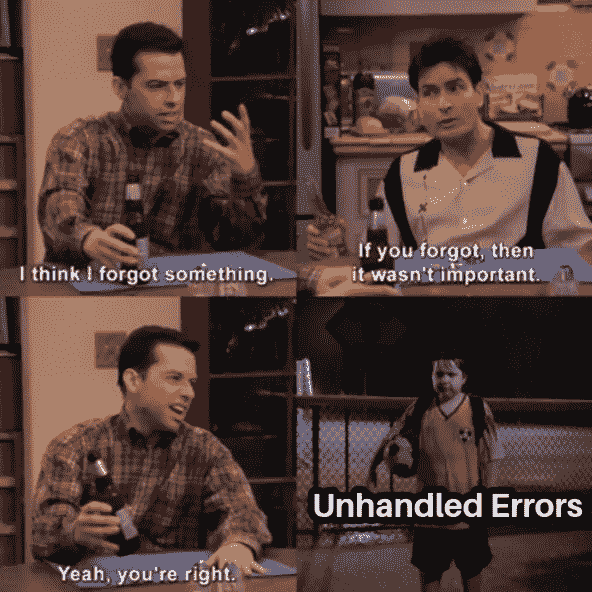
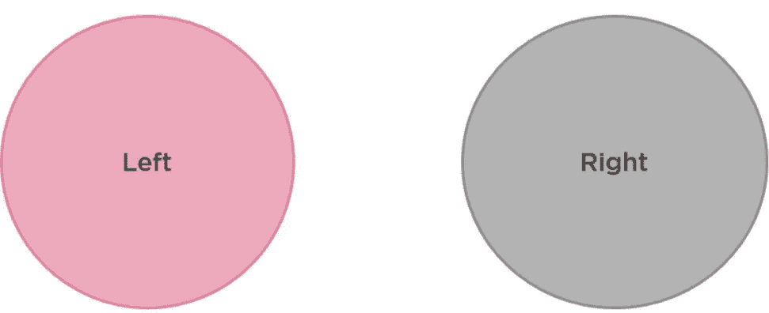

# Dart 中任一类型的错误处理更好

> 原文：<https://medium.com/nerd-for-tech/better-error-handling-with-either-type-in-dart-b91bef20d716?source=collection_archive---------0----------------------->

您是否曾经想过“有没有任何包装类可以将好的响应和坏的响应都包装到一个类型中？”如果你从来没有想过这个问题，让我解释一下为什么它是一个方便的特性。

假设我们有这两个类，

*   失败类是一个当异常发生时我们返回的类。
*   Person 类是当我们有一个有效的响应时想要返回的模型类。

假设我们想在一个类中包含这两个类，我们该怎么做呢？这里有一个非常幼稚的方法。

下面是我们如何使用它，

这门课很酷。这有什么问题🙄？让我们明白

*   响应对象**可以同时启动人员和失败属性**。这肯定不是我们想要的行为。它应该容纳一个人或者一个失败者。两者不应该同时存在。

```
 Response res = Response(failedReponse); res.person = validResponse; //now 'res' has both person and failure
```

*   你可能忘了检查错误。



```
void main(){
    Failure failedReponse = Failure('something went wrong');  
    Response res = Response(failedReponse); //still valid, compiler doesn't complain, but prints 'null'
    print('Response : ${res.person?.name}');
}
```

所以我们需要一些东西，

1.  以确保同一时间只有一种类型可用。
2.  强制执行错误处理(向编译器投诉)。

## 达姿套餐

Dart 没有任何内置类型来使这些发生，但是我们在 dart 中有[*【dartz】*](https://pub.dev/packages/dartz)**一个* *函数编程*。它支持类型**左<，右>T26，满足我们的确切用例。***

*首先将[包](https://pub.dev/packages/dartz/install)添加到你的 ***pubspec.yaml*** 文件中，*

```
*dependencies:
  dartz: ^0.9.2*
```

## *什么是任一类型？*

*`Either`类型用于表示具有两种指定类型中任意一种的值。常见的是使用`Either`来表示成功值或失败值，尽管这并不是必须的。*

```
*Either<int, String> response = Right("Hello, im right");*
```

*这就是使用任一()的简单之处，您在泛型类型参数中以各自的顺序声明左类型和右类型。*

**

*使用`Left(value)`或`Right(value)`来赋值。在上面的代码中，我指定`*Right(“Hello, im right”)*`把字符串作为右边的值，在这种情况下，左边的值将为空(整数值为空)。*

*这里的 fold 方法负责处理这两个值，如果左边的值可用，它将调用第一个回调方法`print(‘Integer : $integerValue’)`，否则，它将调用第二个回调方法 `print(‘String : $stringValue’)`*

*这正是我们想要的，我们想要的*

1.  *一次只有一个值可用。*
2.  *只有在评估左值和右值的可用性后，才应采取相应的措施。*

## ***使用任一**进行错误处理*

*现在让我们利用这两者的力量来重组我们的**响应**模型类。*

*我们不再有两个独立的失败例子&人。我们使用其中一个类将它们组合成一个实例 ***【人】*** 。*

*这里我们必须使用 fold()处理两种失败的情况& Person 对象，否则我们的代码将无法编译。*

***我们所做的是，***

1.  *我们确保在任何时候只有一种类型可用。*
2.  *我们确保错误总是被处理。*

*我用了非常简单的例子来解释这两种类型的概念，但是它非常强大💪来解决许多复杂的问题。dartz 包中还有许多其他类型和功能，这使得 flutter 开发人员的工作变得更加容易🤗。我将在随后的文章中介绍它们。*

*如果你喜欢这篇文章，请竖起大拇指👍我会带着另一篇 Dart 文章来见你。谢谢你🙏和快乐学习。*