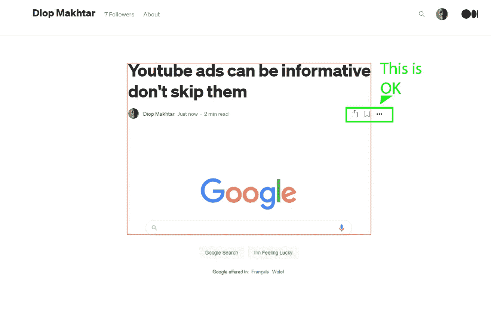
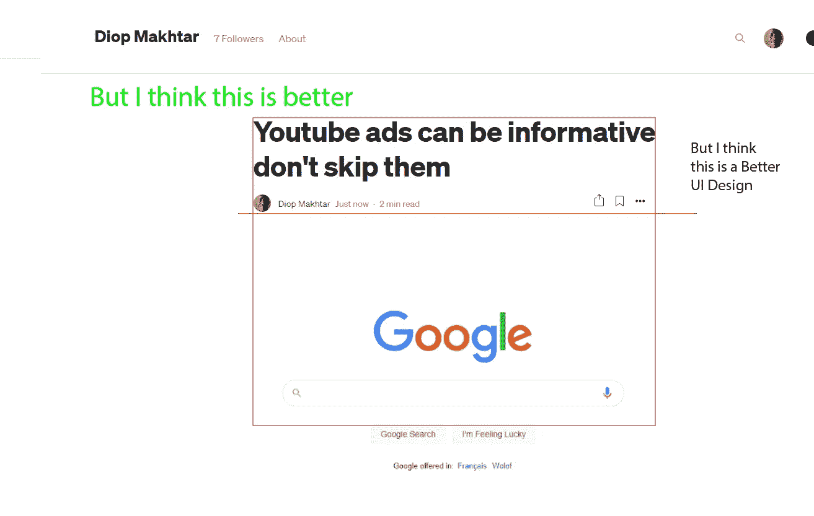

# 更好的中等用户界面

> 原文：<https://medium.com/nerd-for-tech/better-medium-ui-b032c742a1d3?source=collection_archive---------20----------------------->

下图是这篇文章如何在分辨率为 1920x1080 的台式电脑屏幕上显示

物品上的媒体显示

但是我认为

我们的大脑只是碰巧喜欢框架和指导，莱考夫教授用[比喻教给我](https://en.wikipedia.org/wiki/Metaphors_We_Live_By#:~:text=Metaphors%20We%20Live%20By%20is,time%2C%20mental%20activity%20and%20feelings.)一本值得一读的书。你可以用 [Glose 电子书阅读器](https://glose.com/)阅读，或者用[媒介](/@GeorgeLakoff)阅读相关文章