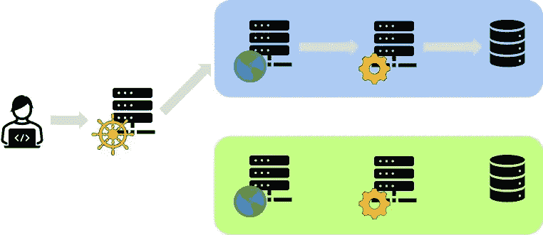
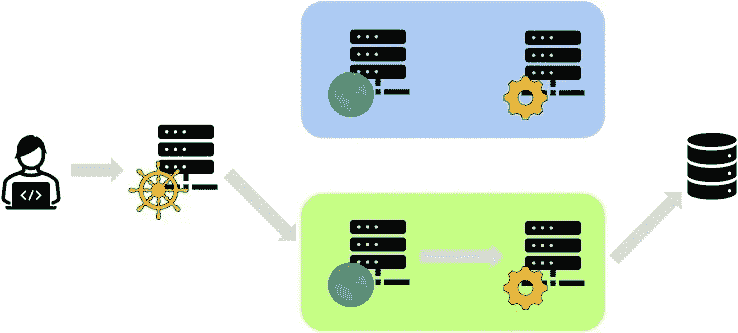

# 超越“Hello World”:在 Kubernetes | Hazelcast 上使用 Hazelcast 实现零停机部署

> 原文：<https://medium.com/nerd-for-tech/beyond-hello-world-zero-downtime-deployments-with-hazelcast-on-kubernetes-hazelcast-cab0436c3b9?source=collection_archive---------3----------------------->

今天，我想提供一种方法，它将允许大多数组织在 Hazelcast 平台的帮助下进行零停机部署。

# 应用程序不是无状态的！

几年前，我开始对持续部署感兴趣，这是我对持续集成浓厚兴趣的自然延伸。在 CD 图案中，[蓝绿展开](https://en.wikipedia.org/wiki/Blue-green_deployment)为第一。这是一个架构示例:

其思想是路由器组件将请求定向到一个环境；按照惯例**蓝色**。这个环境包含应用程序完成其任务所需的所有组件。同时，Ops 可以在环境中部署新版本的应用程序。一切准备就绪后，他们可以切换路由器，将所有请求定向到新环境。

不幸的是，这个理想的场景有几个缺点，都与国家有关。虽然我们希望我们的应用程序是无状态的，但大多数都不是。让我们追逐恶魔。

**会话**(和 cookies)在几乎所有的网络应用中无处不在。一般来说，开发人员在数据量小且需要频繁时使用会话。当这种情况发生时，从数据库中获取数据的成本太高。会话使用的一个简单用例是在 web 应用程序的每个屏幕上显示登录用户的姓名。

当承载会话的节点死亡时，问题就开始出现了。数据丢失。我相信由于会话复制，这个问题现在已经解决了。顺便说一下，您知道 Hazelcast 有许多不同的会话复制方法吗: [Jetty](https://github.com/hazelcast/hazelcast-jetty-sessionmanager) ， [Tomcat](https://github.com/hazelcast/hazelcast-tomcat-sessionmanager) ，[基于 WebFilter 的](https://github.com/hazelcast/hazelcast-wm)，甚至 [Spring Sessions](https://spring.io/projects/spring-session-hazelcast) ？

您应该将不适合会话用例的数据存储在外部**数据库**中。从鸟瞰的角度看，它似乎解决了这个问题，但事实并非如此。当您切换到环境时，需要迁移**蓝色**环境中的数据。在实际应用中，这肯定需要时间。

设想一个电子商务 web 应用程序，其中我们将用户的购物车存储在数据库中。当从**到绿色**的切换开始时，我们需要将用户转移到后者。他们的会话被迁移到使用数据库的应用服务器。我们还需要迁移数据。不幸的是，我们面临一个难题:我们不能在迁移数据之前重定向用户，但是我们不能在使用环境的同时迁移数据。

显而易见的逃跑路线是:

1.  引导新用户进入**绿色**环境
2.  等待现有用户停止使用该应用程序(通过检查会话到期时间)，然后移动他们的数据
3.  当**蓝色**上的所有用户会话到期时，传输剩余数据

这一过程既漫长又容易出错。一天迁移几次是不可行的。

# 一个试验性的解决方案，共享数据库

应对上述问题的最直接的解决方案不是迁移，而是使用两个环境之间共享的数据库(或集群)。

我在过去的中写过[这种方法](https://www.exoscale.com/syslog/kubernetes-zero-downtime-deployment/) [。请在这里找到节略版。](https://www.exoscale.com/syslog/kubernetes-zero-downtime-with-spring-boot/)

共享数据库的最大缺点是一些应用程序部署需要更改数据库模式。但是有些变化不是向后兼容的。因此，因为我们需要能够在保留数据的同时回滚部署，所以我们需要将一个重大变更拆分成一系列并行的兼容变更。这样，应用程序的 x.0 版本仍然可以与数据库模式的 x.1 版本一起工作。

无论是数据库强制执行写时模式(就像大多数 SQL 数据库那样)，还是应用程序需要应用读时模式( *à la* NoSQL)，都是如此。

变更的拆分使得部署过程变得手动和脆弱。此外，我们仍然需要将数据从一种形式迁移到另一种形式，即使是在同一个数据库中。我们可以通过不同的渠道实现它:接触数据的应用程序代码、触发器等。

棺材上的最后一颗钉子归结为我们的过程如何管理。它管理“热”的，但是“冷”的呢？与前面的方法一样，在迁移过程中未被触及的数据仍然需要迁移。

# 拥抱数据迁移

无论我们是围绕每个环境中的数据库还是单个共享环境来设计部署架构，我们仍然需要迁移数据。因此，拥抱迁移比把它推到一边，当作二等问题来对待要好得多。

数据迁移背后的问题不是迁移本身，而是我们如何管理它。批处理作业是实现数据迁移的标准方式。从一个非常普遍的角度来看，我们计划以指定的时间间隔运行一个批处理，从源读取符合特定标准的数据，转换数据，最后将转换后的数据写入接收器。当作业完成其任务时，它会停止。

批处理有几个缺点:

*   如果作业完成时数据尚未到达，该怎么办？
*   如何在内存中保存要处理的全部数据？
*   如果批处理中途失败了怎么办？
*   如果批处理运行的时间过长，超出了它的下一个调度，例如，一个小时的批处理需要超过 60 分钟，该怎么办？

好的一面是批量模型已经伴随我们很长时间了，我们已经想出了应对这些缺点的方法。例如，我们可以分块处理数据，如果需要的话，将光标保持在最后处理的块上，从这个点重新开始。

处理“数据尚未到达”问题的唯一方法是在下一次运行时处理它，这可能是在下一个小时。对于数据迁移，这是不可能的。我们不想再等一个小时来处理后来者的数据，完成迁移。这个问题源于批处理模型的有界性质。它开始…又结束。

如果我们开始一项永无止境的工作，它会在收到数据时立即处理数据，那会怎么样？

# 流处理和变化数据捕获拯救世界

这种永无止境的方法有一个名字:流处理(或数据流)。流处理通过事件驱动的范例解决了批处理方法的所有缺点。

*   如果作业完成时数据还没有到达怎么办:作业永远不会完成；当数据可用时，它会进行处理
*   如何在内存中保存要处理的全部数据:数据以小块的形式到达，因此一个数据项的内存消耗相对较小
*   如果批处理中途失败了怎么办:大多数流处理引擎，比如 Hazelcast Jet，都是分布式的
*   如果批处理运行的时间太长，超出了它的下一个调度，那该怎么办呢？他们可以一直跑，直到你阻止他们

我们需要一种方法让数据库发出这样的数据事件。幸运的是，它通过变更数据捕获及其实现之一 Debezium 存在。简而言之，Debezium 通过读取 SQL 数据库用来提供故障转移的仅附加日志文件来工作。当主节点收到 write 语句时，它会将其写入这个只附加日志。主节点和所有辅助节点都读取该文件并应用语句。这样，它们总是保持相同的状态，如果主节点出现故障，其中一个辅助节点可以接管相同的状态。

Hazelcast Jet 利用 Debezium 作为库来读取只附加日志。

要了解更多关于 Hazelcast Jet 和 Debezium 的细节，请参考[文档](https://jet-start.sh/docs/api/sources-sinks#change-data-capture-cdc)。

# 分 6 步在 Kubernetes 上进行蓝绿色部署

现在我们已经准备好了所有的部分，我们终于可以开始设计解决方案了。我将使用 Kubernetes，因为它是一个非常受欢迎的平台，但 Kubernetes 没有任何关于该解决方案的具体内容。它可以在任何基础设施上运行。

注意，当阅读 Kubernetes 时，很容易认为它的滚动升级特性允许无缝连续部署容器。在某种程度上，这是正确的。虽然部署无状态应用程序是很容易的，但是它并不关心状态。我们是照顾它的人。

1.  我们蓝绿部署的起点是 Kubernetes `Deployment`中的一个应用程序，其副本数量为 3，策略为`RollingUpdate`。它们都使用位于现有**蓝色**环境中的同一个数据库 pod。我们用**会话复制**配置所有应用程序单元。
2.  下一步是在现在空的**绿色**环境中调度新的数据库 pod。这需要多长时间就有多长时间；应用程序舱不会使用它，直到后来。
3.  这是关键步骤:我们安排数据迁移作业 pod(在下图中标为 *forward* )。一旦应用程序窗格执行对蓝色数据库窗格的写入操作，转发作业就会捕获该应用程序窗格，读取其数据，根据绿色数据库窗格中的新模式对数据进行转换，并将其写入数据库窗格。因此，虽然蓝色的数据库是事实的来源，但是你可以把绿色的数据库看作是派生的数据。此外，它与前者保持同步——不是实时的，因为即使是光也不会瞬间传播，而是足够接近我们的需求。
4.  现在是时候安排应用程序的新版本了。我们只是告诉 Kubernetes 关于`Deployment`的新形象。它的工作是通过滚动更新来实现这一点。通过会话复制和两个数据库紧密同步，我们可以将用户从使用**蓝色**数据库窗格的 *v1* 应用窗格无缝移动到使用**绿色**数据库窗格的 *v2* 应用窗格。
5.  在某个时间点，所有用户都将从**蓝色**环境迁移到绿色环境。此时，**蓝色**环境中不会发生写入。**绿色**环境成为活动环境。
6.  是时候做一些清理工作了。我们可以停止 *forward* 作业并取消调度它的 pod。稍后，我们可以对**蓝色**数据库 pod 进行同样的操作。

注意，为了简单起见，我们只描述了名义路径。在现实场景中，您应该准备一个从数据库读取并写回数据库的*向后*作业。如果您需要回滚，您将停止*向前*作业，调度*向后*作业，并再次降级您的应用程序 pods 以将用户移回原始环境。

# 结论

在这篇文章中，我描述了升级应用程序的核心问题:状态。状态在两个地方，应用程序本身和用户会话以及数据库。会话复制是一个已解决的问题，数据库迁移则不然。

有了数据流和变更数据捕获，我们就有了一个简单的流程，可以从数据库迁移数据来更新应用程序，同时为用户提供服务。

请找到相关的 [Git 库](https://github.com/hazelcast-demos/zerodowntime)来解释这篇文章。

*原载于 2021 年 3 月 4 日 https://hazelcast.com***。**