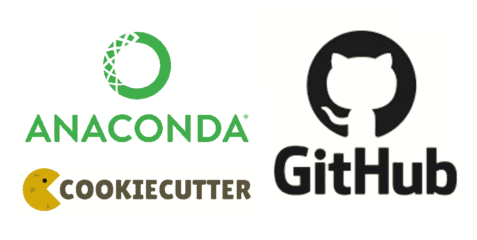

# 超越 Jupyter 笔记本

> 原文：<https://medium.com/nerd-for-tech/beyond-jupyter-notebooks-11af930c6bf7?source=collection_archive---------0----------------------->

## 第 0 部分:设置 ML 项目

一个好的项目从一个好的设置开始。我相信，在结构良好的项目中，创造力可以更好地发挥。

以下是为 ML 项目做好准备的 3 个要点及其相关工具:

*   具有**蟒蛇**的可再生环境
*   结构与**数据科学**
*   用 **Git** 进行版本控制



## 蟒蛇

Anaconda 是用于数据科学的 Python 和 R 编程语言的事实上的开源发行版。简而言之，康达把你从开销(想维护！)来管理您的包和环境。

**您为什么会在意？**因为在运行数据科学项目时，您的结果具有**可再现性**至关重要。首先是你自己:意思是你必须有一个固定的环境，一旦你完成了工作，这个环境就不会改变。其次，对其他人来说:任何人都应该能够拿起你的工作，复制你的成果。

**如何安装？**在这里你可以下载蟒蛇:[https://www.anaconda.com/products/individual](https://www.anaconda.com/products/individual)。如果你担心体积太大(500MB)，另一个选择是 MiniConda([https://docs.conda.io/en/latest/miniconda.html](https://docs.conda.io/en/latest/miniconda.html))。

**如何设置环境？**一旦开始一个项目，只需运行以下命令:

```
conda create --name <name environment> python=<python version>
```

然后激活您的环境:

```
source activate <name environment>
```

现在您的环境已经激活，任何 python 代码都将使用安装在其中的包运行。对于任何额外的软件包，只需通过[https://anaconda.org/anaconda/repo](https://anaconda.org/anaconda/repo)进行搜索。

那*皮普*然后*呢？* pip 是 Python 的包安装程序。它可以与 conda 结合使用，任何安装都将在您的活动 conda 环境中进行。但是，建议优先使用 conda 进行包装安装。

如果你像我一样，总是忘记 Anaconda 的主要命令，这里有一个不错的备忘单

## 曲奇饼干数据科学

Cookit Cutter 数据科学([https://drivendata.github.io/cookiecutter-data-science/](https://drivendata.github.io/cookiecutter-data-science/))允许你为你的每个项目建立一个集合结构。这使得组织你的工作更快，你的项目也更容易被其他人理解。

**怎么安装？**在终端运行中:

```
conda install -c conda-forge cookiecutter
```

**怎么用？**在终端中，转到您的项目文件夹并运行:

```
cookiecutter https://github.com/drivendata/cookiecutter-data-science
```

这是该结构的外观:

```
├── LICENSE
├── Makefile           <- Makefile with commands like `make data` or `make train`
├── README.md          <- The top-level README for developers using this project.
├── data
│   ├── external       <- Data from third party sources.
│   ├── interim        <- Intermediate data that has been transformed.
│   ├── processed      <- The final, canonical data sets for modeling.
│   └── raw            <- The original, immutable data dump.
│
├── docs               <- A default Sphinx project; see sphinx-doc.org for details
│
├── models             <- Trained and serialized models, model predictions, or model summaries
│
├── notebooks          <- Jupyter notebooks. Naming convention is a number (for ordering),
│                         the creator's initials, and a short `-` delimited description, e.g.
│                         `1.0-jqp-initial-data-exploration`.
│
├── references         <- Data dictionaries, manuals, and all other explanatory materials.
│
├── reports            <- Generated analysis as HTML, PDF, LaTeX, etc.
│   └── figures        <- Generated graphics and figures to be used in reporting
│
├── requirements.txt   <- The requirements file for reproducing the analysis environment, e.g.
│                         generated with `pip freeze > requirements.txt`
│
├── setup.py           <- Make this project pip installable with `pip install -e`
├── src                <- Source code for use in this project.
│   ├── __init__.py    <- Makes src a Python module
│   │
│   ├── data           <- Scripts to download or generate data
│   │   └── make_dataset.py
│   │
│   ├── features       <- Scripts to turn raw data into features for modeling
│   │   └── build_features.py
│   │
│   ├── models         <- Scripts to train models and then use trained models to make
│   │   │                 predictions
│   │   ├── predict_model.py
│   │   └── train_model.py
│   │
│   └── visualization  <- Scripts to create exploratory and results oriented visualizations
│       └── visualize.py
│
└── tox.ini            <- tox file with settings for running tox; see tox.testrun.org
```

## 饭桶

Git 是一个**开源的分布式版本控制系统**。简而言之，这意味着 Git 是一个内容跟踪器。本地存储库中的代码链接到 GitHub 上的远程存储库，您可以通过提交所做的任何更改来更新它。此外，许多开发人员可以并行添加代码。

**你在乎什么？通过维护已经发生的所有变更的历史以及谁提交了变更，如果需要的话，您可以回到任何时间点，并与其他开发人员并行地充分协作，而不会搞砸(想想代码冲突！)你的项目。**

Git 是一个相当广泛的话题，这不是我试图演讲的目的。那里有很多好资源。

**如何安装？**你可以在这里下载:这个链接有关于如何在多个操作系统中安装 Git 的细节:
[https://Git-SCM . com/book/en/v2/Getting-Started-Installing-Git](https://git-scm.com/book/en/v2/Getting-Started-Installing-Git)

你还需要一个 GitHub 账户:[https://github.com/join](https://github.com/join)。

**怎么用？对于基本用法，我使用这个简单的备忘单:[https://rogerdudler.github.io/git-guide/](https://rogerdudler.github.io/git-guide/)**

本文到此为止！其目的只是简单介绍一下为数据科学项目创造良好开端的主要组件。希望你觉得有用。

像往常一样，任何建设性的反馈都是最受欢迎的！

以下是系列*中超越 Jupyter 笔记本*的部分内容:

*   [第 0 部分:建立一个 ML 项目](https://gregjan.medium.com/beyond-jupyter-notebooks-11af930c6bf7)
*   [第 1 部分:使用烧瓶和对接器的非 ML 模型部署](https://gregjan.medium.com/beyond-jupyter-notebooks-6fd11322d313)
*   第 2 部分:使用 Streamlit 和 Docker 的非 ML 模型部署*(未发布)*
*   [第 3 部分:带烧瓶和对接器的 ML 模型部署](https://gregjan.medium.com/beyond-jupyter-notebooks-8fc0333517f3)
*   第 4 部分:使用 Streamlit 和 Docker 的 ML 模型部署*(未发布)*