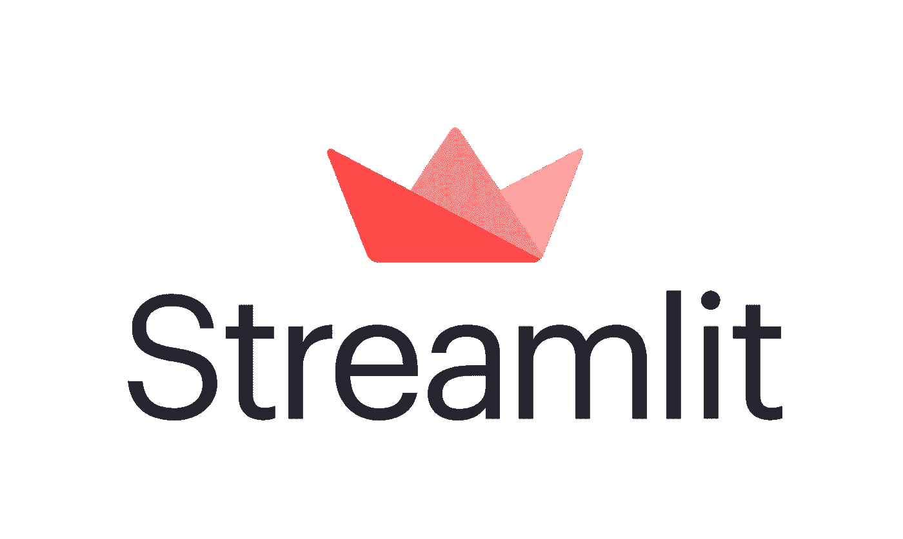
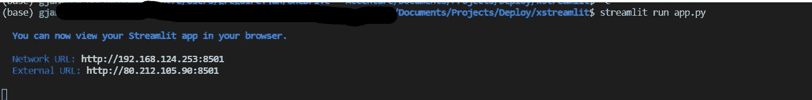
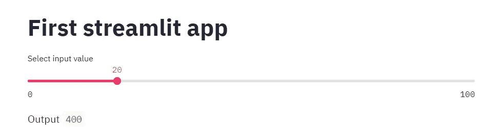
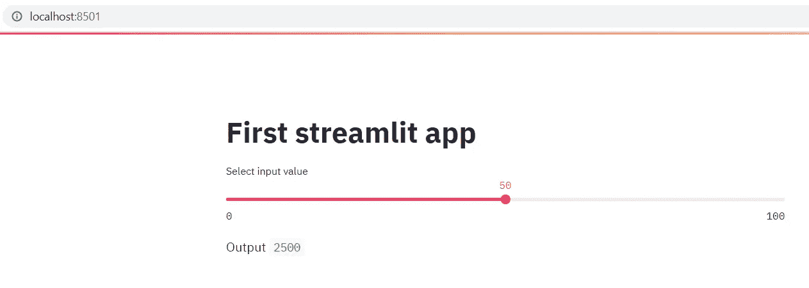

# 超越 Jupyter 笔记本

> 原文：<https://medium.com/nerd-for-tech/beyond-jupyter-notebooks-63b169c43c44?source=collection_archive---------6----------------------->

## 第 2 部分:使用 Streamlit 和 Docker 的非 ML 模型部署

欢迎学习第 2 部分。在本文中，您将学习如何使用 Streamlit 部署一个非常简单的非机器学习模型，并使用 Docker 在第 1 部分的基础上构建一个容器。

更准确地说，我们将:

*   **创建一个服务于我们模型的 web 应用**
*   **将我们的网络应用程序容器化**

我们不会用我们的非机器学习模型创建生产就绪代码，也不会用**测试我们的模型**，因为这部分已经在[第 1 部分](https://gregjan.medium.com/beyond-jupyter-notebooks-6fd11322d313)中讨论过了。



## 简化应用程序

[Streamlit](https://streamlit.io/) 是一个开源的 Python 库，可以轻松地为机器学习和数据科学(他们自己的话！).就我个人而言，我发现很容易构建一个好看的交互式应用程序非常方便。缺点是可伸缩性(考虑数据的高容量和高吞吐量)和复杂性(在这个问题上，我会使用[破折号](https://plotly.com/dash/))。

首先让我们将 *streamlit* 安装到我们的 conda 环境中:

```
conda install -c conda-forge streamlit
```

现在我们可以为应用程序本身编写代码了:

正如你所看到的，这比 Flask 应用程序要简单和整洁得多(见[第 1 部分](https://gregjan.medium.com/beyond-jupyter-notebooks-6fd11322d313))。它分为 4 个部分:

1.  导入 *streamlit* 并加载我们的*建模器*类(详情请参见[第 1 部分](https://gregjan.medium.com/beyond-jupyter-notebooks-6fd11322d313)
2.  设置应用程序的标题
3.  制作一个滑块来选择一个值 *x*
4.  打印来自类*建模器*的*预测*函数的输出，将 *x* 作为输入。它隐式地使用了一个回调函数，roles 将在输入组件的属性改变时自动调用 *predict* 。

就这样吗？是的，差不多！要启动该应用程序，只需在您的终端中输入:

```
streamlit run app.py
```

现在，您应该会看到类似这样的内容:



跟随第一个网址，它将打开你的应用程序:



我相信 20 = 400，所以该应用程序正在按预期工作。

# 用码头工人集装箱化

所以我们现在只需要一个 Docker 文件来配置我们的容器(假设已经安装了 *Docker* )。您可以将以下文件放在项目文件夹的根目录下:

这里使用的基本映像是 *python 3.7-slim* (基于 Debian)。所有运行命令都使用最新的软件包更新基础映像。正如你所看到的，第一批是专门用来在集装箱上安装*流线型*的。*docker 文件*中的两个关键行是从 *requirements.txt* 文件中复制并安装所有的 python 库。这意味着容器和本地 anaconda 环境将使用相同的库版本。要创建这个文件，请在终端中运行(您的 anaconda 环境**必须**被激活):

```
pip freeze > requirements.txt
```

然后， *COPY* 行将所有文件和文件夹复制到容器中。最后，CMD 行将通过在 app.py 作业上运行 *streamlit* 来启动 web 应用程序。

好了，现在我们都准备好了。让我们制作这个容器:

```
docker build --tag <containername> .
```

这可能需要一点时间，取决于您的连接速度。但是一旦完成，您就可以启动容器了:

```
docker run  -p 8501:8501 <containername>:latest
```

并通过在浏览器中键入 *localhost:8501* 来检查您的应用程序。



50 = 2500 似乎也差不多。

现在，我们可以将这个容器注册到任何云供应商，如 GCP、Azure、AWS 或名为 *streamlit sharing* 的 streamlit own 部署，并让全世界都可以访问它。这不包括在这里。

尽管我们的模型非常简单，但我们得到了一个外观漂亮、功能强大的 web 应用程序。Jupyter 笔记本又一次完全没有被使用。相反，我们使用生产代码和配置文件。

你可以访问我的 GitHub 回购中的所有代码:[https://github.com/GregoireJan/xstreamlit](https://github.com/GregoireJan/xstreamlit)

在下一篇文章中，我们将制作我们的第一个机器学习模型及其 Flask web 应用程序！

以下是 Jupyter 笔记本系列*之外的部分:*

*   [第 0 部分:建立一个 ML 项目](https://gregjan.medium.com/beyond-jupyter-notebooks-11af930c6bf7)
*   [第 1 部分:使用烧瓶和对接器的非 ML 模型部署](https://gregjan.medium.com/beyond-jupyter-notebooks-6fd11322d313)
*   [第 2 部分:使用 Streamlit 和 Docker 的非 ML 模型部署](https://gregjan.medium.com/beyond-jupyter-notebooks-63b169c43c44)
*   [第 3 部分:带烧瓶和对接器的 ML 模型部署](https://gregjan.medium.com/beyond-jupyter-notebooks-8fc0333517f3)
*   第 4 部分:使用 Streamlit 和 Docker 的 ML 模型部署*(未发布)*