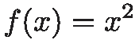
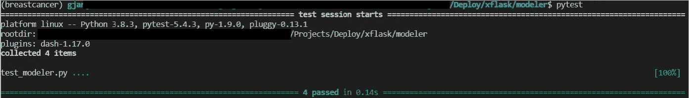
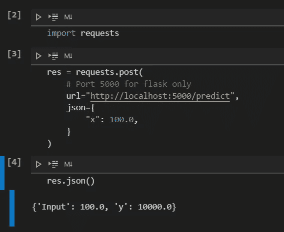
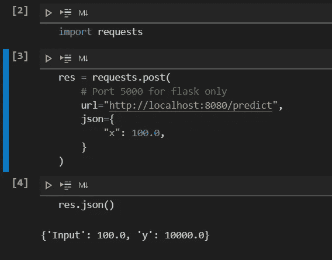

# 超越 Jupyter 笔记本

> 原文：<https://medium.com/nerd-for-tech/beyond-jupyter-notebooks-6fd11322d313?source=collection_archive---------0----------------------->

第 1 部分:使用 Flask 和 Docker 的非 ML 模型部署

欢迎学习第 1 部分。很高兴你完成了第 0 部分([第 0 部分:建立一个 ML 项目](https://gregjan.medium.com/beyond-jupyter-notebooks-11af930c6bf7))，老实说，这并不是最令人兴奋的。在本文中，您将学习如何使用 Flask 部署一个非常简单的非机器学习模型，并使用 Docker 构建一个容器。

更准确地说，我们将:

*   **用我们的非机器学习模型创建一个生产就绪代码**
*   **测试我们的模型**
*   **创建一个服务于我们模型的 web 应用**
*   **将我们的网络应用容器化**


## **非机器学习模型**

非机器学习模型看起来是这样的:



模型的简单性应该让你的注意力从建模部分移开。下面的 Python 类*建模器*什么也没做，只是返回上面的函数，将 *x* 作为*预测*函数的输入。

上面这段代码中有几个函数没有用到。其背后的原因是，我们将在下面的文章中使用相同的代码结构，而模型的复杂性将会增加。基本上，我们将在未来构建相同的代码。

## 单元测试

测试是自然的下一步，因为我们现在有了一个模型。Pytest 是一个让用 Python 写小测试变得容易的框架。要安装它，请运行:

```
conda install -c anaconda pytest
```

*Pytest* 将运行任何文件名以“test_”开头的测试代码。下面是测试我们的 Mo *deler* 类的代码:

在导入我们的 *Modeler* 类和 *pytest* 库之后，我们使用 decorator @ pytest . mark . parameterize 来定义输入值/预期输出对。在 assert 语句中，我们评估预期输出是否等于实际输出。

要启动测试，只需在终端中写入 *pytest* 。如果成功，输出应该如下所示:



## **烧瓶 app**

现在我们的测试成功了，我们可以构建我们的 web 应用程序了。你可能会问烧瓶是什么？Flask 是一个 web 应用程序的微型框架。换句话说，它让你创建一个网络应用变得容易。如果你想了解更多关于 Flask 的信息，可以查看它的网站:[https://flask.palletsprojects.com/en/1.1.x/](https://flask.palletsprojects.com/en/1.1.x/)。

让我们来分解这个程序:

1.  首先， *Flask* 类与我们的*建模器*类一起被导入。
2.  接下来，我们创建这个类的一个实例。第一个参数是应用程序的模块或包的名称。 *__name__* 是默认包。
3.  然后， *@app.route* decorator 告诉 Flask 什么 URL 应该触发我们的函数(在本例中是 *localhost:5000/predict* )并且使用的方法将是 POST。POST 请求意味着我们将向我们的 web 应用程序发送数据。
4.  然后我们进入 *post()* 函数:
    4.1。由于我们将以 JSON 格式将数据发送到我们的 web 应用程序，因此我们使用 *request.get_json()* 读取数据，并将其存储在 *data* 中。
    4.2。从*数据*中提取 *x* 的值，并存储在变量4.3 中。调用我们的*建模器*类到 *m* 中，用 *x.* 4.4 馈入函数 predict。返回 JSON 格式下的输入 *x* 和输出*预测*。
5.  最后的 *if* 条件检查我们的 Python 程序 *app.py* 已经导入。如果没有，它将通过端口 5000 在默认的*localhost*URL(127 . 0 . 0 . 1)上运行来启动 Flask 服务器。

现在，要运行我们的 Flask 应用程序，您只需在终端中编写:

```
python app.py
```

现在，您应该会看到类似这样的内容:


我们的 web 应用上没有前端。因此，如果您打开浏览器并输入给定的 URL (http://127.0.0.1:5000/)，您将得到一条**未找到**的错误消息。

也就是说，后端应该是完美的工作，我们现在可以查询我们的应用程序。我们试试吧！

这里笔记本是一个不错的选择(但不是必须的):



我们使用*请求*包将我们的 POST 请求发送到 web 应用程序。我们需要指定的只是 URL 和 JSON 格式的输入。这个模型给了我们预测值 *y = 10000* ，在我看来，这个值正好等于 *100* 。

## 用码头工人集装箱化

我们现在有一个本地 web 应用程序，它成功地部署了我们的非机器学习模型。恭喜你！

但我们希望我们的应用程序被这个世界上的每个人看到并闪耀，不是吗？我们当然知道。为此，我们引入了 *Docker* 容器。如果你不熟悉码头集装箱，就把它想象成船上的集装箱。你的程序将在一个与外部世界隔离的容器中运行，这样它就可以完全按照你的要求运行，并且完全可移植。欲了解更多信息并安装*Docker*:[https://docs.docker.com/get-docker/](https://docs.docker.com/get-docker/)

所以我们现在只需要一个 Docker 文件来配置我们的容器(假设已经安装了 *Docker* )。您可以将以下文件放在项目文件夹的根目录下:

这里使用的基本映像是 *python 3.7-slim* (基于 Debian)。所有运行命令都使用最新的软件包更新基础映像。*docker 文件*中的两个关键行是从 *requirements.txt* 文件中复制并安装所有的 python 库。这意味着容器和本地 anaconda 环境将使用相同的库版本。要创建这个文件，请在终端中运行(您的 anaconda 环境**必须**被激活):

```
pip freeze > requirements.txt
```

然后, *COPY* 行将所有文件和文件夹复制到容器中。最后，CMD 行将通过将 app.py 作业运行到 URL 0.0.0.0 和端口 8080 来启动 web 应用程序。此 URL 是一个“所有接口”地址，可通过使用 localhost 进行本地访问。

**在构建我们的容器之前，不要忘记通过取消注释第 21 行来更新 *app.py* ，以便通过端口 8080(和注释行 19)将应用程序路由到 URL 0.0.0.0。**

好了，现在我们都准备好了。让我们制作这个容器:

```
docker build --tag <containername> .
```

这可能需要一点时间，取决于您的连接速度。但是一旦完成，您就可以启动容器了:

```
docker run  -p 8080:8080 <containername>:latest
```

下一步，我们测试。在我们的本地版本中，我们可以运行以下笔记本，只需将端口从 5000 更新到 8080:



我们得到了和当地一样的回应。你成功了。恭喜你！

现在，我们可以将这个容器注册到任何云供应商，如 GCP、Azure 或 AWS，并向全世界开放。但是我不会在本文中涉及它。

尽管我们的模型非常简单，但仍然需要学习很多东西。希望这已经让您对如何部署模型有了更好的了解。除了测试我们的应用程序，Jupyter 笔记本没有被使用。相反，我们使用生产代码和配置文件。

你可以访问我的 GitHub 回购中的所有代码:[https://github.com/GregoireJan/xflask](https://github.com/GregoireJan/xflask)

在下一篇文章中，我们将使用 Streamlit 为我们的 web 应用程序创建一个漂亮的前端！

以下是 Jupyter 笔记本之外的系列*部分:*

*   [第 0 部分:设置 ML 项目](https://gregjan.medium.com/beyond-jupyter-notebooks-11af930c6bf7)
*   [第 1 部分:使用烧瓶和对接器的非 ML 模型部署](https://gregjan.medium.com/beyond-jupyter-notebooks-6fd11322d313)
*   [第 2 部分:使用 Streamlit 和 Docker 的非 ML 模型部署](/nerd-for-tech/beyond-jupyter-notebooks-63b169c43c44)
*   [第 3 部分:带烧瓶和对接器的 ML 模型部署](https://gregjan.medium.com/beyond-jupyter-notebooks-8fc0333517f3)
*   第 4 部分:使用 Streamlit 和 Docker 的 ML 模型部署*(未发布)*