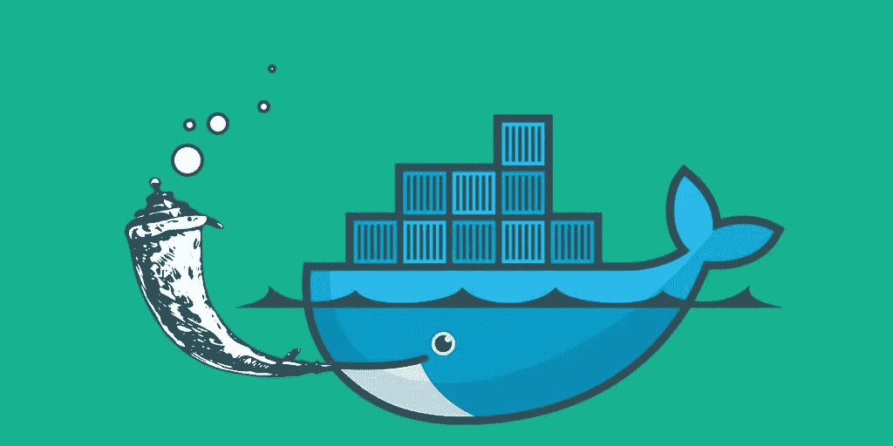
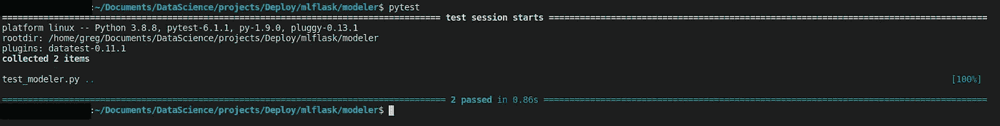
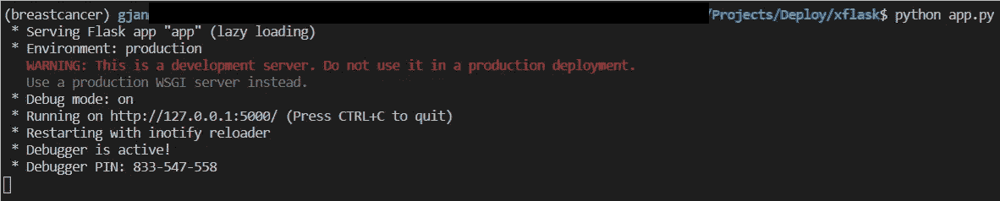
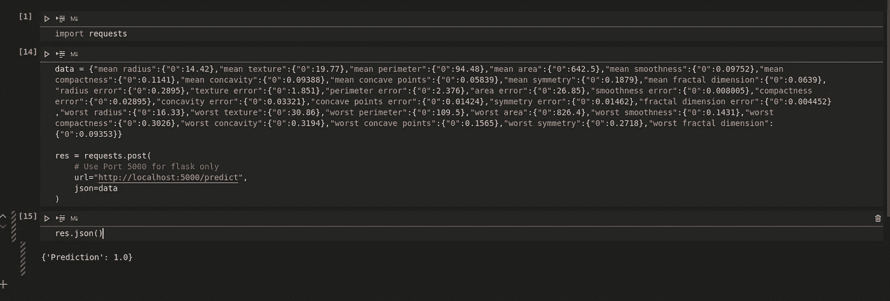
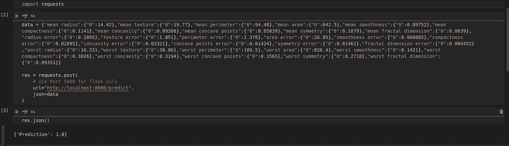

# 超越 Jupyter 笔记本

> 原文：<https://medium.com/nerd-for-tech/beyond-jupyter-notebooks-8fc0333517f3?source=collection_archive---------7----------------------->

## 第 3 部分:使用 Flask 和 Docker 的 ML 模型部署

欢迎学习第 3 部分。在这一部分，我们将最终使用一个 ML 模型！这篇文章广泛引用了[第 1 部分:使用 Flask 和 Docker 的非 ML 模型部署](https://gregjan.medium.com/beyond-jupyter-notebooks-6fd11322d313)，所以我建议你在进入下面的步骤之前先阅读一下。在本文中，您将学习如何使用 Flask 部署一个非常简单的机器学习模型，并使用 Docker 在一个容器中运行它。

更准确地说，我们将:

*   **用我们的机器学习模型创建一个生产就绪代码**
*   **测试我们的模型**
*   **创建一个服务于我们模型的 web 应用**
*   **将我们的网络应用容器化**



## 机器学习模型

乳腺癌数据集是一个经典且非常简单的二进制分类数据集([https://sci kit-learn . org/stable/modules/generated/sk learn . datasets . load _ breast _ cancer . html](https://scikit-learn.org/stable/modules/generated/sklearn.datasets.load_breast_cancer.html))。机器学习的目标是预测患者是否患有乳腺癌。

我不会在本文中讨论探索数据分析，因为这不是本系列的重点。关于那件事我推荐查一下下面的笔记本:[https://www . ka ggle . com/rcfreitas/python-ml-breast-cancer-diagnostic-data-set](https://www.kaggle.com/rcfreitas/python-ml-breast-cancer-diagnostic-data-set)。

假设我们已经完成了上面的 EDA，并基于一些度量评估决定了预处理和模型算法。所以我们现在已经准备好让我们的代码生产变得友好:

正如我们在前面的文章中看到的，我们的生产代码使用了四个函数，分别用于加载数据、处理数据、拟合模型和预测结果。

*   *__init__()* 函数从 Scikit-learn 加载数据集，并将其转换为 Pandas 数据帧。
*   *prepro()* 函数是 EDA 的直接结果。进行列选择和跨列缩放是为了提高预测的质量。 *if* 条件将预处理与拟合过程或预测分开。这背后的原因是用于拟合我们的模型的历史数据集包含目标特征，而用于预测的数据集不包含目标特征。
*   *fit()* 函数将数据集分为训练和测试数据，然后在没有超参数调整的情况下训练 Scikit-learn 的随机森林分类器模型，从而使用默认的超参数(超参数调整将在后续文章中介绍)。如果模型提供了足够准确的结果(在这种情况下使用了准确性度量)，那么模型被转储到*。joblib* 格式的文件。否则程序会引发异常并停止。
*   *预测()*函数读取一个数据帧作为输入，并将其通过*预处理()*函数。然后，我们加载我们的模型，并使用它来预测和返回结果。

## 单元测试

测试是自然的下一步，因为我们现在有了一个模型。 *Pytest* 是一个让用 Python 写小测试变得容易的框架。要安装它，请运行:

```
conda install -c anaconda pytest
```

*Pytest* 将运行任何文件名以“test_”开头的测试代码。下面是测试我们的 Mo *deler* 类的代码:

第一个测试函数 *test_modeler_model()* 在从我们的 *modeler.py* 代码中运行 *fit()* 函数后断言模型是否被转储。

第二个 *test_modeler_output()* 断言预测的结果是 0 还是 1(即患者是否患有癌症)。装饰器*@ py test . fixture(scope = ' module ')*允许我们使用 fixture 函数作为测试函数的输入参数，并且该输入参数已经是返回对象(我推荐在 pytest [中阅读更多关于 fixture 的内容，这里是](https://betterprogramming.pub/understand-5-scopes-of-pytest-fixtures-1b607b5c19ed))。

要启动测试，只需在终端中写入 *pytest* 。如果成功，输出应该如下所示:



## 烧瓶应用程序

现在我们的测试成功了，我们可以构建我们的 web 应用程序了。你可能会问烧瓶是什么？Flask 是一个 web 应用程序的微型框架。换句话说，它让你创建一个网络应用变得容易。如果你想了解更多关于 Flask 的信息，可以查看它的网站:[https://flask.palletsprojects.com/en/1.1.x/](https://flask.palletsprojects.com/en/1.1.x/)。

让我们来分解这个程序:

1.  首先， *Flask* 类与我们的*建模器*类一起被导入。
2.  接下来，我们创建这个类的一个实例。第一个参数是应用程序的模块或包的名称。 *__name__* 是默认包。
3.  然后， *@app.route* decorator 告诉 Flask 什么 URL 应该触发我们的函数(在本例中是 *localhost:5000/predict* )并且使用的方法将是 POST。POST 请求意味着我们将向我们的 web 应用程序发送数据。
4.  然后我们进入 *post()* 函数:

*   因为我们将把数据以 JSON 格式发送到我们的 web 应用程序，所以我们使用 *request.get_json()* 读取它，并将其存储在*数据*中。
*   将*数据*从 JSON 转换为 pandas 数据框。
*   将我们的*建模器*类调用到 *m.*
*   如果模型不存在，运行 *fit()* 功能。
*   运行 *predict()* 函数，返回 JSON 格式的输出*预测*。

5.最后的 *if* 条件检查我们的 Python 程序 *app.py* 已经导入。如果没有，它将通过端口 5000 在默认的*localhost*URL(127 . 0 . 0 . 1)上运行来启动 Flask 服务器。

现在，要运行我们的 Flask 应用程序，您只需在终端中编写:

```
python app.py
```

现在，您应该会看到类似这样的内容:



我们的 web 应用上没有前端。因此，如果您打开浏览器并输入给定的 URL (http://127.0.0.1:5000/)，您将得到一条**未找到**的错误消息。

也就是说，后端应该是完美的工作，我们现在可以查询我们的应用程序。我们试试吧！

这里笔记本是一个不错的选择(但不是必须的):



我们使用*请求*包将我们的 POST 请求发送到 web 应用程序。我们需要指定的只是 URL 和 JSON 格式的输入。该模型给出了预测 1，这意味着给定的输入参数预测患者患有乳腺癌。

## 用码头工人集装箱化

我们现在有一个本地 web 应用程序，它成功地部署了我们的非机器学习模型。恭喜你！

但我们希望我们的应用程序被这个世界上的每个人看到并闪耀，不是吗？我们当然知道。为此，我们引入了 *Docker* 容器。如果你不熟悉码头工人集装箱，就把它想象成船上的集装箱。你的程序将在一个与外部世界隔离的容器中运行，这样它就可以完全按照你的要求运行，并且完全可移植。欲了解更多信息并安装*Docker*:[https://docs.docker.com/get-docker/](https://docs.docker.com/get-docker/)

所以我们现在只需要一个 Docker 文件来配置我们的容器(假设已经安装了 *Docker* )。您可以将以下文件放在项目文件夹的根目录下:

这里使用的基本映像是 *python 3.7-slim* (基于 Debian)。所有运行命令都使用最新的软件包更新基础映像。*docker 文件*中的两个关键行是从 *requirements.txt* 文件中复制并安装所有的 python 库。这意味着容器和本地 anaconda 环境将使用相同的库版本。要创建这个文件，请在终端中运行(您的 anaconda 环境**必须激活**):

```
pip freeze > requirements.txt
```

然后， *COPY* 行将所有文件和文件夹复制到容器中。最后，CMD 行将通过将 app.py 作业运行到 URL 0.0.0.0 和端口 8080 来启动 web 应用程序。此 URL 是一个“所有接口”地址，可通过使用 localhost 进行本地访问。

**在构建我们的容器之前，不要忘记**通过取消注释第 25 行来更新 *app.py* ，以便通过端口 8080(和注释行 27)将应用程序路由到 URL 0.0.0.0。

好了，现在我们都准备好了。让我们制作这个容器:

```
docker build --tag <containername> .
```

这可能需要一点时间，取决于您的连接速度。但是一旦完成，您就可以启动容器了:

```
docker run  -p 8080:8080 <containername>:latest
```

下一步，我们测试。在我们的本地版本中，我们可以运行以下笔记本，只需将端口从 5000 更新到 8080:



我们得到了和当地一样的回应。你成功了。恭喜你！

现在，我们可以将这个容器注册到任何云供应商，如 GCP、Azure 或 AWS，并向全世界开放。但是我不会在本文中涉及它。

这是一个简单的机器学习模型，但它允许我们经历制作生产就绪代码的各个步骤。下面是我们所做工作的简要总结:

*   找出什么样的预处理和机器学习模型能够提供预测乳腺癌的最佳准确性(我们没有自己做，但使用了 EDA 完成的工作[这里](https://www.kaggle.com/rcfreitas/python-ml-breast-cancer-diagnostic-data-set))。
*   在 *Modeler()* 类中实现了加载数据、处理数据、拟合模型和预测结果的所有步骤。
*   使用 *pytest* 实现了一个单元测试，以确保 *Modeler()* 类按预期工作。
*   创建了一个 flask 应用程序，我们可以使用它来输入新数据并获得预测。
*   在本地和 Docker 容器中运行 flask 应用程序

你可以访问我的 GitHub 回购中的所有代码:[https://github.com/GregoireJan/xflask](https://github.com/GregoireJan/mlflask)

现在，您可能想知道当我们进行更改、自动运行单元测试、警告错误、重新运行装配过程时，如何自动部署我们的项目……这个主题(CI/CD 和编排)将是另一篇文章的焦点。

在下一篇文章中，我们将使用 Streamlit 为我们的 web 应用程序创建一个漂亮的前端！

以下是 Jupyter 笔记本之外的系列*部分:*

*   [第 0 部分:设置 ML 项目](https://gregjan.medium.com/beyond-jupyter-notebooks-11af930c6bf7)
*   [第 1 部分:使用烧瓶和对接器的非 ML 模型部署](https://gregjan.medium.com/beyond-jupyter-notebooks-6fd11322d313)
*   [第 2 部分:使用 Streamlit 和 Docker 的非 ML 模型部署](https://gregjan.medium.com/beyond-jupyter-notebooks-63b169c43c44)
*   [第 3 部分:带烧瓶和对接器的 ML 模型部署](https://gregjan.medium.com/beyond-jupyter-notebooks-8fc0333517f3)
*   第 4 部分:使用 Streamlit 和 Docker 的 ML 模型部署*(未发布)*