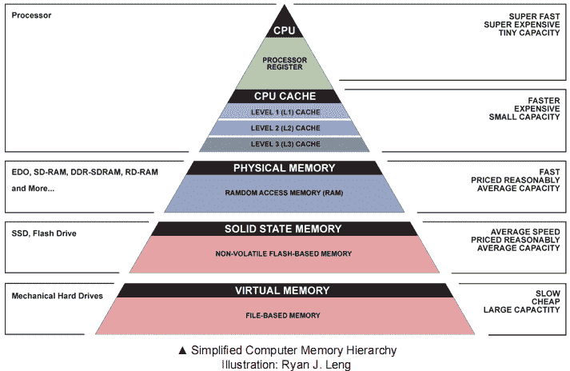
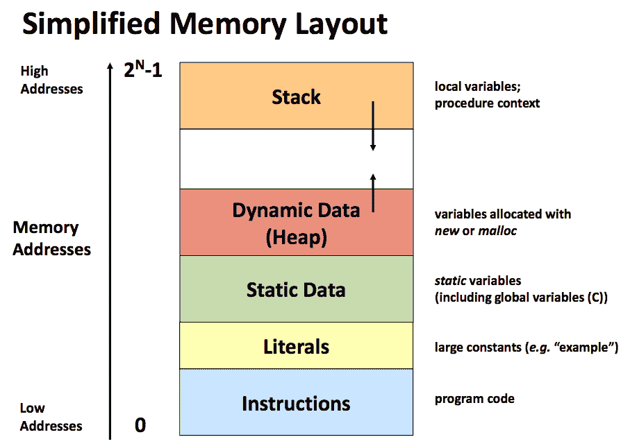

# 超越训练营:软件如何看待内存？

> 原文：<https://medium.com/nerd-for-tech/beyond-the-bootcamp-how-does-software-look-at-memory-5b8b9d88ce7f?source=collection_archive---------15----------------------->

欢迎回到另一个版本的超越训练营！

今天，我们来看看软件是如何与内存接口的。我们将快速回顾一下硬件方面的情况，然后直接进入 Java 或 Ruby 等编程语言如何处理内存。

## 硬件如何看待内存？

回想一下本模块第一版中的图表:

当我们的程序执行时，操作系统代表程序与硬件接口，以找到正确的数据位来成功地执行程序。它首先查看 CPU 中的进程寄存器，以查看数据是否在其中，如果没有找到数据，它将尝试在后续层中一直找到该数据，直到找到基于文件的内存。那么，语言是如何与硬件接口的呢？

## 软件是如何与内存交互的？

下面的图表说明了软件看到的内容:

乍一看，这可能有点令人不知所措，所以让我们来分解一下。在左手边，我们有地址空间。地址用十六进制表示。低位地址从 0 开始，一直到最大地址 0XFFFFFFFF (2^n-1，其中 n 取决于您运行的系统架构)。

我们将在本模块中讨论的两个主要部分是堆栈和堆。

在最顶端的右侧，我们有所谓的**堆栈**。堆栈负责存储可以存储在 CPU 寄存器中的局部变量，如整数、浮点、双精度和长整型。在您的编程生涯中，您可能在使用递归编程时遇到过堆栈溢出错误。这就是它的由来！

对于像 int 和 longs 这样的简单变量，这些变量被复制到堆栈上。所以当调用 changeNum(f)时，整数 f 被复制到堆栈上。当在 changeNum 中更改 f 时，该整数与 main 方法中声明的整数不同。这种将参数复制到堆栈上的行为通常被称为通过值进行**调用。**

与**堆形成对比。**堆是程序分配数据块的地方，这些数据块可以在当前方法之外变异。数组就是一个例子。让我们看一个代码片段来演示:

在 Java 中，每当我们调用 **new** 时，我们明确地告诉 Java 在堆上为这个数组留出一些地址空间，我们希望在软件中引用它。当我们将 num 传递给 setToAllOnes 时，它会发送一个对内存地址的引用。整个 nums 数组不会复制到堆栈上。这通常被称为**引用调用**，因为我们不是调用复制的值，而是调用对内存地址的引用。

在没有类型的其他语言中，比如 Ruby 或 Python，尽管作为程序员我们不会显式地调用 new，但运行时会在幕后为我们做这件事。观察:

**更改号码:**

**换阵:**

虽然这个方案听起来很棒，但可能会出现的一个自然问题是，我们会耗尽内存吗？如果我们用完了内存会发生什么？程序崩溃了吗？我们将解开所有这些问题以及更多！

## 我们会耗尽内存吗？

在程序的整个执行过程中，内存不断地分配到堆上。如果您有一个长时间运行的应用程序，比如一个不断接受请求、查询数据库并使用大量内存的服务器，会发生什么情况？

早在最初创建像 C 这样的编程语言的时候，程序员就必须手动释放对空闲内存的引用。不幸的是，当程序员不负责任，不释放内存时，他们就会产生**内存泄漏。**

当进程不再使用堆上的空间，但意外地将其标记为已用时，就会发生内存泄漏。这导致了一个巨大的问题，因为如果有一个长时间运行的进程没有释放内存，程序将继续运行，直到进程耗尽内存。如果进程用完了内存，它将开始将内存块写到磁盘上，并在一个名为**交换**的过程中交换位。

如果我们回头看看我们的层次结构，我们可以看到磁盘位于金字塔的底部，这意味着它的访问速度非常慢。为了确保我们编写高性能的应用程序，我们应该总是确保在不需要的时候不使用内存。那么编程语言如何避免内存耗尽呢？

## 介绍垃圾收集！

在大多数现代语言中(想想 Python、Javascript、Ruby 和 Java) **垃圾收集**指的是进程回收内存的行为。相比之下，其他语言，如 C 和 C++没有垃圾收集，依赖程序员自己释放内存。

在 C 语言中，有一个叫做 **malloc** 的特殊方法，代表内存分配。它类似于 Java 的**新**构造，除了 C 程序员必须调用 **free** 来释放内存。在这种方法中，程序员对何时释放内存有更多的控制，但是如果程序员忘记调用 **free** 来避免耗尽内存**，这可能会导致内存泄漏。**

然而，在使用垃圾收集的语言中，该语言负责判断是否存在对该内存地址的引用。该语言有效地保持了对每个内存地址引用的映射。一旦达到 0，它就可以安全地从堆中释放那个内存地址。让我们以这段代码为例来看看:

在 myFancyMethod 退出后，Java 垃圾收集器发现不再有对数组 foo 的引用。所以它继续从堆中释放与 foo 相关的内存地址！

## 厉害！所以我们再也不用担心内存了，对吗？

没那么快！虽然这种语言将为我们管理内存是件好事，但我们仍然需要理解它是如何工作的，这样我们才不会导致不必要的内存泄漏。在下一期，我们将看看垃圾收集是如何出错的。下次见！