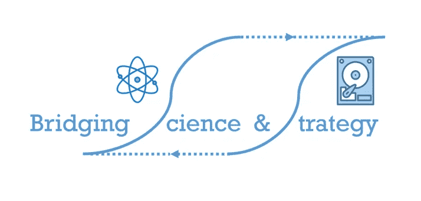
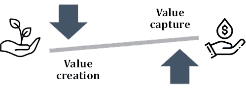
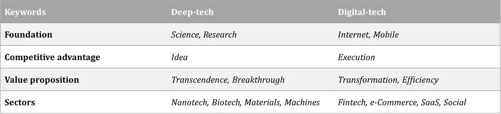
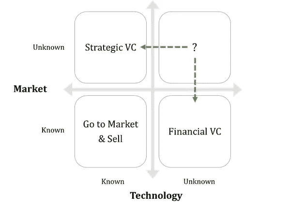
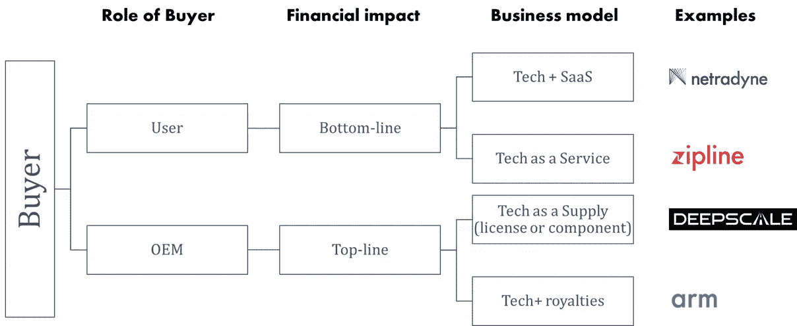
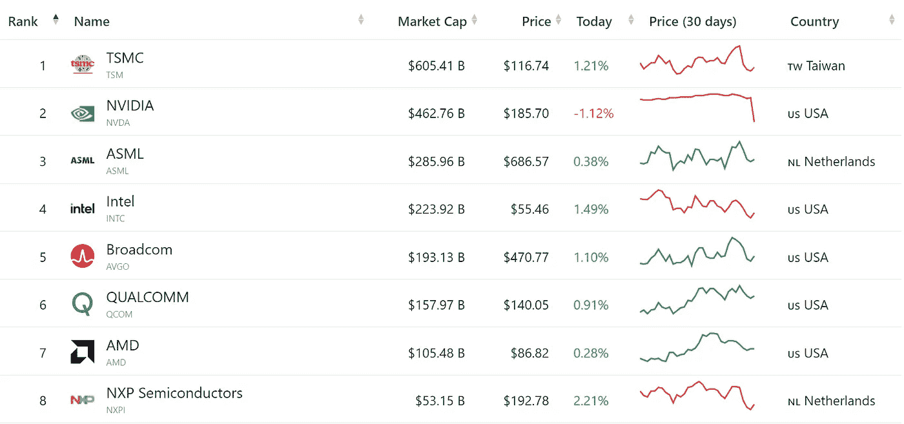
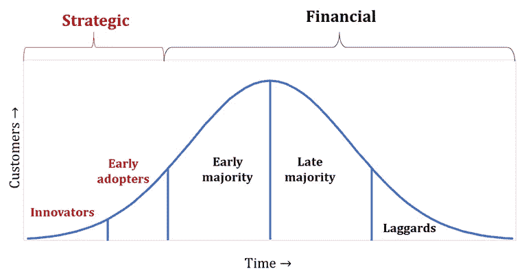
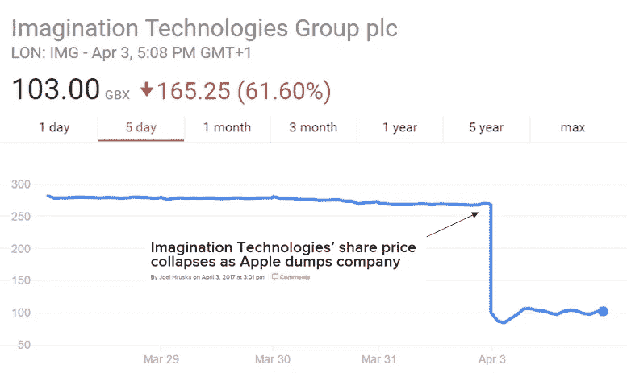
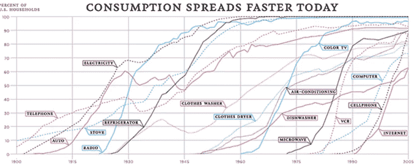

# 超越科学:捕捉 B2B 高科技领域的价值

> 原文：<https://medium.com/nerd-for-tech/beyond-the-science-capturing-value-in-b2b-deep-tech-sector-11b1f8536658?source=collection_archive---------7----------------------->

***简介。*** 与众不同。它们的典型特征是强大的科学和研究基础。此外，最近关于深度技术进化的叙述是，它不仅影响多个垂直领域，如医疗保健、移动性、能源等。但是也有希望为全球问题提供**可持续的解决方案**，例如气候变化。考虑到这一前提，显然需要理解的不仅仅是围绕这些技术的科学。

一家新的科技企业所做的一切都可以分为两类——创造价值和获取价值。对于高科技创业公司来说，**创造价值的活动优先** &显然如此。然而，除非在一个潜在的巨大的&增长市场中建立一个令人信服的用例，否则编织一个成功的故事将成为一项艰巨的任务。对于潜在客户来说，深度技术的本质决定了选择并不总是显而易见的。因此，即使在商业化的早期阶段，高科技想法的成功率也非常低。

在高科技初创企业中，规模向价值创造活动倾斜

因此，解码战略、销售和市场趋势同样重要。详尽无遗是不可能的，但是，对于早期的 deep-tech，有几个类别是必不可少的。了解有效管理有限资源(时间和资本)的选项总是更好。

***投资人*** *。虽然在过去的二十年里，对基础科学发现的投资有所放缓，但对数字技术的投资却呈爆炸式增长。然而，数字技术的扩散归功于互联网和高科技的发展——尤其是在数据处理、存储和通信方面。*

下表根据相关的关键字区分了这两种技术

数字技术可用的风险资本(VC)投资选择是巨大的，因为许多这些风险投资是专注于消费者或商业功能的软件平台。一个人不需要深入钻研就能理解问题解决方案的适用性&此外，他有围绕价值主张的个人经验。另一方面，Deep-tech 有几个特点，会劝阻一些人提供前期投资，如下所列。

1.  深入的领域知识
2.  资本要求—即使在早期阶段也难以启动
3.  更长的酝酿期，更长的视野
4.  更高的风险、更大的不确定性—交付周期、制造等。
5.  价值链动态——上游利润更低

所有上述因素听起来都像是一个纯粹的金融风险投资者会警惕的事情，不是因为缺乏兴趣，而是因为“未知”。相反，企业风投不会被这些因素所拖累，因为这正是企业研发团队日复一日所做的事情。为了不错过任何前沿技术，许多公司都有一只活跃的、在某些情况下独立管理的基金(在公司资产负债表之外)，用于投资初创公司。

**“未知”矩阵**从投资者的角度看早期技术创意

深度技术通常会落在左上角的方框中。战略投资者或公司风投更善于识别和投资这类有巨大前景但尚未找到可行市场的技术。另一方面，大多数金融风险投资会专注于低风险市场，只要技术可行，他们就不会觉得有必要了解技术的本质。数字技术的想法将属于这一类。无论如何，投资者必须相信，技术或市场是潜在的赢家(加上创始人的可信度)，他们才会下注。

***商业模式。*** 在 deep-tech (B2B)中，对客户的价值主张可以是知识产权，也可以是实体产品(设备或组件)。根据技术和客户的使用案例，下面的一种收入模式可能非常适合。每种货币化方法都有其利弊。但是，决策主要取决于解决方案对客户业务的重要性，而这又取决于客户对以下问题的回答:

a)技术是否会影响他们的顶线或底线？

b)购买是战略决策还是财务决策？

c)是否会影响他们的产品或运营？

d)价值主张是由技术还是技术本身提供的服务？

(e)就送达而言，是永久使用还是间歇使用？

e)这是否会直接或间接影响他们的品牌？

f)最后，是否是有价值的、稀有的、独家的技术或 IP？

简而言之，高科技商业模式

1.  ***科技作为供给或输入***——这是最简单的模型。客户付款购买产品，该产品可能是他们销售的最终产品的一个组件或一部分。这是一个典型的 B2B 供应商-客户关系。示例包括软件许可证或硬件组件、附件，如高级传感器、处理器或 OEM 的其他组件。这是针对一个客户的每个产品的一次性交易。然而，同一个软件许可证可以卖给多个原始设备制造商。该软件不同于典型的 SaaS 产品，因为它嵌入了特定领域的知识。
2.  ***技术即服务*** —客户支付一次性或固定时间段的技术使用费用。当客户由于高资本支出而不想拥有该技术时，或者当使用不可预测时，这种模式是有意义的。典型的例子包括技术基础设施即服务，如无人机即服务、机器人即服务、AR/VR 系统即服务，以完成企业的特定任务。这是许多客户之间的一次性交易。
3.  ***技术加 SaaS*** —客户一次性支付技术费用，并支付经常性费用以查看技术的性能、影响和其他指标—即服务。大多数情况下，这种技术将是一个平台，比如在它上面有 SaaS 的硬件。典型的例子包括支持人工智能的摄像头或其他传感器融合方法，以收集数据并在云仪表板上为车队、制造、仓库等企业提供数据分析&等。对于每个客户来说，这是一个一次性交易和一个经常性交易。
4.  ***技术加专利费*** —客户一次性支付技术费用和经常性费用，该费用为客户使用该技术所实现销售额的%。这里的技术是一个独特的知识产权，对于客户的业务来说非常重要，可以获得经常性收入，这对任何技术来说都不是一件容易的事情。最受欢迎的例子来自半导体行业——芯片设计的知识产权许可，甚至 EUV(极端紫外线)的概念，用于 ASML 的光刻工具，没有这些我们无法想象摩尔定律能够维持&处理器性能的提高。这是每个产品的一次性许可费，外加每个客户的经常性版税。每位客户的销售额(美元)必须很高，版税才有意义——因为原始设备制造商的数量是有限的。

对于上面的前两种模式，与客户的关系是事务性的，因此，作为技术提供商，客户是可替换的。具有经常性收入(加上资本支出)的后两种模式不仅在财务上是理想的，而且也验证了技术的重要性。这些合作是战略性的，是客户品牌和产品的组成部分。对于任何高科技企业来说，向经常性收入的转变表明向价值捕捉的倾斜。OEM 买家的一个有趣的方面是，他们有时倾向于成为供应商的竞争对手。因此，如果一个人想要控制皇室，他必须是国王，领先于任何竞争对手。

***半导体价值链中供应商议价能力的案例。*** 最初，成为高科技供应商似乎不是什么好主意。诸如材料科学中的基本思想可能会在大多数价值链的错误一端结束，远离最终用户，利润微薄。然而，也有一些典型的供应商垄断利润池的异常现象，如个人电脑行业的英特尔。不过，这并没有自然而然地转化为智能手机时代的主导地位。现在，当我们听到半导体芯片短缺的消息时，半导体生态系统中最有价值的公司是 TSMC 和 ASML，它们再次处于价值链的所谓“错误”端。
应该注意的是，这些都是异常值，而不是趋势。作为一个已经处于尖端行业的供应商，只有当技术为他们所专有时，他们才能获得更高的利润，这总是几十年研究&学习曲线的结果。

市值最大的半导体公司( [ref](https://companiesmarketcap.com/semiconductors/largest-semiconductor-companies-by-market-cap/) )

**深度技术采用。**技术销售是一个社会过程，deep-tech 也不例外。即使在 B2B 深度技术销售中，也是个人或一群个人购买，公司提供资源。这些销售周期可能漫长、复杂、痛苦——很多时候是没有回报的。

然而，B2B 深度技术销售的一个关键区别是，决策从来都不是纯粹的财务决策——必须有最高领导层的战略授权才能采用新颖的尖端技术。记住这一点，在早期阶段，将自己的资源用于获取具有战略意图的客户是有意义的。

深度技术的技术采用曲线

让我们使用 B2B deep-tech 的技术采用曲线——曲线下的总面积代表 TAM(总目标市场)。然而，一组点代表每个客户，而不是单个点。所有的竞争产品和替代产品都在争夺同一块蛋糕。

对于深度技术，创新者、早期采用者以及可能是早期大多数用户都必须具有战略眼光。

1.  理想情况下，“创新者”必须是中小企业。潜在的中小企业客户可能会为了自己的利益而寻找与深度技术提供商的合作伙伴关系，以吸引投资者、创新用户或仅仅通过差异化获得一些牵引力，而深度技术初创公司则可以验证其技术和功效。这是一个双赢的局面，因为力量是平衡的。
2.  对于某些技术和知识产权，追逐企业可能更有意义。在这些情况下，技术堆栈必须与 OEM 产品集成。[蓉城](https://www.morningbrew.com/emerging-tech/stories/2021/07/23/argo-deepens-miami-austin-roots-lyft-partnership?email=ajeeshsahadevan@gmail.com&__cf_chl_jschl_tk__=pmd_99300608ac6cfde14bfd2e159bebe2025947ff44-1627128122-0-gqNtZGzNAqKjcnBszQj6)，能够确定&采用这种方法，而不是多此一举，那会浪费时间&资源。
3.  如果不过河拆桥，就需要警惕无休止的定制请求、多次迭代、漫长的购买周期，或者在早期阶段整合所有资源而失去销售惯性。

尽管如此，一旦跨越了鸿沟，超过 15%的 TAM 采用了技术，企业就是要走的路，要成为市场领导者。前两个阶段的经验必须转化为“财务”或价值驱动型细分市场的令人信服的价值主张。

***半导体价值链中买方议价能力的案例。在早期阶段，高科技创业公司可以把所有鸡蛋放在几个篮子里。然而，随着企业的成长，它需要警惕对一两个关键客户的过度依赖。Imagination technologies (IMG，为早期 iPhones 设计图形处理器的半导体知识产权提供商)经历了惨痛的教训。当苹果决定抛弃 IMG，在内部制造芯片时，其股价暴跌，除了出售之外别无选择。这里的平衡对于任何类型的专利或知识产权侵权之争来说都过于不平衡。***

即使对成熟的公司来说，依赖少数几个关键客户也是有风险的

***深度科技风险投资是一场持久战*** ，有些创意需要几十年才能成功商业化&规模化。下面是半导体和电子行业的两个案例(占全球研发支出的 22%)。

1.  硬盘的发展提供了技术快速发展的经典范例。巨磁电阻的发现(GMR，1987)是自旋电子学的一个重大突破。然而，它的商业化花了十多年的时间。发现者确实通过授权获得了一大笔财富，并最终获得了 2007 年的诺贝尔物理学奖。这项技术需要重大的商业化开发，其中大部分是在 20 世纪 90 年代由 IBM 研究实验室完成的。
2.  20 世纪 90 年代的另一项发展是 ARM 开创的 RISC(精简指令集计算机)架构。ARM 芯片最初是一种面向利基应用的芯片设计技术，如今全球 90%以上的智能手机都采用 ARM 芯片设计。事后看来，更简单的芯片设计(用于低功耗应用)的概念是一个绝妙的主意，直到智能手机的普及以著名的 iPhone 发布为开端，英特尔才意识到这一点。

但仍有两种趋势持续了几十年，对有抱负的高科技企业家来说绝对是鼓舞人心的。

1.  *行业动态*:现有的市场领导者现在很谨慎，因为根据历史数据(财富 500 强或顶级市值排行榜)，顶级排名不能想当然。其结果是，许多企业风险基金已经成立，并等待被收购。
2.  *消费者动态*:在过去的几十年里，消费者技术的采用率快速增长，这一速度将会持续下去。即使在消费电子产品中，也有很多嵌入式高科技解决方案。

一图百年科技进军( [ref](https://www.theatlantic.com/technology/archive/2012/04/the-100-year-march-of-technology-in-1-graph/255573/) )

最后，技术确实让我们的生活变得更容易，而且，这样的想法并不缺乏。然而，我们真正需要的是让我们和这个星球上的所有生命更加可持续发展的想法——为了让这成为可能，科学和战略必须携手并进。