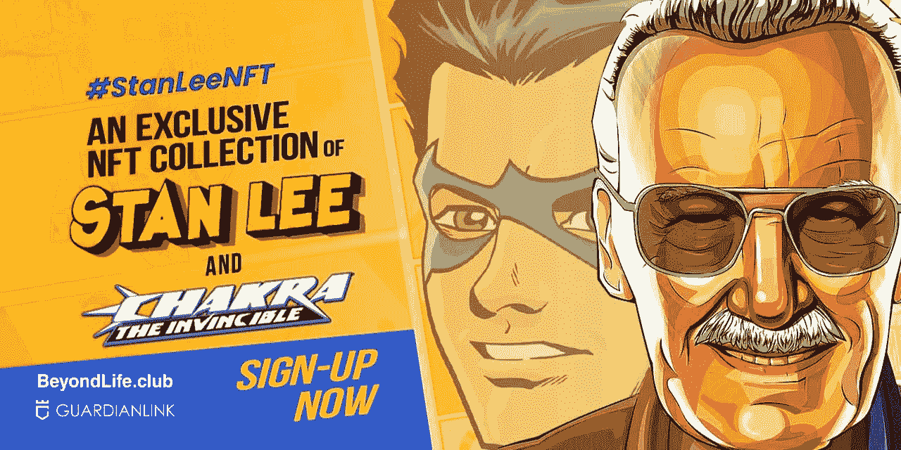

# BeyondLifeClub 呼吁斯坦·李的查克拉年底推出

> 原文：<https://medium.com/nerd-for-tech/beyondlifeclub-calls-on-stan-lees-chakra-for-year-end-launch-8befc973db4b?source=collection_archive---------3----------------------->

> 超越生命。俱乐部(全 NFT 发射台)与斯坦·李的 POW 娱乐公司和 Orange Comet 合作，在新年前夕推出 Chakra 无敌 NFTs。

T 年终发布对任何产品都意义重大，无论是移动应用还是不可替代的代币(NFT)。因为它体现了节日的核心部分，人们更喜欢疯狂消费。如果我说某项支出会产生长期价值呢？！一个这样的东西是 [**斯坦·李的查克拉无敌 NFTs**](https://chakra.beyondlife.club/?fsz=home) ，它将驱动巨大的效用(当然)。

最近几个月，随着人们利用支撑加密货币的区块链技术赋予数字艺术全新的意义，不可替代的代币市场蓬勃发展。《NFT 宇宙》也在漫画行业引发了争论，似乎一家主要的漫画出版商也加入了这场争论。

## 📌**关于查克拉 NFTs**

> 12 月 14 日，斯坦·李仍然活跃的推特账户发布了一条关于查克拉无敌 NFTs 的公告。斯坦·李 POW 娱乐公司、Orange Comet 和 BeyondLife 的三重奏。俱乐部(由 GuardianLink 提供动力)正在赋予尚未出版的印度超级英雄生命，在新年前夕(为期 3 天的拍卖)投放。

一旦推出，查克拉无敌 NFT 作为报酬，给予持有者额外的奖励，同时上市。似乎有一个像 ERC-721 和 ERC-1155 标准的组合赋予他们。

明确一点，参与查克拉 NFT 拍卖不需要任何密码；相反，你可以用法定货币购买。但是，不可避免的是，你必须掏钱去参加全 NFT 拍卖。在与阿米特巴·巴强的 NFT 一起打破纪录后，超越生命。俱乐部已经准备好用斯坦·李的查克拉无敌 NFTs 来标志它的突出地位。

👉**告诉我更多信息** ❗

✅ **直接来自传奇人物斯坦·李**

斯坦·李的 POW 娱乐公司和 BeyondLife.Club 一起领导了这次 NFT 发布会。所以，我不认为有任何怀疑的余地！随着查克拉 NFT 推出，你可以拥有限量版的独家超级英雄收藏品(你可以永远享受！).

✅ **超越生命。你去过的俱乐部**

无论你喜欢普通的、稀有的还是超稀有的 NFT 收藏品，超越生命。俱乐部提供各种类别的数字收藏品(包括你最喜欢的)。买家/收藏家可以在各种市场上展示他们的 NFT 作品集来赚钱。在网页上浏览你的虚拟脉轮世界，很快就有机会使用手机应用程序！

✅ **买/卖**

超越生命。俱乐部的反 rip 人工智能 Spyder 技术，您可以保护您的数字资产免受网络盗窃。增强现实(AR)功能可以帮助你虚拟化自己和印度超级英雄的脉轮。

在市场上，你可以和其他收藏家进行买卖和交易。如果你错过了一个数码收藏品，不要害怕！你可以浏览二级市场寻找你需要的收藏品，或者你可以选择出售或交换你拥有的任何收藏品！

斯坦李的脉轮 NFT

## **如何为❓的 NFT 发布做准备**

超越生命。俱乐部是一个将 NFT 爱好者聚集在一起的媒介，launchpad 的重点更多地是名人、艺术家等。用户将享受到合法性协议、反 rip spyder 技术等前卫技术(由 GuardianLink 提供支持)。

纪念斯坦·李 99 岁生日， [**超越生命。俱乐部**](https://chakra.beyondlife.club/?fsz=home) 已经安排了 12 月 28 日的 NFT 下降，随后是为期 3 天的拍卖，直到 2021 年 12 月 30 日。

密切关注超生。俱乐部的社会处理和不和谐社区了解更多信息。