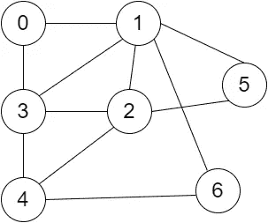
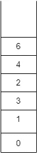
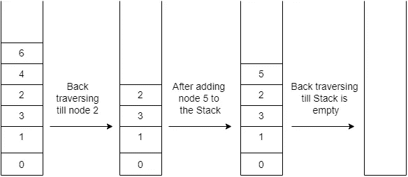
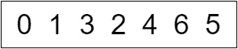
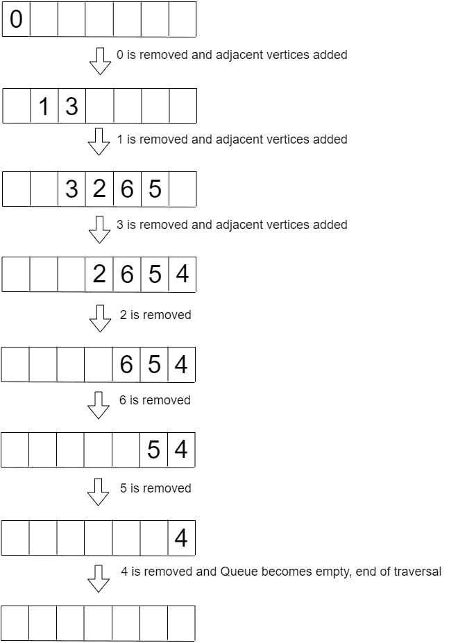
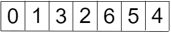

# BFS 和外勤部

> 原文：<https://medium.com/nerd-for-tech/bfs-and-dfs-6abde74daace?source=collection_archive---------3----------------------->

> 不熟？？？让我们在这里讨论广度优先搜索(BFS)和深度优先搜索(DFS)算法！！！

# DFS？？？

在这里，我们不探索下一层周围的顶点，而是深入到图形的深度。我们深入探索连接到源节点的节点，我们开始遍历，直到最后一个节点。

当遍历时，我们经常被 DFS 图中的节点级别所迷惑。我们假设如果节点位于彼此之上，则它们处于不同的层，并且不在搜索深度内。 ***DFS 不是遍历图形的各个层，而是从一个源节点深入到最后一个节点。***

> 因此，不要因为看到图是如何绘制的而感到困惑，而是考虑连接到源节点的节点，并更深入地探索该路径。
> 
> 对于一个 **DFS** ，我们**不能使用队列**作为数据结构！！！为什么？？？因为 DFS 意味着我们从源节点/某个特定的节点更深入，遍历回来(返回到同一个节点)。明确的规则是后进先出，最后进入的元素将首先被删除。所以，合适的人选是**栈**！！！
> 
> 但是，队列遵循 FIFO(先进先出)规则；进入第一个的元素将首先被移除。更适用于 BFS。在 BFS 中，在移动到下一层/级别之前，必须首先探索同一级别中的所有节点。

## 无向图上 DFS 的规则

*   遍历 ***可以从任意顶点*** 开始(没有具体规则说这应该是初始顶点/源节点)。
*   从源节点开始， ***遍历该路径中的每个相邻顶点，直到最后一个节点*** (没有边的节点！！！)—假设遍历是深入一个树枝！！！
*   当有 ***个节点连接到另外两个或更多的节点时，可以选择任何路径*** ，(没有明确的规则说先右后左！！！)，即 ***可以沿着任意一个节点的路径*** 走，直到最后一个节点没有相邻的未访问过的顶点。
*   在 DFS 中遍历特定路径时，我们总是会检查当前节点 的 ***相邻未访问顶点(vertex 的复数，vertex 的意思是节点)。***

我们来看一个例子！！！

DFS 图

## DFS 遍历的步骤

1.  从任意顶点开始，我们就从顶点 0 开始。
2.  初始化堆栈，并将节点 0 压入堆栈。
3.  从节点 0 可以取两条路径， ***取任意一条路径*** ，即 1 或 3(因为这些是 ***到节点 0 的相邻顶点*** )。
4.  我们将采用节点 1 的路径。将节点 1 压入堆栈。
5.  节点 1 将节点 0、3、2、6 和 5 作为相邻顶点。但是 ***我们不能进入节点 0 的路径，因为它已经被访问并被推送到堆栈*** 。因此，剩下的选项是 3、2、6 和 5。我们将采用节点 3 的路径，并将节点 3 推入堆栈。
6.  节点 3 将节点 0、1、2 和 4 作为相邻顶点。节点 0 和 1 是已经被访问过的 ***并被推入堆栈*** 。所以剩下的顶点是 2 和 4。我们将采用节点 2 的路径。将节点 2 压入堆栈。
7.  节点 2 的相邻顶点是节点 1、3、4 和 5，但是节点 1 和 3 被访问并被推送到堆栈。我们将获取节点 4 的路径，并将其推送到堆栈。
8.  节点 4 将节点 3、2 和 6 作为相邻节点，但只有节点 6 未被访问，因此采用节点 6 的路径并将其推入堆栈。
9.  节点 6 将节点 1 和 4 作为相邻顶点，但这两个节点都被访问过，并且已经在堆栈中。节点 6 没有其他未访问的相邻顶点，我们需要向后遍历。

向后遍历前捕捉堆栈

> 当向后遍历时，我们将从节点 6 开始，但是如何继续呢？？？我们将使用堆栈并从中弹出元素，以便在图中进一步遍历！！！这里，在每个节点上，**我们必须检查该节点是否有任何相邻的未访问节点**(查看是否所有节点都被遍历过！！！).
> 
> 注意:当从堆栈中弹出节点时，在向后遍历过程中(我们使用堆栈来这样做，因为也是为了跟踪遍历)，您看到您弹出的是您推到堆栈中的最后一个节点吗！！！这就是为什么 DFS 实现遵循 **LIFO 原则**，结果是**堆栈作为其数据结构**。

1.  从堆栈中弹出节点 6，因为它是堆栈的当前顶层元素*。*
2.  *下一个顶部元素是节点 4，我们必须检查它是否有任何未访问的相邻顶点。节点 4 有节点 2、3 和 6，所有节点都被访问。因此，我们将从堆栈中弹出节点 4。*
3.  *堆栈中的下一个顶部元素是节点 2。节点 2 有 ***节点 5 作为没有访问过*** 的相邻顶点，因此，节点 5 将被压入堆栈。*
4.  *当前栈顶元素是节点 5，节点 5 有任何相邻的未访问顶点吗？？？不，那我们需要从这里往回走。*
5.  *从堆栈中弹出节点 5。*
6.  *现在堆栈中的顶部元素是节点 2。节点 2 有没有没有被访问过的相邻顶点？？？没有。因此，从堆栈中弹出节点 2。*
7.  *顶层元素是节点 3，与其相邻的节点 0、1、2 和 4 都被访问。因此，从堆栈中弹出节点 3。*
8.  *现在，顶部元素是节点 1，所有与其相邻的顶点都被访问，我们将把它从堆栈中弹出。*
9.  *最后，节点 0 是堆栈中的唯一元素和顶部元素，是否有任何相邻的 0 顶点仍未被访问？？？不，所以从堆栈中弹出节点 0。*

> *当**堆栈变空**时，**指示**我们需要**停止 DFS 遍历。***

**

*堆栈转换的快照*

*因此，上图中一个有效的深度优先搜索是:*

**

*一次有效遍历*

> *基于您选择采用的路径，上面的图**可以有替代的有效遍历。例如，最初，在节点 0，如果您选择跟随节点 3 的路径而不是节点 1(如上例所示)，那么遍历将是 **0 3 ……** 并继续！！！***

*万岁！！！希望你明白深度优先搜索！！！现在让我们看看 BFS！！！*

# *BFS？？？*

*这是广度优先，其中一层一层地遍历 ***图*** 。 ***在移动到下一层*** 之前，浏览每一层中的所有节点。*

*实现 BFS 时， ***队列用作数据结构*** 。 ***队列遵循 FIFO(先进先出)规则*** 。为什么是 FIFO？？？让我们先讨论一下 BFS 的规则吧！！！*

## *无向图上的 BFS 规则*

1.  *遍历可以从任意顶点开始(没有具体的规则说这应该是初始顶点/源节点)。*
2.  *从源节点/根节点， ***我们需要探索连接到它的所有节点*** (所有相邻顶点都要探索)。*
3.  *连接到初始节点的节点可以以任何顺序被访问。*
4.  *当探索连接到特定节点的节点时，必须检查该节点是否未被访问，以插入到队列中。*

> *注意:找出任意节点的**相邻顶点称为对该节点**的**探索！！！***
> 
> *有两种类型的图，**有向图和无向图。***
> 
> ***有向图**遵循特定的方向，根据该方向遍历该图。每个顶点基于一个方向通向下一个顶点。图上标明了方向！！！*
> 
> ***无向图**没有指定方向，可以向任何方向遍历。*

*我们来看一个例子！！！*

**

*BFS 图*

## *BFS 遍历的步骤*

1.  *从任意顶点开始，我们就从顶点 0 开始。*
2.  *初始化队列，并将节点 0 插入队列。*
3.  ****现在，我们从队列中删除节点 0，将其标记为“已访问”。****
4.  *然后，我们将研究与节点 0 相连或相邻的节点。在这种情况下，节点 1 和 3 连接到节点 0，因此插入到队列中。这些节点可以以任何顺序插入队列。*
5.  *此时，我们的队列中有节点 1 和 3，因此，根据 FIFO 规则(删除先插入的节点)， ***节点 1 将从队列中删除，并标记为“已访问”。****
6.  *现在，我们需要检查节点 1 的 ***相邻未访问顶点*** 。节点 1 连接到节点 0、3、2、6 和 5。但是 ***节点 0 已经被访问过*** 并且 ***节点 3 已经在队列*** 中。因此，只有节点 2、6 和 5 将被插入队列。*
7.  ****节点 3 被插入到节点 1 之后的队列中，根据 FIFO 规则，它有资格从队列中移除并被标记为“已访问”。****
8.  *节点 0、1、2 和 4 是节点 3 的相邻顶点。 ***但是节点 0 和 1 被访问，节点 2 已经在队列中*** 。因此，只有节点 4 被插入队列。*
9.  *接下来， ***节点 2 将从队列中移除并标记为“已访问”*** 。*
10.  *节点 1、3、4 和 5 是节点 2 的相邻顶点。 ***由于已经访问了节点 1 和 3，并且节点 4 和 5 已经在队列*** 中，所以不必在队列中插入任何内容。因此， ***要从队列中移除的下一个元素是节点 6，并且将被标记为“已访问”。****
11.  *节点 6 的相邻顶点是节点 1 和 4。 ***节点 1 已经被访问，节点 4 已经在队列中*** 。不需要在队列中插入任何东西，所以我们移动到下一个可以从队列中删除的节点。*
12.  *从队列中移除的下一个节点 ***将是节点 5，并且将被标记为“已访问”。****
13.  *节点 5 的相邻顶点是节点 1 和 2。 ***由于两个节点都被访问过*** ，所以队列中没有要插入的内容。*
14.  *最后，留在队列中的唯一节点是 ***节点 4，它将从队列中移除并标记为“已访问”*** 。*

> *现在，队列**为空**和**表明我们需要停止 BFS 遍历。***
> 
> *我们**跟踪“访问过的”节点**，以便**它们不会被再次访问！！！为此，我们从队列中删除节点，并将它们标记为“已访问”！！！***
> 
> *一旦移除，**该节点的相邻的未访问顶点被插入到队列**中。请注意，该节点的任何未被访问但**已经在队列**中的相邻顶点不得再次插入队列！！！*

*下图说明了队列在 BFS 遍历中的状态！！！*

**

*队列状态*

*因此，上图的一个有效的广度优先搜索是:*

**

*一次有效遍历*

> *根据你将一个节点的相邻顶点插入队列的顺序，上面的图**可以有替代的有效遍历，例如，最初，在节点 0，如果你选择将节点 3 和 1 插入队列，按照顺序 3 和 1，那么遍历将是 0 3 1…等等！！！***

*希望你明白广度优先搜索！！！*

*如果你有兴趣，请查看我的 [GitHub](https://github.com/Lakshikuga/Krish-training/tree/main/BFSDFS) 关于 BFS 和 DFS 的实现！！！*

*快乐学习！！！*

# *参考*

1.  *[https://www.youtube.com/watch?v=aMCI4AqVUug](https://www.youtube.com/watch?v=aMCI4AqVUug)*
2.  *[https://www.youtube.com/watch?v=vf-cxgUXcMk](https://www.youtube.com/watch?v=vf-cxgUXcMk)*