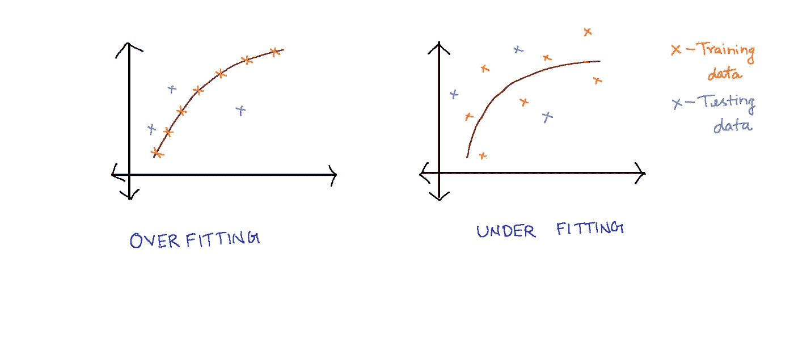
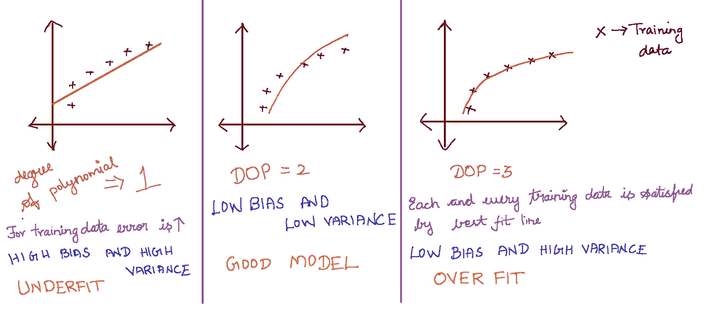
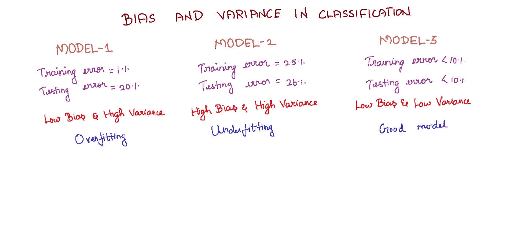
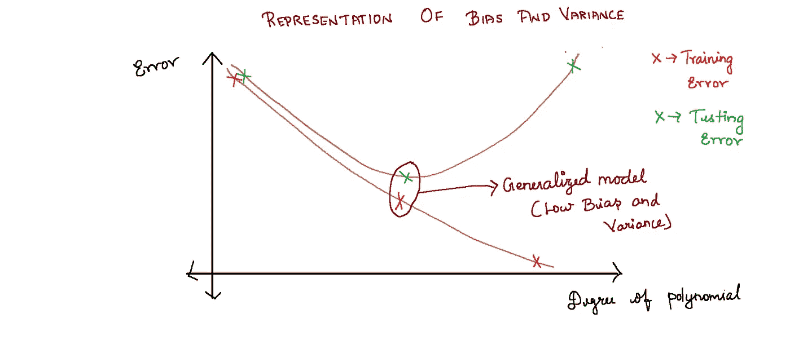
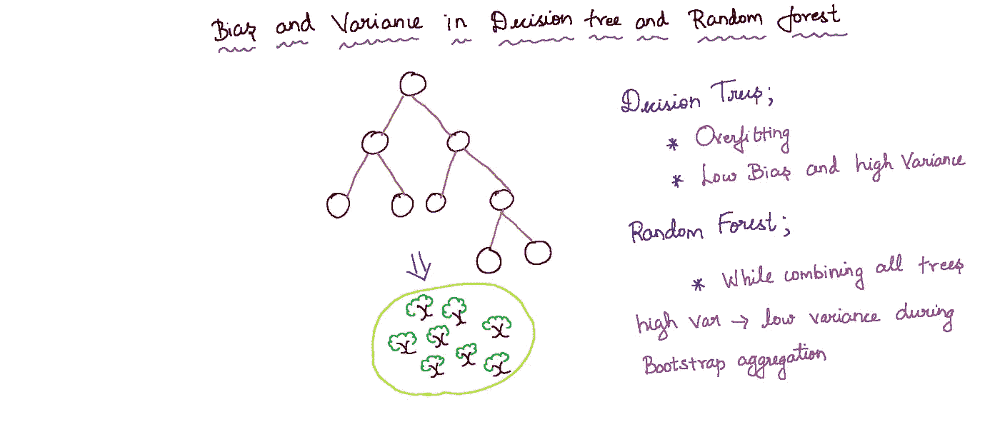

# 偏差和方差

> 原文：<https://medium.com/nerd-for-tech/bias-and-variance-389dc1dd0ee3?source=collection_archive---------17----------------------->

在这篇博客中，我将解释偏差和方差的概念

过度拟合和欠拟合

让我们弄清楚过度适应和欠适应，

最佳拟合线满足训练数据中的每个数据点，但同一条最佳拟合线不能满足测试数据。最佳拟合线在满足训练数据的同时无法满足测试数据的情况称为**过拟合。**换句话说，过度拟合是一个模型在训练集上表现很好而在测试集上表现很差的场景

在欠拟合中，相应的训练数据和测试数据的误差非常高。换句话说，**欠拟合**是一个模型在训练集和测试集上表现不佳的场景。

偏差——训练数据的误差

方差——测试数据的误差

## **回归中的偏差和方差:**

回归中的偏差和方差

考虑多项式次数= 1，2，3 的三个模型。次数为 1 的多项式具有直线最佳拟合线，次数为 2 的多项式的模型将是曲线最佳拟合线，而次数为 3 的 DOP 的模型将具有比其他两个 DOP 更倾向于满足大多数训练点的曲线。

当 DOP(多项式次数)为 1 时，训练和测试数据的误差都很高

当 DOP 为 3 时，训练数据的误差很小，测试数据的误差很大。

当 DOP 为 2 时，训练和测试数据的准确性都很高。这意味着方差(测试误差)和偏差(训练误差)都很低。

> **“偏差和方差低的模型是好模型”**

## 分类中的偏差和差异:

分类中的偏差和方差

在模型 1 中，很明显测试误差(方差)很高，但训练误差(偏差)很低，因此这种情况是**过拟合。**

在模型 2 中，测试误差(方差)和训练误差(偏差)很高，因此这种情况是**欠拟合。**

在模型 3 中，测试误差(方差)和训练误差(偏差)很低，因此这将是所有三个模型中最好的模型。

## 偏差和方差的表示:

偏差和方差的表示

从上图中，当绘制多项式的次数与误差值**的关系时，我们得到了上图。随着多项式次数的增加，训练误差减小，测试误差减小到一定值后又开始增加。**

我们应该选择同时具有低训练误差(偏差)和测试误差(方差)的模型。上图显示了如何选择具有低偏差和方差的广义模型。

## 决策树和随机森林中的偏差和方差:

决策树和随机森林中的偏差和方差

如果我们继续分裂直到数据集不能再纯净，一个**决策树**将**过度拟合**数据。最初，决策树将具有低偏差和高方差。当组合所有树时，**高方差在自举聚合期间被转换成较低方差**

> **“通过从决策树到随机森林的选择来实现偏差和方差的权衡”**