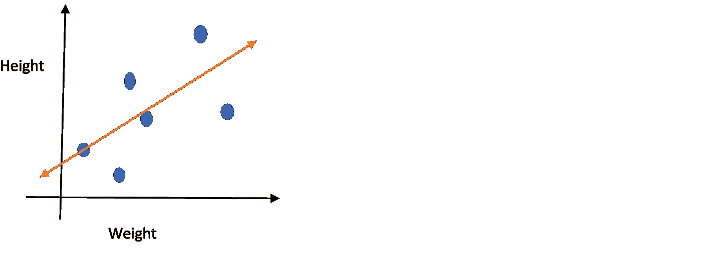
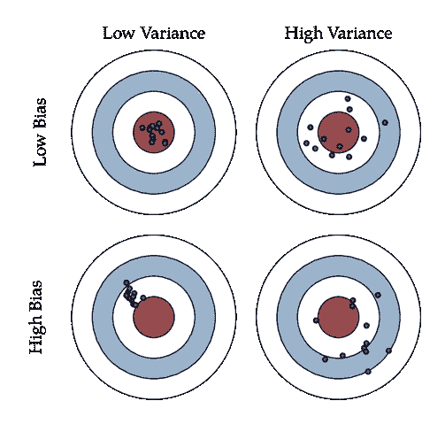
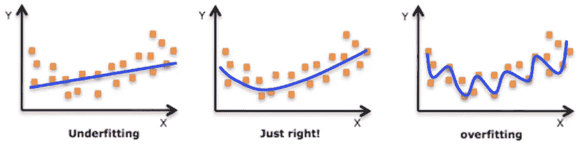
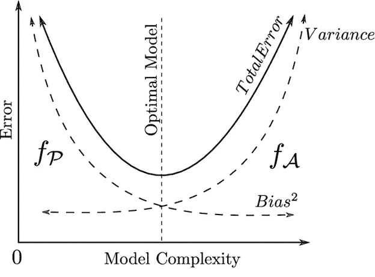

# 偏差和方差的权衡

> 原文：<https://medium.com/nerd-for-tech/bias-and-variance-trade-off-9691682ab36b?source=collection_archive---------15----------------------->

任何模型要表现良好，都需要减少误差。偏差和方差的正确平衡对于构建任何机器学习算法以及从它们的模型中创建准确的结果都是重要的。偏差和方差用于监督机器学习，其中算法从训练数据或已知数量的样本数据集进行学习。偏差和方差是可约误差的组成部分。

# 偏见

偏差基本上就是我们预测的值与实际值相差多远。如果我们的预测与实际预测相差甚远，我们可以说偏差太大。换句话说，偏差意味着训练数据的错误。高偏差会导致算法错过输入和输出变量之间的关系，从而使模型过于简化，并导致拟合不足。

让我们举个例子，看看什么是偏见…

假设我们想使用线性回归来预测学生的身高

作者图片

在上图中，我们可以清楚地看到，无论我们在训练数据中拟合得多么好，直线都没有建立真实关系的灵活性。机器学习方法无法找到真正的关系被称为偏见。

# 差异

当模型的表现不如训练数据集时，模型有可能出现偏差。换句话说，方差意味着测试数据的误差。它基本上告诉你预测值和实际值有多分散。数据集中的高方差意味着模型是用大量噪声和不相关数据训练的，从而导致过度拟合。

# 偏差和方差如何影响模型

图片 endtoend.ai

**高方差高偏倚:**模型会不一致，平均起来也不准确。

**低方差高偏倚:**模型一致但平均值低。

**高方差低偏倚:**稍准确但平均不一致。

**低方差和低偏差:**这是模型平均一致和准确的理想模型。

# 偏差方差权衡

图像数据机器人

这是一个在偏差和方差之间找到正确平衡的概念，这样我们的模型既不会过拟合也不会欠拟合。如果模型太简单并且只有很少的参数，它将遭受高偏差和低方差，另一方面，如果模型有大量的参数，那么它将具有高方差和低偏差。权衡的结果应该是完全平衡的偏差和方差。

# ***偏差和方差的概念数学上***

假设我们预测的方差为 Y，其他独立变量为 x。让我们假设这两个变量之间存在如下关系

**Y=f(x)+e**

其中 e 是平均值为 0 的估计误差，然后我们使用线性回归或支持向量机等算法进行分类。X 点的预期平方误差将是 Y 的平方加上方差加上不可约误差。

***总误差=偏倚+方差+不可约误差***

# ***总误差***

为了建立一个好的模型，我们需要在偏差和方差之间找到一个合适的平衡点，使总误差最小化。

图像研究门户

***总误差=偏倚+方差+不可约误差***

偏差和方差的完美平衡永远不会欠拟合或过拟合。对于任何数据科学家来说，理解偏差和方差的概念以减少错误并建立准确的模型都是非常重要的。

**感谢您阅读**😊

*原载于 2021 年 3 月 4 日*[*https://www.numpyninja.com*](https://www.numpyninja.com/post/bias-and-variance-trade-off)T22。