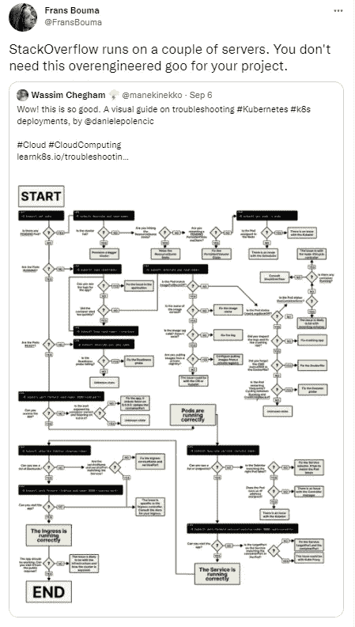
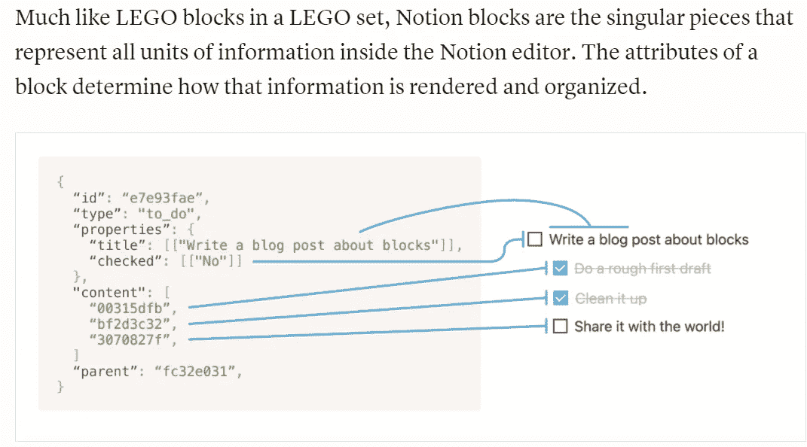
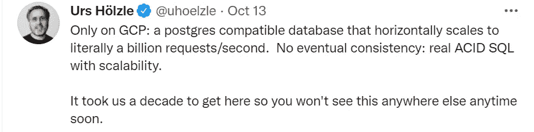
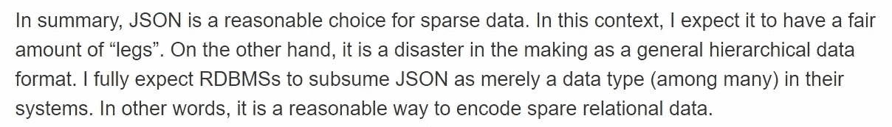
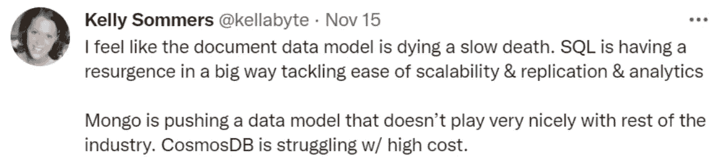

# 对于企业来说，大数据只是一时的时尚。现在怎么办？

> 原文：<https://medium.com/nerd-for-tech/big-data-was-a-passing-fad-for-enterprises-what-now-d4ec7cadd4cb?source=collection_archive---------0----------------------->

我们已经听过一遍又一遍了。大数据并没有为**企业**带来它所承诺的价值。在这上面花了数百万的高管们还不会承认。确实有一些网络规模的公司认为大数据技术不仅有益，而且不可避免。这是给我们其他人的。

为了让我们所有人都立足于现实，Salesforce 的后端是 Oracle，StackOverflow 运行在 3 个 SQL Server 数据库上，这两个数据库都是关系数据库，比过去 20 年的所有宣传都要早。

# 过去 20 年——我们是如何走到这一步的

大数据是 *web2* 的贡献——我们今天所处的万维网状态主要由谷歌和 [FAANG](https://en.wikipedia.org/wiki/Big_Tech) (MAANG？)帮。

从 2003 年[开始，Jeff Dean](https://slate.com/technology/2013/01/jeff-dean-facts-how-a-google-programmer-became-the-chuck-norris-of-the-internet.html) 、 [Sanjay Ghemawat](https://www.newyorker.com/magazine/2018/12/10/the-friendship-that-made-google-huge) 和谷歌其他一些不太知名的人发表了一系列著名的论文，讲述他们构建的定制软件如何运行谷歌的高速基础设施——GFS、BigTable 和 MapReduce，以及其他软件，如协议缓冲区、容器、Borg 等。

世界各地无聊的开发人员和其他 web 规模的公司一个接一个地捡起它们，从 GFS(后来成为 Hadoop)开始，重新实现它们，并把它们贡献给 Apache。

我们称这个堆栈为大数据。

## 哪里出了问题？

**大数据值得吗？谷歌早就将自己从 MapReduce 中分离出来，即使企业也在赶时髦。数据的分布式并行处理只能通过 lazy ACID 控制来实现，因为，生活是不公平的——根据 [CAP 定理](https://en.wikipedia.org/wiki/CAP_theorem)，你不可能同时拥有数据节点网络的*数据一致性和所有用户*的*可用性(Google Spanner 是个例外——参见下面的最后一节)。***

但是一些用例非常适合这种**规模一致性权衡**。

> 例 1。*谷歌搜索的规模*与*用户对免费网络搜索中略微过时的结果的容忍度(基于 GFS 实现)*
> 
> 例 2。*在亚马逊维护全球产品目录*与*客户短暂地看到售罄的产品(通过 Dynamo——不要与 DynamoDB 混淆)*
> 
> 例 3。*相对较慢的脸书数十亿人的数据检索*对比*数十亿人的快速写入(通过 Cassandra)*

**谁让企业出了个傻子？**上面提到的用例不是企业通常会遇到的类型——银行交易或医生预约都不是好的选择。企业不需要大数据，他们想要大数据。他们的[数据并不大](https://www.google.com/search?q=no%2C+you+don%27t+have+big+data)——当然也不是网络规模。但是个人希望它出现在他们的简历上。高管们开始担心他们可能会输给采用它的竞争对手。每一个天真的记者都在文章中贴满了“大数据”这个词，而这些文章只是稍微提到了科技。

数据专家偶尔的抗议淹没在噪音中。当我们称之为逻辑回归，人工智能时，这种趋势今天仍在继续。

开发商在加剧这种炒作方面有着不可忽视的作用。那些仅仅为了通过 Java 面试而考虑**数据完整性**的应用程序开发人员，激烈地采用大数据和无模式数据存储，最终将自己从僵化的老派数据团队中解放出来。像 Hibernate 这样的 ORM 总能让它们摆脱 SQL 的负担(而且理由很充分)。

在他们看来，关系数据库不是水平可伸缩的，好的商业数据库非常昂贵。占主导地位的开源数据库 MySQL 和 Postgres 当时功能并不丰富。不过，这种情况已经改变了。

# 现在——现在发生了什么

难以驾驭的集群。投资大数据集群的公司后悔将它建立在本地而不是公共云上。它们处理集群维护，不管它是如何托管的，经常会遇到 Java.lang 错误和 Spark.context 异常，而不是处理关于数据完整性违规的直接而清晰的错误消息。

**多层不必要的数据堆栈。**其中一些公司正在提供从大数据集群到数据湖和/或云数据库(如雪花)的数据。需要注意的是，数据湖本身是大数据的副产品，数据存储在像 S3 这样的对象存储系统中，并在像 Hive 这样的 SQL 兼容大数据接口中编目。

所以现在他们有大数据(即。数据湖)在大数据之上(即。本地或基于云的 Hadoop 集群)。通常还有另一个数据库(如雪花或红移)来提供分析服务。这会导致不必要的数据移动。

**SQL 是分析结构化数据的首选。**许多企业都在使用 Spark，它具有快速的内存处理和基于它构建的原生分析工具(ML 和 Graph)。但是许多人使用 Spark 只是为了 ETL，利用其快速的 [RDD](https://spark.apache.org/docs/latest/rdd-programming-guide.html#resilient-distributed-datasets-rdds) 抽象，然后以传统的逐记录 SQL 格式提供 Spark 之外的分析。

这些不幸的公司中有一些是没有从 Spark 开始的老派企业——他们花费了数百万美元首先将他们的 SQL 数据库转换成 RDD 或 HDFS，然后在 SQL 中提供分析。现在，所有的处理都已经转移到(或计划转移到)云(云上的 SQL 数据库确实可以很好地扩展)，他们正在悄悄地考虑如何处理大数据堆栈的底层装置。

**作为大数据开发人员，你应该担心吗？**技术有粘性。看看大型机就知道了。尽管如此，一系列大数据项目将在未来几十年中让你继续受益。毕竟，科技行业一直在永无止境的循环中捆绑和解绑*复杂性*。

# 眼前的未来是什么？

**SQL 又飙回来了。**在中短期内，SQL 显然是不可或缺的工具，因为人们希望以简单的方式利用和分析数据。今天，被吹捧为*大数据*的平台强制性地提供了一个 SQL 接口。曾经被吹捧为 MongoDB 的可信的 NoSQL 威胁的 CockroachDB，正在向 SQL 倾斜就是一个典型的例子。

相比之下，2005 年至 2015 年间诞生的初创公司总是选择大数据平台，无论这些平台上的 SQL 处于什么状态。这一趋势正在逆转。

概念应用的数据模型一瞥。[https://www.notion.so/blog/data-model-behind-notion](https://www.notion.so/blog/data-model-behind-notion)

建立在 Postgres 上的 conception 的[数据模型](https://www.notion.so/blog/data-model-behind-notion)是一个很好的例子，它展示了 SQL 数据库的可能性，即使模式是不可预测的，并且很难预先定义。

水平扩展关系数据库似乎是一个已经解决的问题，在 Google 云平台上更是如此。几家云供应商和数据库供应商已经在使用 [Paxos](https://en.wikipedia.org/wiki/Paxos_(computer_science)) 分布式共识算法。但是真正让谷歌与众不同的是他们自己的[原子钟](https://www.theverge.com/2012/11/26/3692392/google-spanner-atomic-clocks-GPS)，时间 API，以及包括[海底电缆](https://cloud.google.com/blog/products/infrastructure/new-apricot-subsea-cable-brings-more-connectivity-to-asia)在内的基础设施的不断升级。

Google Spanner 是一个全球可用的关系数据库，具有严格的一致性(不是最终的)和强酸。这是关于扳手的 Urs hlz le:

NoSQL 不会离开。它非常适合作为专门构建的数据库，服务于狭窄的用例—搜索、键值查找、图形算法等。

例如，尽管雪花是一个 SQL 数据库，但它在内部使用名为 FoundationDB 的键值存储来管理元数据。SingleStore 是一个分布式 SQL 数据库，它使用键值存储来管理索引。ElasticSearch 或者它的一个变种对于网络应用的快速搜索是必不可少的。

然而，值得一提的是，在 NoSQL 家族中，*文档数据库似乎有一个身份危机。*

斯通布雷克在红皮书第 5 版。[http://www.redbook.io/all-chapters.html](http://www.redbook.io/all-chapters.html)

正如迈克尔·斯通布雷克(数据库先驱和 Postgres 的创建者)在十多年前正确地[预测的](http://www.redbook.io/all-chapters.html)那样，大多数关系数据库本身支持 JSON，这就对像 MongoDB 或 DynamoDB 这样的独立文档数据库的基本原理提出了质疑。缩放不再是决定性因素。

**丰富的 SQL 工具。开始使数据民主化的工具强调了 SQL 的复兴。 *Presto* (现在的 Trino)和 *dbt* (数据构建工具)或许就是贴切的例子。**

Presto 是一个通用的 SQL 查询引擎，支持从对象存储(平面文件、拼花文件等)查询。)、关系数据库、NoSQL 数据库等。

dbt 使用 SQL + Python 的 Jinja 模板化条件代码，从仓库或临时区域创建数据转换，以产生数据集市(在 dbt 中称为模型),用于服务分析。此外，它将关于 SQL 和数据的文档从 enterprise Confluence 页面转移到 SQL 本身所在的单一框架下。所有这些通过云的*胶水组合在一起:一个 yml 配置文件。*

**大数据平台没有消失。**随着机器学习(一种数据密集型流程)成为主流，非结构化数据的分布式处理变得更加必要。流媒体平台(如卡夫卡)和对象存储(如 S3)也是如此。Spark 虽然可能没有被很多人以最佳方式使用，但它在 ML、图形、批处理和流方面有着巨大的应用。

**数据管道自动化蓬勃发展。**持续集成/交付(CI/CD)一直是数据领域的一个神秘概念。企业数据库管理员仍然在与这种想法作斗争。使用 dbt、Liquibase、Airflow 等工具。与 git 平台的协作开发相结合，使得自动化数据管道易于构建。数据库开发现在可以像应用程序开发一样敏捷。

# 摘要

企业跟随消费者网络公司采用大数据技术，这是由许多因素驱动的，其中一些因素值得怀疑。毕竟谷歌做到了，对吧？但是企业技术非常难搞。他们不能像谷歌或网飞那样快速改变工具。

有 40 多年历史的数据声明式编程语言 SQL 正在夺回它在 NoSQL 潮流中失去的地盘。虽然 NoSQL 有它的位置，但 SQL 被认为是结构化数据的数据分析的必要工具。为了赶上这一逆转趋势，有一些有趣的工具和流程进入了数据空间。