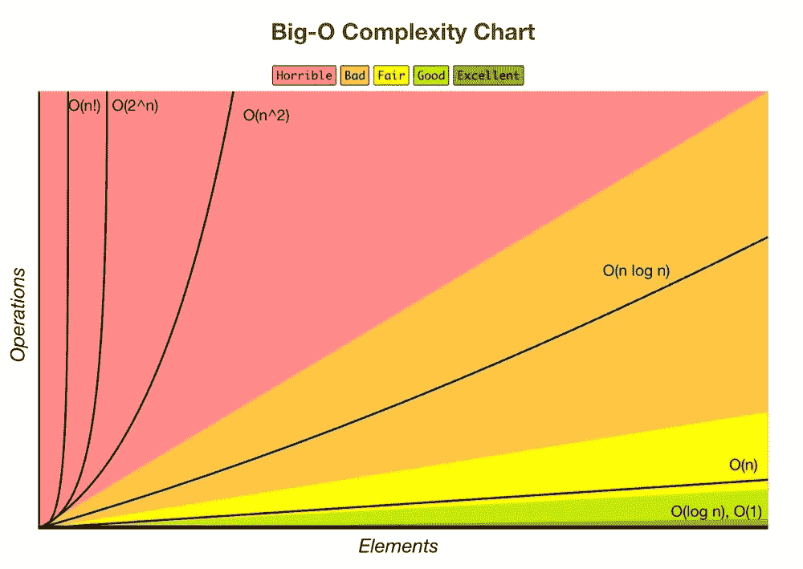
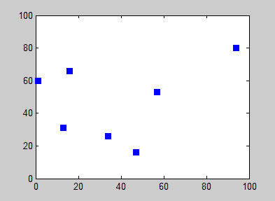
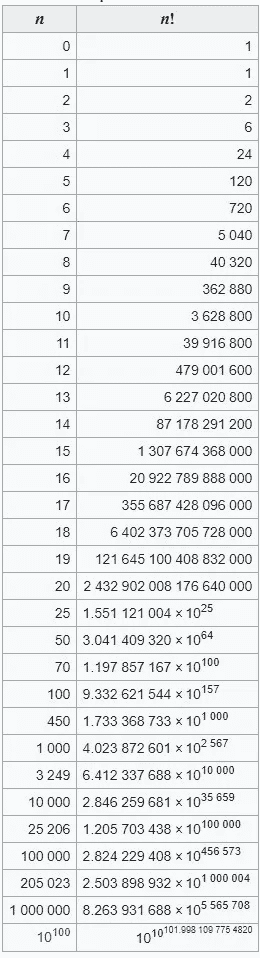

# 面向 Web 开发人员的大 O 符号基础

> 原文：<https://medium.com/nerd-for-tech/big-o-notation-basics-for-web-developers-af02ec3b89f?source=collection_archive---------13----------------------->

# TLDR——大 O 符号展示了算法如何扩展。



[来源](https://towardsdatascience.com/big-o-d13a8b1068c8)

## 随着数据集规模的增大，算法速度如何变化？

我用故事的形式很好地理解了大 O 符号的概念，2009 年，开普敦一只名叫 Winston 的信鸽创造了历史，它在 2 小时 6 分 57 秒内将 4GB 的数据传输了 75 公里，击败了 ISP，而在同一时间，ADSL 线路只发送了 4%的数据。

大 O 符号关注的是某样东西花费的时间和它拥有的数据量

下面列出了一个不同的场景

# **O( *1* )**

因此，鸽子携带 8GB 数据所花的时间与携带 4GB 数据所花的时间一样长，这被称为 O( *1* )(也就是最好的情况)。用编程术语来说，你的项目可以扩展，完全不需要额外的东西，它会正常运行，不管它的容量有多大。

# **O( *n* )**

另一方面，**网速**和**数据量**一起增加**，**随着传输量的增加，完成任务所需的时间也增加。我们都在某个时候经历过这种情况(大文件比小文件下载时间长)。这就是所谓的 **O( *n* )** ，其中 **( *n* )** 为时间变量。

这个*'****n '****变量可以代替您正在处理的任何内容，它可以表示站点上的用户数量、向端点发出的请求数量或从数据库中提取的数据量。*

# ***O(n )***

***O(n )** 的一个例子是循环中有循环——也称为嵌套循环。这种情况将导致算法性能不佳，因为你的大 O 符号将迅速扩展。*

*在上面给出的图表中，这将属于 **O(n )***

*例如*

```
***#Data**
**const** data = [‘A’, ‘B’, ‘C’, ‘D’]**const** data2 = [1, 2, 3, 4, 5]**#loops****for** (let j =0; j < data2.length; j++){ **for** (let i = 0; i < data.length; i++) { console.log(data[i] + data2[j])}}
**#Results**A1
B1
C1
D1
A2
B2
**etc...***
```

# ***O(n！)—** 旅行推销员问题*

*我想说的大 O 记数法的最后一个变体是 **O(n！)***

*由于解决这个问题变得不切实际，这个例子在旅行推销员问题中表现得很好。*

*给定一个城市列表和每对城市之间的距离，去每个城市一次并返回出发城市的最短路线是什么？*

**

*[来源](https://en.wikipedia.org/wiki/Travelling_salesman_problem)*

## *随着城市**或** ( **n)** 变量数量的增加，难度也随之增加……**荒谬**。*

*在 10 个城市，可能要考虑的部分已经在 362 880。这将使你的代码库停滞不前，因为你的 CPU 将永远被固定在 100%😂解决这个问题。*

***用于比较***

*10 个城市有 362 880 种变化*

*如果我们在销售人员的站点上再增加 6 个城市，就会有 1 307 674 368 000 种变化。*

***现在难度增加了 360 万倍***

**

*[来源](https://en.wikipedia.org/wiki/Factorial)*

*总之，开发人员需要保持他们的代码高效且易于运行。大 O 符号是一种很有帮助的方法。*

*感谢你阅读这篇文章，我希望它能帮助你理解大 O 符号的基础*

*[**LinkedIn**](https://www.linkedin.com/in/danielleitch/)*

*[**GitHub**](https://github.com/danleitch)*

***资源:***

*我学到的东西*

*[网站开发简化版](https://www.youtube.com/channel/UCFbNIlppjAuEX4znoulh0Cw)*

*[黑客排名](https://www.youtube.com/watch?v=v4cd1O4zkGw&t)*

*[顶部编码器](https://www.topcoder.com/blog/big-o-notation-primer/#:~:text=O(N!)-,O(N!),6%20seconds%20and%20so%20on.)*