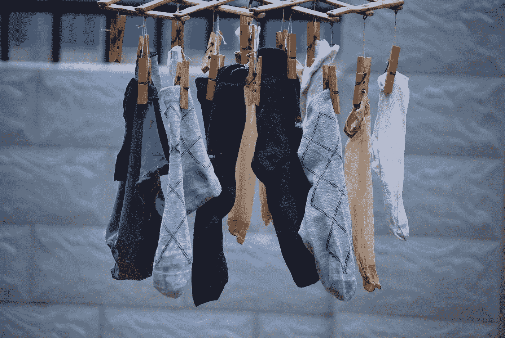

# 大 O 符号，但它是袜子

> 原文：<https://medium.com/nerd-for-tech/big-o-notation-but-its-socks-75726fac3520?source=collection_archive---------19----------------------->

大 O 符号是技术面试中的一个常见问题，因为优化不仅仅是一个流行词。如果你不能解释大 O 和你的代码的复杂性，这可能会有所帮助。

我们要从装满袜子的抽屉开始。直到你把它拿出来，你才能看到你选择了哪种颜色。你正在寻找一双相配的袜子，但是我们将假设你在找到一双之前必须拿出最大数量的袜子。(或者你可以说，我们想知道你需要拿出的最少袜子数量，以保证有一双相配的袜子。)

## O(1):

如果你有十只袜子，而且都是同一个颜色，不管你从哪只袜子开始，下一只都是相配的。即使抽屉变得更满，操作的次数也是恒定的。

## O(n): 10 双袜子，9 种颜色

你需要把抽屉里的每一只袜子都拿出来才能保证一双匹配。操作次数是线性的——抽屉里的每只袜子一次。

## O(n 的平方):10 只袜子，9 种颜色

你拿出一只袜子穿上。你拿出另一只袜子穿上。如果它们不匹配，你就把第二只放回去，然后再拿出一只袜子。穿上它。如果没有一只袜子和你的第一只相配，你把它放在一边，拿出另一只袜子穿上，然后和其他的每一只袜子比较。运算的次数是二次的——对于抽屉里的每只袜子，你对它进行的运算次数等于袜子的数量。

## O(log(n)): 10 双袜子，9 种颜色

当你收起袜子的时候，你是故意的。现在，一旦你拿出一只袜子，你就会知道它应该放在抽屉的哪一边。每次你拿出一只袜子，你就能把搜索范围缩小一半，这样每次都更容易。

## O(2 的 n 次方):10 只袜子，9 种颜色

你拿出一只袜子，转过身两秒钟，你的孩子已经把另外十只袜子扔进了抽屉。每次你拿出一只袜子都会这样。她从哪里得到这些袜子的？！有可能在某个时候你会碰到相匹配的袜子，但是每次都要加倍努力。

你如何解释大 O 符号？