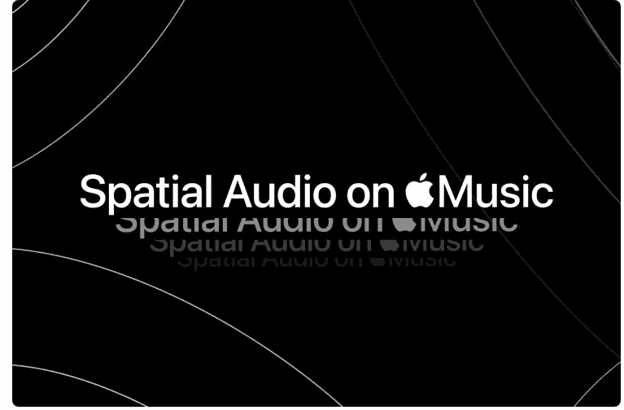
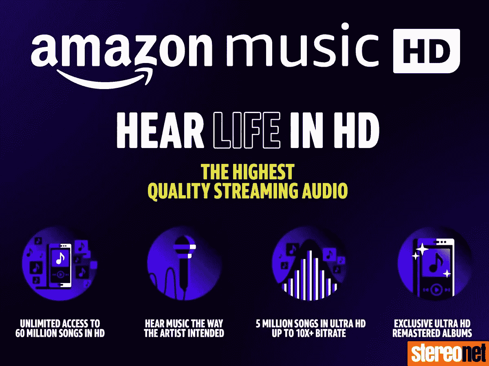

# 大型技术、流媒体战争和高保真音频

> 原文：<https://medium.com/nerd-for-tech/big-tech-streaming-wars-hifi-audio-4ccbf27cbdeb?source=collection_archive---------28----------------------->

# 苹果音乐终于宣布向所有订户免费推出高保真音频版本——但并不是每个人都高兴

我们写了一份关于音乐及其背后的商业和技术的每日时事通讯。如果您想直接在收件箱中获得它，现在就订阅吧！

什么是好的，人们？

Apple Music 终于发布了它的高保真和无损音频版本，这是我们在 [**上一期的新闻简报**](https://incentify.substack.com/p/hifi-music-whats-hype-whats-real) 中写过的，支持杜比全景声——世界上最流行的环绕声格式，拥有 8000 多万订户。

苹果声称杜比全景声是一种“革命性的沉浸式音频体验，使艺术家能够混合音乐，使声音来自四周和上方”，苹果音乐和 Beats 副总裁奥利弗·舒斯特(Oliver Schuster)声称“**在杜比全景声中听一首歌就像魔术一样”。**

最精彩的部分？这绝对是免费的。

苹果宣布，订阅用户每月 9.99 美元的标准价格将包括新的音频版本，结束了长期以来围绕订阅计划可能涨价的猜测，这是 Spotify 本月早些时候宣布的。

苹果发布声明后不久，亚马逊发布消息称“ **Amazon Music HD For All，现在不需要额外费用，**”——确认亚马逊音乐无限服务上的一系列高清音频选项现在也可以以每月 9.99 美元的价格获得。

但这有什么奇怪的呢？

这比亚马逊之前对其高清层(包括高清音频、超高清和 3D 音频选项)的收费低了**5 美元。看到苹果宣布其高级版本不涨价，亚马逊也迅速降低了自己的订阅价格。**

但是当苹果和亚马逊互相争吵的时候，为什么降价是一件坏事呢？

它伤害了本该帮助的人——艺术家和音乐版权持有者。华纳音乐集团(Warner Music Group)去年的上市前申请文件包括了现代音乐行业向投资者推销的一个关键部分:

***“2019 年，*** [***亚马逊***](https://www.musicbusinessworldwide.com/companies/amazon/) ***推出了亚马逊音乐高清(Amazon Music HD)，这是一种在美国以溢价向客户提供的高质量音频流媒体服务。我们相信流媒体为消费者提供的价值主张支持了高端产品计划。”***

音乐行业看好流媒体平台，如苹果和亚马逊提高其优质产品的价格，并反过来公平地补偿他们；然而，在确保流媒体平台和艺术家之间公平的收入分成方面，这是一种倒退。查看我们上一期关于流媒体战争的**以获得更多关于音乐行业资金流动的背景信息。**

****

**那么，对于流媒体平台来说，更低的订阅价格有什么意义呢？**

**对于全球科技巨头来说，**用高清硬件赚钱比订阅高清音频要容易得多。****

**对于亚马逊和苹果来说，以标准流媒体价格普及高清音频非常有意义，它为注重价格的客户提供了一个重要的额外好处，以推动他们对硬件升级的渴望。**

**苹果在 2019 年 10 月推出了高清版的 Airpods Pro，价格为 249 美元，而亚马逊的 Echo Studio 扬声器在一个月后以 200 美元的价格上市。苹果最新的 **Airpods 3** 将于近日发布，预计价格将再次达到三位数。**

**因此，尽管大型科技公司可能重视音乐，但它们重视音乐销售更高利润产品的能力(如亚马逊 Echo 扬声器或高端 Airpods)的程度还不到一半。**

****吉米·艾奥文 Beats 与德瑞医生**的联合创始人，早些时候预测，当“所有流媒体服务都一样”时，自然会出现成为向消费者提供最低价格的平台的下行压力。**

****

**如果你做到了这一步，那就意味着这并没有让你感到不适！为什么不和喜欢这些内容的人分享呢？**

**我们对此的看法？**

**我们正看到音乐产业的动态变化，音乐消费已经成为一种公用事业，而不是奢侈品，歌曲本身也开始被视为独立的商业单位。**

**在这种情况下，高价的优质高清层是流媒体平台最不希望看到的，因为它创造了一个**好-更好-最好的价格阶梯**，从更复杂的角度看待消费者，而不是假设他们总是会选择最便宜的选项。**

**最重要的是，它也为最佳体验的音乐设定了一个标志，即 T21 真正的价值。**

**在接下来的十年里，我们可以预计音乐版权持有者和世界上最大的科技巨头之间将会围绕这个价值计算展开一场缓慢的消耗战。**

**我们 Incentify 致力于让艺术家们获得一个公平的平台来发布和货币化他们的音乐，并很高兴为您带来更多相关更新。如果你想了解更多，请留下你的评论，我们将安排一个独家的先睹为快的机会来了解我们迄今为止的进展！ *如果你喜欢来自 P.S .的时事通讯，现在就在 Twitter 上关注我们吧！* [忿忿不平](https://incentify.substack.com) *，为什么不和喜欢的人分享呢？让我们建立社区:)***

***最初发表于*[*https://incentify.substack.com*](https://incentify.substack.com/p/big-tech-streaming-wars-and-hifi)*。***