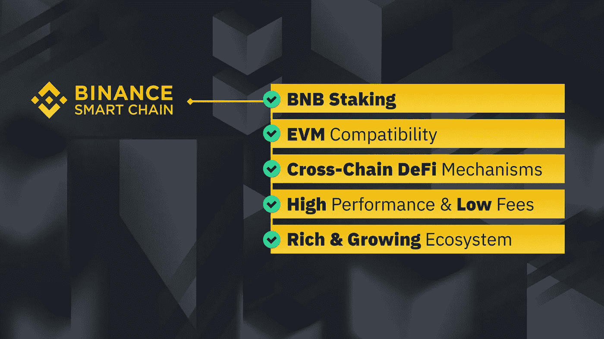

# 币安和币安智能链简介

> 原文：<https://medium.com/nerd-for-tech/binance-and-binance-smart-chain-an-introduction-b05d83bd6dec?source=collection_archive---------11----------------------->

币安和币安智能链不需要在密码和区块链的世界介绍。币安无疑是全球最大的加密货币交易所。它已经建立了巨大的霸权，成为最不可避免的实体之一，也是加密货币增长和普及的主要贡献者。

事实上，像币安这样的大型加密实体需要创建自己的区块链，[币安智能链](https://www.blockchainappfactory.com/binance-smart-chain-development-services?utm_source=Medium+&utm_medium=Publication+Nerd+-+09%2F09%2F2021&utm_campaign=vignesh)应运而生。币安智能链是由币安创建的独家区块链，它有助于为分散的金融生态系统创建分散的应用程序。这被认为是一个很好的发展和加强币安链的继任者，币安在创造自己的区块链的第一次尝试。

币安智能链克服了所有的缺点，不仅是它的前身，甚至一些最流行的区块链像以太坊。

## **为什么选择币安智能连锁？**

有几个原因可以解释为什么币安智能链是针对不同目的设计的许多现有区块链的有效替代品。虽然币安智能链与以太坊虚拟机兼容，这使得熟悉以太坊的开发人员也可以很容易地在币安智能链上推出他们的应用程序。

币安智能链，通常缩写为 BSC，具有每三秒生成一个块的能力，并且它使用有效的共识机制。这是一个不断发展的生态系统，考虑到它所提供的优势，它具备成为主流的所有条件。

BSC 最大的优势之一可能在于它的互操作性和快速的事务处理速度。这使得它成为用于去中心化金融应用的最理想的区块链。就像以太坊一样，针对不同的实用程序和目的，设计了不同的令牌标准。

## **不同的令牌标准**

*   [BEP-20](https://academy.binance.com/en/glossary/bep-20)
*   [BEP-721](https://academy.binance.com/en/glossary/bep-721)
*   [BEP-1155](https://academy.binance.com/en/glossary/non-fungible-token-nft)

## BEP-20

并且这个标准是，到目前为止，最显著的令牌标准。它们用作在 BSC 区块链中推广新代币的参考代币。这可以被认为类似于帮助发起众筹活动的以太坊的令牌标准。

BEP-20 标准令牌是完全分散的，并且与其他令牌标准兼容。它们支持多种货币，并且易于验证。使用 BEP 20 标准创建令牌是一个简单直接的过程。

 [## 如何在币安智能链网络上创建 BEP-20 令牌

### 概观

medium.com](/security-token-offering/how-to-create-a-bep-20-token-on-binance-smart-chain-network-77cc72b17787) 

## BEP-721

正如你可能已经猜到的，BEP-721 与以太坊相似，有着相同的编号。与 20 个标准形成鲜明对比的是，这一个标准是关于稀缺和独特的令牌。它们为游戏平台、数字收藏品、区块链域名上的[独特资产创造代币提供了完美的选择，并且符合最近的趋势，不可替代的代币。](https://www.blockchainappfactory.com/nft-gaming-platform-development?utm_source=Medium+&utm_medium=Publication+Nerd+-+09%2F09%2F2021&utm_campaign=vignesh)

## BEP-1155

BEP-1155 综合并汇聚了上述两种标准的优点。它们可用于可替换和[不可替换的令牌](https://www.blockchainappfactory.com/nft-development-services?utm_source=Medium+&utm_medium=Publication+Nerd+-+09%2F09%2F2021&utm_campaign=vignesh)，并以其多功能性而闻名。这个标准已经成为密码爱好者和企业家的选择之一。

## **创建您的币安智能链令牌的步骤**

 [## 在币安智能链上推出您自己的令牌，如 BEP-20

### 任何热衷于加密货币和分散项目的人都会熟悉币安和…

www.blockchainappfactory.com](https://www.blockchainappfactory.com/blog/create-launch-your-very-own-token-like-bep-20-on-binance-smart-chain/?utm_source=Medium+&utm_medium=Publication+Nerd+-+09%2F09%2F2021&utm_campaign=vignesh) 

开发 BSC 令牌是一个简单明了的过程。除了币安智能链带来的所有优势之外，BSC 令牌开发的便利性也是其日益流行的另一个因素。

**选择你的身份**

如果你熟悉加密货币交易所，你会明白每一个代币/硬币都由一个符号代表。您需要为您的 BSC 令牌选择一个名称和一个简单的，这是创建令牌的第一步。不用说，除了简单之外，您还需要为您的令牌定义一个目的。

**选择连锁基础设施**

虽然这一步看起来很平凡，但为你的令牌做出一个完美的选择是很重要的。令牌所引用的区块链决定了令牌的性能和扩散。考虑到这些特点，再看看我们正在讨论的话题，很明显我们会选择币安智能连锁区块链。

**整合钱包**

下一步是整合您的加密货币钱包。由于其互操作性，您可以将您的币安智能链令牌与大多数主流钱包相集成。在集成过程中，您需要确保顶级的安全性。

**建立智能合同**

智能合同可以被认为是区块链的宪法，其中的一切都需要遵守！创建一个智能契约来确定令牌的功能是至关重要的。

## 处理函数

当您在 BSC 上创建令牌时，需要注意许多辅助过程。

*   用户需要方便地创建一个用于评分的帐户。
*   需要正确定义令牌的可交易性，以便用户可以使用他们的钱包在他们之间交易/交换令牌。
*   还需要找出一种燃烧机制，这样令牌的稀缺性就得以保持。
*   如果您打算围绕令牌构建分散的应用程序，您还需要处理与应用程序提供的实用程序相关的用户通知。

## **结论**

看一下文件上的证书，很明显，BSC 是最受欢迎和最值得区块链去中心化应用程序开发和去中心化财务的学校之一。也许，币安智能链落后于以太坊的唯一领域是在数字方面。用不了多久，BSC 就会迎头赶上，成为以太坊的有力竞争者，如果不是彻底将其赶下台的话！

如果您想在这个游戏中领先一步，并在这个新的高效区块链上发布您的应用程序，您需要做的就是与专门从事 BSC talk in development 的公司取得联系。他们将确保带来他们的技术和市场专业知识，帮助您在 BSC 上创建您的令牌。