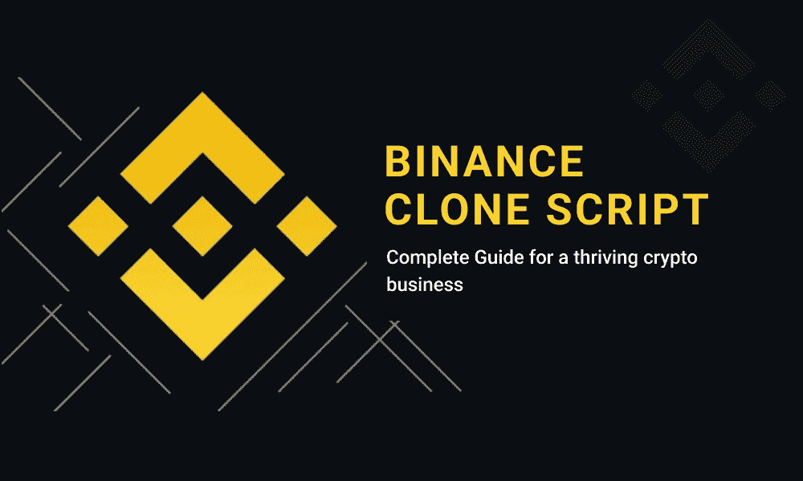

# 币安克隆脚本——繁荣加密业务的完整指南

> 原文：<https://medium.com/nerd-for-tech/binance-clone-script-complete-guide-for-a-thriving-crypto-business-4e91f8bac05c?source=collection_archive---------2----------------------->

每个密码交易者都知道，推出一个密码交易平台是一个有利可图的商业模式。许多企业家和创业公司对密码行业有着敏锐的眼光，并愿意推出自己的密码交易所。

币安克隆脚本

但当谈到发展点时，他们内部会产生很多问题。

因此，让我们在本文中对这些查询有一个清楚的解释…

# 为什么选择币安这样的交易所？

首先，建立一个像币安这样的交易所是最好的选择。币安是目前全球最大、最受欢迎的加密货币交易平台。币安于 2017 年推出，到目前为止，币安在世界各地拥有大量的密码交易员。

由于其特性和功能，币安是密码市场中最受欢迎的交易平台。与其他密码交易平台相比，币安被认为是对密码交易者最方便的平台。此外，币安已经开始增加许多不同的法定支付选项，供用户使用信用卡或借记卡购买加密硬币。

# 如何建立一个像币安一样的交易所？

这是所有有前途的企业家在计划推出他们的密码交易所时最常提出的问题。那么，有三种方法来创建你的加密交换平台类似于币安。他们是，

*   使用开放源代码
*   从头开始构建
*   使用币安克隆脚本启动

## 使用开放源代码:

开源代码被认为是从互联网上免费获得软件，为此，你需要精通编码。但是事情从来没有这么简单，因为当你选择开源的时候，你的交换没有安全的保证。它受到许多问题的影响。

## 从头开始构建:

从零开始建立一个交易所需要区块链开发团队的资源。这种方法像拼图一样工作，任何小的技术错误都可能导致完全的安全混乱。最主要的是，它需要大量的资金支持，开发时间相当长。

## 使用币安克隆脚本启动:

币安克隆脚本被认为是一个最安全和最安全的方式来启动你的加密交换业务像币安。这些都是现成的软件，已经开发、测试并准备部署。与其他两种方法相比，这些克隆脚本具有成本效益，并且时间要求非常低。

# 什么是币安克隆剧本？

币安克隆脚本是一个预制的软件，集成了所有内置的功能和插件，类似于原来的币安交易所。这些克隆脚本已经过开发、测试和部署，可 100%定制，您可以根据自己的业务计划添加或删除选项。

# 币安克隆脚本的交易特性和安全选项

功能和安全选项在启动繁荣的加密交换时起着重要作用。当用户接近平台时，这些是他们首先注意到的。因此，交易功能和安全选项应该给来自不同国家的用户留下深刻印象。

**基本特征:**

*   多种交易选项
*   加密货币钱包集成
*   多种支付方式
*   快速交易
*   用户友好的仪表板
*   上推通知
*   高度可扩展的交易引擎
*   多语言支持

# **重大安全选项:**

*   KYC/反洗钱验证
*   HTTPS 认证
*   基于托管的证券
*   实时更新
*   服务器端请求伪造(SSRF)
*   跨站点请求防伪(CSRF)
*   加密交易
*   安全钱包

这些是币安克隆脚本中包含的一些值得注意的交易功能和安全选项

# 建立像币安这样的交易所的开发成本和时间

这两者也是企业家计划开展密码交易业务时主要关心的问题。从头开始开发一个加密交易所是不可取的，因为他们需要大量的钱，大约 120000 美元，并消耗大量的时间。根据你的要求，大约需要六个月甚至更长时间，所以这不是每个人都喜欢的。但与此同时，购买一个币安克隆脚本是明智的选择，它的基本功能大约需要 5000 美元，成本可能会根据您的业务需求而有所不同。使用这个币安克隆脚本，您可以在 10 天内安全地启动您的加密交换。

# 我在哪里可以获得安全的高性能币安克隆脚本？

说真的，世界各地都有许多解决方案提供商在提供解决方案，并且每天都有许多新的解决方案提供商在加密领域涌现。但这里最重要的是选择有经验的和最好的解决方案提供商，他们能实现你的商业期望。

经过不懈的努力和深入的筛选，我向您介绍 WeAlwin Technologies，它是最好的克隆脚本提供商，一直在提供具有高级交易功能的健壮、可靠的币安克隆脚本。他们有一个专家团队，在过去几年里一直在这个密码交换行业工作。他们的首要目标是为客户提供 100%无 bug、安全和高性能的软件。

即刻获得现场试玩@ [**币安克隆脚本**](https://www.alwin.io/binance-clone-script)

我相信我已经在上面的文章中证明了你所有的问题，如果有任何遗漏或者你有任何其他的问题。敬请评论。我会帮你的！！！