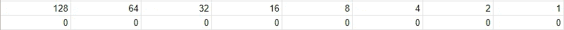
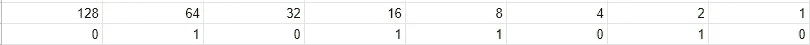

# 二进制的

> 原文：<https://medium.com/nerd-for-tech/binary-92c4cd96efbc?source=collection_archive---------6----------------------->

二进制是一个有两个可能值 1 或 0 的计数系统。利用 1 和 0，计算机可以用不同的模式来表示数字。在这个系统中，1 被认为是真的，因为它有一个值，而 0 是假的，因为它没有值。

二进制的工作原理是查看 1 和 0 所代表的数字，并将它们相加。为了得到这个值，它将是你所在位置的 2 次方(从 0 开始计数)。例如，如果你有 8 个地方，那么第一个地方是 2⁰，这将是 1。第二名是 2 或 2。第三个是 2 或 4。你可以继续这样做，直到你得到 8 个地方，8 是 2⁷或 128。

让我们看一个例子。

在上面的例子中，第八位是零，所以它没有值。第七位的值为 1，意味着它的值为 64。第六名没有价值。第五位的值为 16。第四位的值为 8。第三名没有价值。第二位的值为 2。这个第一名没有价值。将这些值相加(64 + 16 + 8 + 2)得到 90。所以 01011010 等于 90。

在一些练习中，试着弄清楚这些数字代表什么。

00110100

11001000

00000111

10010101

答案:

52, 200, 7, 149