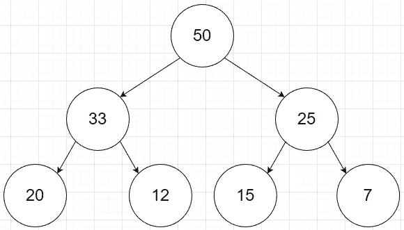
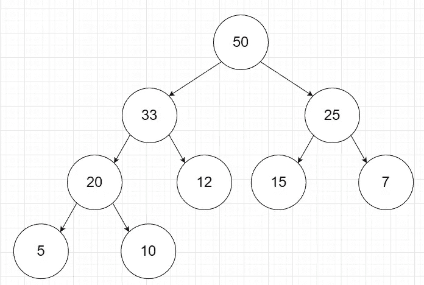
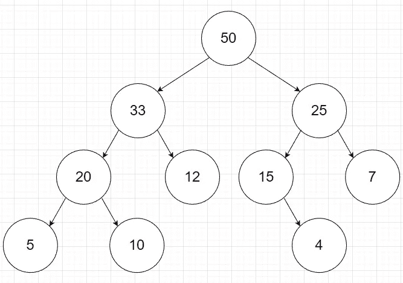
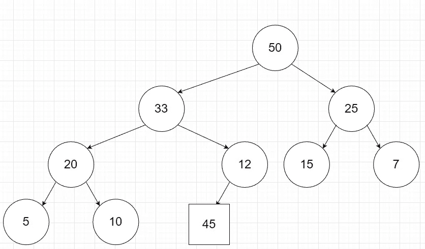
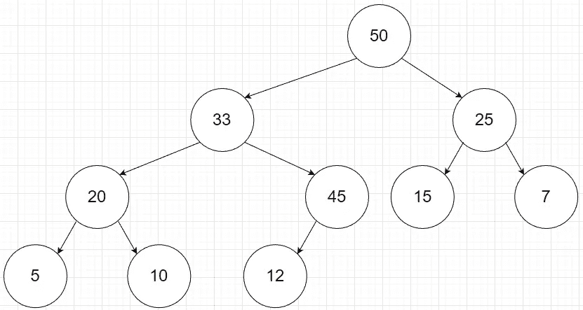
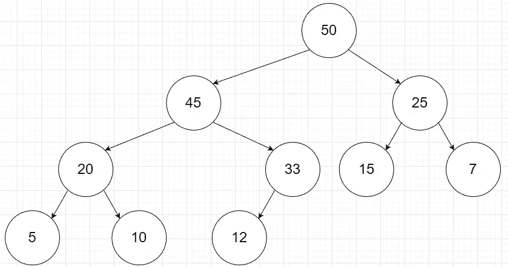
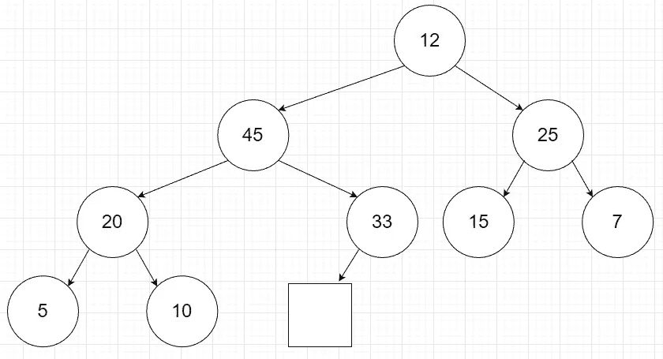
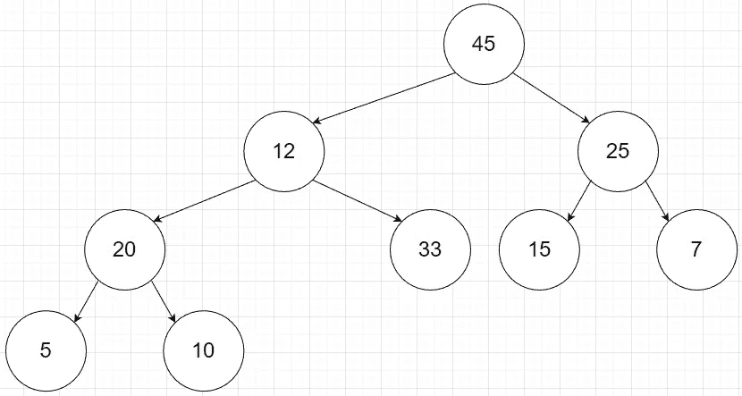
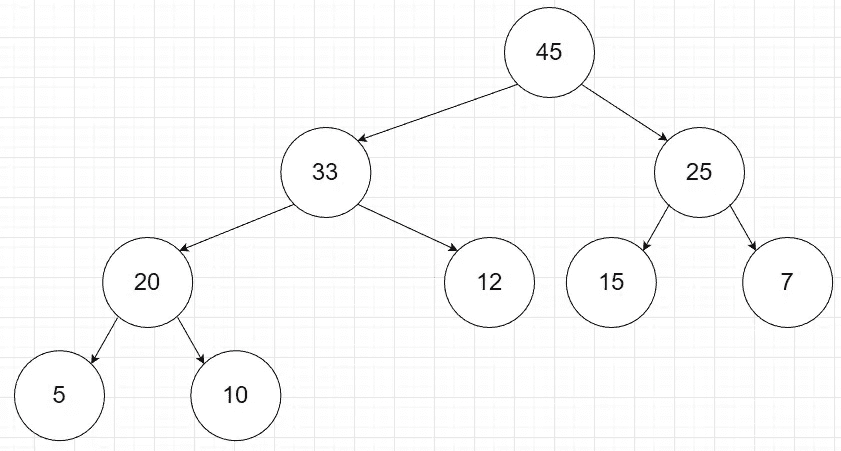

# 二进制堆

> 原文：<https://medium.com/nerd-for-tech/binary-heaps-2ff5b484a002?source=collection_archive---------0----------------------->

二进制堆是一种有自己一套规则的[二叉树](/nerd-for-tech/binary-search-tree-a0b0e7d8567a)。有两种类型的二进制堆，即最大堆和最小堆。

**规则**

二进制 max-heap 遵循的第一条规则是，每个节点的值必须大于其所有后代的值。这意味着，如果您正在查看的节点是 8，那么后面的所有节点都必须小于 8。在二进制最小堆中，每个节点的值必须小于其所有后代的值。如您所见，根据您创建的二进制堆的类型，规则是相反的。

二进制最大堆示例

第二条规则是二进制堆必须是一棵完整的树。一个完整的树是一个完全充满节点的树。这意味着当从左向右阅读树时，所有节点都在那里。例外情况是，只要空节点右侧没有节点，底部行上的节点就可能会丢失。

左边是一个完整树的示例，缺少底部行中的节点。右边是一个不完整树的例子，因为空节点的右边有节点。

**插入**

为了插入一个值，我们创建一个新的节点，并把它放在堆底层的最右边。在 max-heap 中，我们将比较新节点和它的父节点，如果新节点大于父节点，就交换它们。这将被重复，直到新值得到一个大于它自身的父节点或者它是新的根节点。对于最小堆，这是相同的过程，只是如果新节点小于父节点，您将切换值。

在最大堆中插入 45

这里的方块代表最右边的点。我们将把 45 和它的父代 12 进行比较。45 大于 12，因此我们将交换它们。

再次将 45 与其新的父代 33 进行比较。45 大于 33，因此我们将交换它们。

最后，我们将比较 45 和它的新父代 50。50 大于 45，所以我们知道 45 在正确的位置。

**删除**

当从二进制堆中删除时，我们将只删除根节点。要删除，我们将把最后一个节点移到根节点。这将删除根节点的原始值。如果你使用的是最大堆，那么你将比较父堆和子堆的值，并用两个值中较大的一个来交换。这将继续下去，直到节点在正确的位置。对于最小堆，除了父堆将与两个值中最小的一个交换之外，其他都是一样的。

从最大堆中删除 50

首先，用堆中的最后一个节点替换 50。

这个方块表示 12 是从这个位置开始的，因为它是堆中的最后一个节点。

接下来，将 12 与其子节点 45 和 25 进行比较。我们将把 12 和 45 交换，因为它是两个孩子之间的较大值。

现在比较一下 12 和它的新成员 20 和 33。33 是最大值，因此我们将交换 33 和 12。

我们现在完成了，因为这 12 个孩子已经没有了。

**用例**

二进制堆是实现优先级队列的最佳选择。优先级队列类似于常规队列，删除和访问是相同的。不同之处在于这些值是以特定的顺序插入的。优先队列的一个完美例子是急诊室中使用的分类系统。当患者进入急诊室时，他们的病情严重程度会得到评估，并据此将他们加入队列。这使得医院可以先治疗病情较重的病人。二进制堆很好地解决了这个问题，因为根总是优先级最高的病人。

关于二进制堆实现的更多信息，请查看 G[eeksforgeks](https://www.geeksforgeeks.org/binary-heap/)的这篇文章。