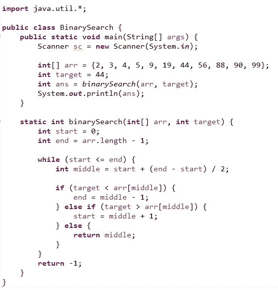
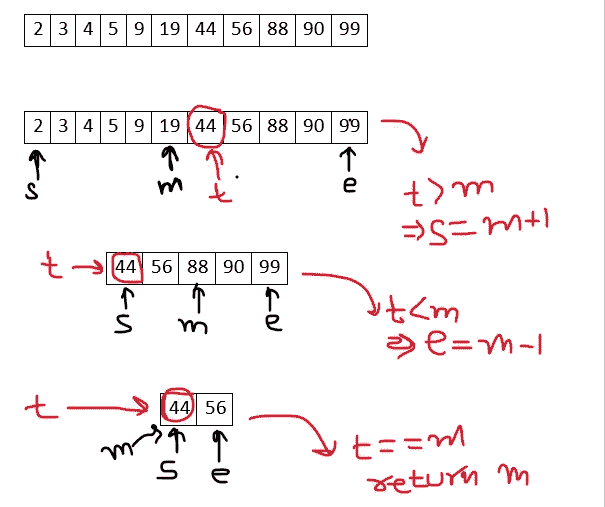

# 用 Java 实现二分搜索法算法

> 原文：<https://medium.com/nerd-for-tech/binary-search-algorithm-using-java-3c7c24d783cf?source=collection_archive---------1----------------------->

**老弟:-** 老弟，我压力很大啊老弟。

**我:-** 为什么老弟，发生什么事了？

**老弟:-** 我就是搞不懂这个二分搜索法算法的人其路太难走了，让人摸不着头脑

我:- 你说什么呢老弟。对于**排序数组**来说，这是最好的**搜索算法**之一，也非常简单。

**老弟:-** 老弟求求你帮帮那，我实在是受不了了。

我:- 好吧，兄弟，那我们从头开始，我们将学习如何用 java 实现它。

# 搜索算法:-

当你必须从给定的数据结构中检查或检索一个元素时，我们使用搜索算法。

它有两种类型

1.  **顺序搜索:-** 顺序遍历列表或数组，检查每个元素。
2.  **区间搜索:-** 专为在排序数据结构中搜索而设计，比顺序搜索更有效，因为它们反复瞄准搜索结构的中心，并将搜索空间一分为二。

区间搜索的一个例子二分搜索法。

# 二分搜索法:-

这是一种**高效的**搜索算法，用于从有序数组或列表中查找元素。

这个排序后的数组可以是升序也可以是降序。

二分搜索法背后的想法是反复将数组分成两半，直到你将可能的位置缩小到只有一个。

# 二分搜索法算法:-

1.  取四个变量=> start，end，middle，target。
2.  找到数组的中间元素= >现在你的数组被分成左右两部分。
3.  如果**目标元素>中间元素** = >在**右侧**部分搜索。
4.  如果**目标元素<中间元素** = >在**左侧**部分搜索。
5.  If **中间元素==目标元素** = >返回该元素。
6.  如果**开始>结束** = >元件未找到。

## 时间复杂度分析:-

*   在每次迭代或每次递归调用中，搜索减少到数组的一半。
*   所以对于数组中的 n 个元素，有 log2n 次迭代或者递归调用。

因此，对于**最佳情况**，即如果我们仅在第一次迭代中得到元素(中间元素)= > O(1)，对于**平均情况和最坏情况** = > O(log2N)。

**空间复杂度**为 O(1)。

**老弟:-** 感谢老弟对二分搜索法如此浅显易懂的解释。

**我:-** 为你老弟两肋插刀。

**老弟:-** 但是老弟，代码呢？我在写代码的时候还是有点困惑。

**我:-** 没问题老弟，那我也简化一下😉

# 代码实现:-

注意:-这里我们采用一个升序排序的数组，因为二分搜索法总是只在排序的数组上实现。

二分搜索法代码实现

## 解释:-

1.  创建了一个名为 binarySearch 的函数，它具有数组变量和目标元素变量的参数。
2.  用值 0 初始化开始变量，用 arr.length -1 初始化结束变量，arr . length-1 表示数组的最后一个元素。因此，这里我取排序数组的开始和结束值。
3.  以起始值应始终小于或等于结束值为条件开始 while 循环。
4.  然后用给定的公式求中间的元素。
5.  现在检查二分搜索法的情况，它的算法中也有解释，如果没有一个值匹配，那么简单地返回-1。
6.  在驱动程序代码中，我采用了一个已排序的数组，并定义了需要找出其索引值的目标元素，然后调用函数。

**老弟:-** 谢谢老弟的代码讲解。这是非常简单的事情。

我:- 告诉你老弟这很容易。现在让我们来看看它的利弊。

# 二分搜索法的优点:-

1.  通过使用每次比较的结果，它消除了进一步搜索的一半列表。
2.  它指示正在搜索的元素是在列表中的当前位置之前还是之后。
3.  该信息用于缩小搜索范围。
4.  对于大型数据列表，它比线性搜索效果好得多。

# 二分搜索法的缺点:-

1.  它采用需要更多堆栈空间的递归方法。
2.  编程二分搜索法算法是容易出错和困难的。
3.  二分搜索法与内存层次结构(即缓存)的交互很差。

**老弟:-** 为此感谢老哥。但是有一件事，如果我再次遇到关于你感兴趣的任何话题的任何此类疑问，我将如何联系你🤔

**我:-** 这里的兄弟只是从下面提到的链接与我联系，并将保持联系**😉**

> [领英](https://www.linkedin.com/in/iam-aman-chopra/)
> 
> [推特](https://twitter.com/iam_chopra_aman)
> 
> [GitHub](https://github.com/Aman1905)
> 
> Instagram