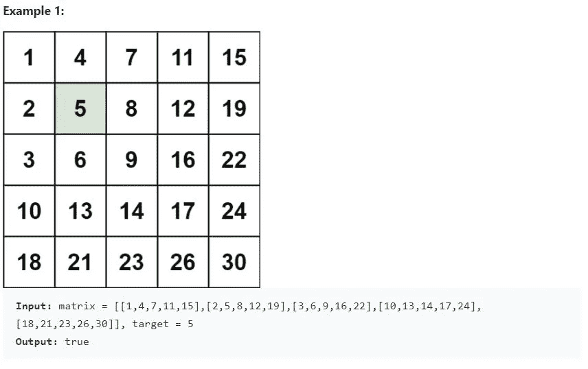
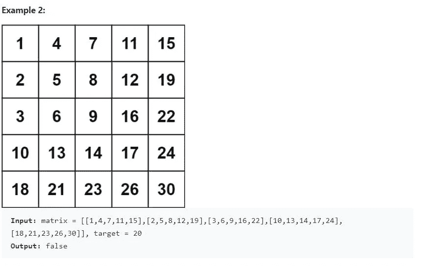

# 二分搜索法问题:搜索一个 2D 矩阵 II

> 原文：<https://medium.com/nerd-for-tech/binary-search-problem-search-a-2d-matrix-ii-leetcode-240-317b690642bd?source=collection_archive---------4----------------------->

这个问题类似于“搜索 2D 矩阵”，我在上一篇文章中已经给出了解决方案。如果您已经阅读了前一篇文章，请阅读问题描述并继续高效的解决方案。

## 问题链接

 [## 搜索 2D 矩阵 II - LeetCode

### 提高你的编码技能，迅速找到工作。这是扩展你的知识和做好准备的最好地方…

leetcode.com](https://leetcode.com/problems/search-a-2d-matrix-ii/) 

## 问题描述:

编写一个有效的算法，在一个`m x n`整数`matrix`中搜索一个`target`值。`matrix`具有以下特性:

*   每行中的整数从左到右升序排列。
*   每列中的整数从上到下按升序排序。

## 天真的解决方案:

遍历矩阵中的每个元素，并将其与目标值进行比较。时间复杂度为 O(mn)，效率非常低。

## 体面的解决方案:

因为每一行都是排序的，我们可以利用二分搜索法来搜索每一行。这个解的时间复杂度是 O(nlogm)。logm 是二分搜索法在一行中花费的时间，因为我们对每一行都这样做，所以 O(n*logm)是总的时间复杂度。

## 高效解决方案:

上面提出的 O(nlogm)解决方案是一个不错的解决方案，但我们可以进一步优化它。我们不需要遍历每一行。问题陈述了每一列中的整数也是排序的。

因此，从示例中，如果您仔细观察右上角的元素，会发现其左侧的所有元素都小于它，而其下方的所有元素都大于它。

*   从右上方开始
*   如果 target 小于右上角的元素，则向左移动，因为我们可以忽略该列
*   如果 target 大于右上角的元素，则向下移动，因为我们可以忽略该行

在示例 1 中，15 是右上角的元素。

*   [1，4，7，11]在比它小的 15 的左边。
*   [19，22，24，30]都是向下方向且大于 15。
*   目标元素是小于 15 的 5。所以我们向左移动。
*   现在 5 <11,move left again
*   Now 5<7,move left again
*   Now 5> 4、向下移动
*   我们到达目标元素 5。

时间复杂度为 O(m+n)。