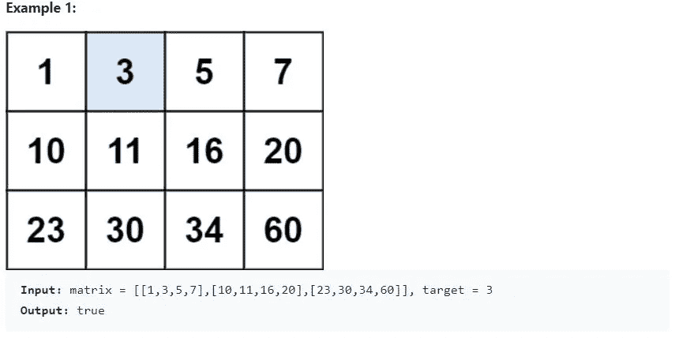
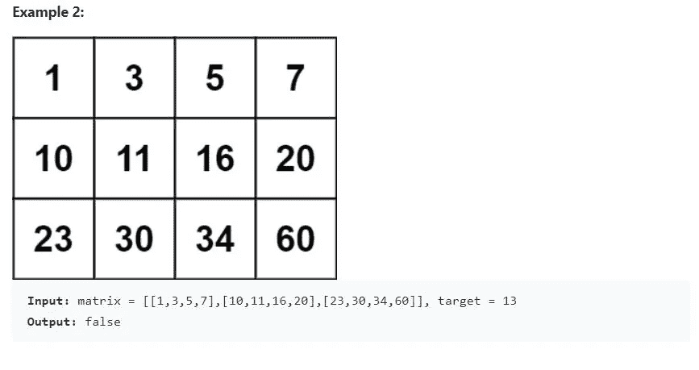

# 二分搜索法问题-搜索一个 2D 矩阵[Leetcode — 74]

> 原文：<https://medium.com/nerd-for-tech/binary-search-problems-search-a-2d-matrix-leetcode-74-7facd6f2db53?source=collection_archive---------5----------------------->

## 链接到问题:

 [## 搜索 2D 矩阵- LeetCode

### 写一个在 m×n 矩阵中搜索一个值的有效算法。该矩阵具有以下特性…

leetcode.com](https://leetcode.com/problems/search-a-2d-matrix/) 

## 问题描述

编写一个有效的算法，在一个`m x n`矩阵中搜索一个值。该矩阵具有以下特性:

*   每行中的整数从左到右排序。
*   每行的第一个整数大于前一行的最后一个整数。

## 天真的解决方案:

遍历矩阵中的每个元素，并将其与目标值进行比较。时间复杂度为 O(mn)，效率非常低。

## 体面的解决方案:

因为每一行都是排序的，我们可以利用二分搜索法来搜索每一行。这个解的时间复杂度是 O(nlogm)。logm 是二分搜索法在一行中花费的时间，因为我们对每一行都这样做，所以 O(n*logm)是总的时间复杂度。

## 高效解决方案:

上面提出的 O(nlogm)解决方案是一个不错的解决方案，但我们可以进一步优化它。我们不需要遍历每一行。该问题指出每一行的第一个整数大于前一行的最后一个整数。因此，每一行都被排序，下一行包含的元素也比前一行多。

因此，我们可以使用二分搜索法来查找所需的行。我们从矩阵的中间行开始，如果目标元素在该行的范围内，我们就对该行应用二分搜索法。否则，如果目标元素小于行的起始元素，我们在前一行中搜索，如果目标元素大于行的最后一个元素，我们在下一行中搜索。

这样，我们将搜索的行数从 n 减少到 logn。

总体时间复杂度为 O(logm + logn)。返回二分搜索法的结果需要 logm，我们在 logn 行中搜索。

## 注意:

时间复杂度是 O(logm + logn)而不是 O(logm*logn)。只有当我们确定目标在该行的范围内时，我们才连续进行二分搜索法。因此，操作总数将是 O(logm + logn)。

将在我的下一篇文章中解决“2D 矩阵中的搜索 II”。