# 二叉查找树

> 原文：<https://medium.com/nerd-for-tech/binary-search-tree-a0b0e7d8567a?source=collection_archive---------3----------------------->

二叉查找树是一种基于节点的数据结构，它根据一组规则存储数据。任何节点的左子树的值都将小于父节点的值。任何节点的右子树的值都将大于父节点的值。左右子树必须是二叉查找树。

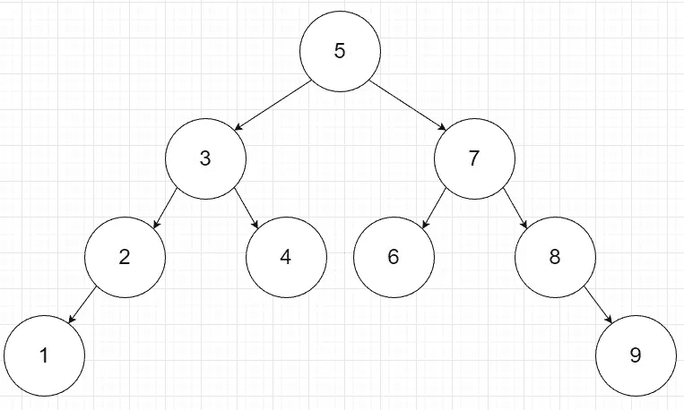

二叉树的节点有 3 种类型的数据。第一种类型是存储在节点中的值。另外两个是指向左边和右边节点的指针。

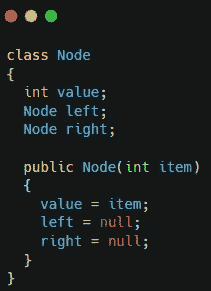

**搜索**

搜索二叉查找树的工作方式类似于搜索[二分搜索法](/nerd-for-tech/binary-search-d8363b22e684)。这些值经过排序，因此每次搜索都会排除一半的可能选项。

让我们在上面显示的二叉查找树中寻找 1。

首先，您将确定 1 小于根 5，因此它必须在左边。

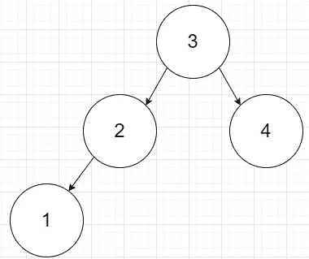

接下来，您将确定 1 小于 3。这将允许您继续只搜索左边的选项。

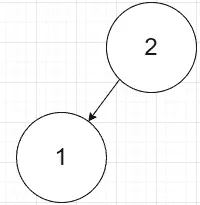

接下来，您将确定 1 小于 2。你将继续向左搜索。

最后，您将确定 l 在搜索树中。

下面是一个如何实现搜索树的代码示例。

**插入**

要插入一个二叉树，你需要搜索整个树，直到找到正确的位置。这通过将节点的值与您想要插入的值进行比较来实现。如果根为空，您将添加想要插入到该空值中的值。如果该值不为空，您将根据要插入的值是小于还是大于根的值向左或向右移动。

下面是插入的代码实现。

**删除**

删除一个值时，有三种可能的情况。

第一种情况是当您要删除的值没有子代时。在这种情况下，只需删除该值。

删除 1

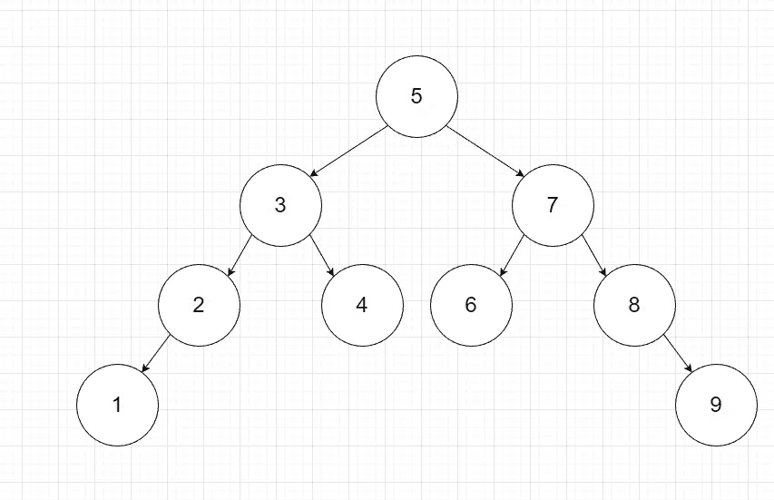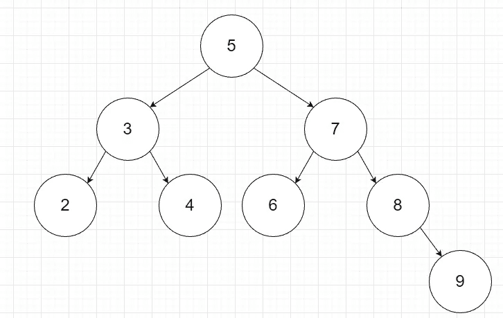

第二种情况是值只有一个子级。在这种情况下，将子对象复制到父对象并删除子对象。

删除 2

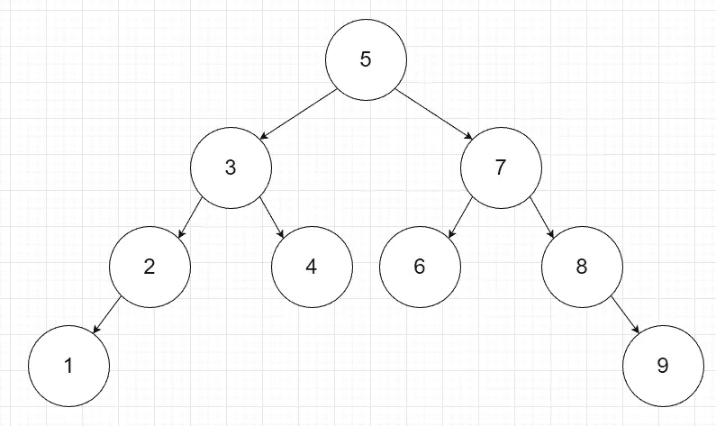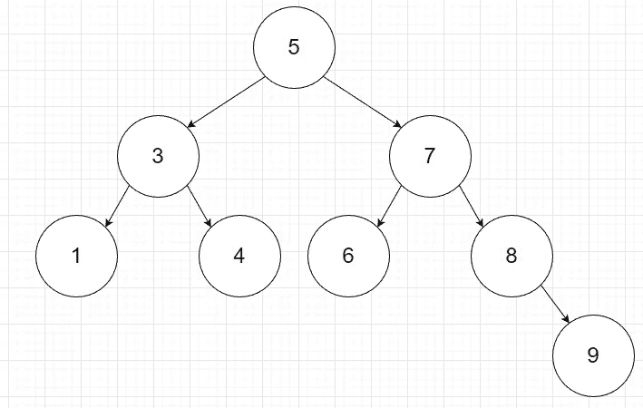

最后一种情况是当值有两个子值时。在这种情况下，查找有序的后继者。然后将顺序后继值复制到您要删除的值，然后删除顺序后继值。

删除 5

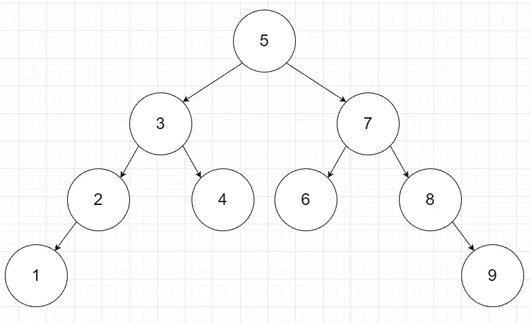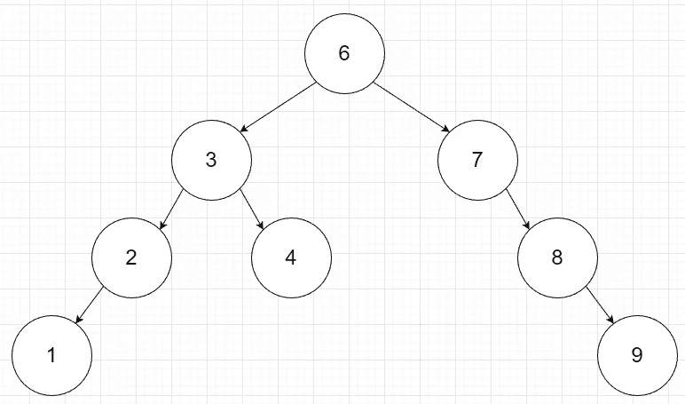

下面是删除的代码实现。

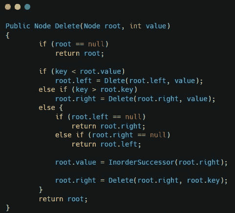