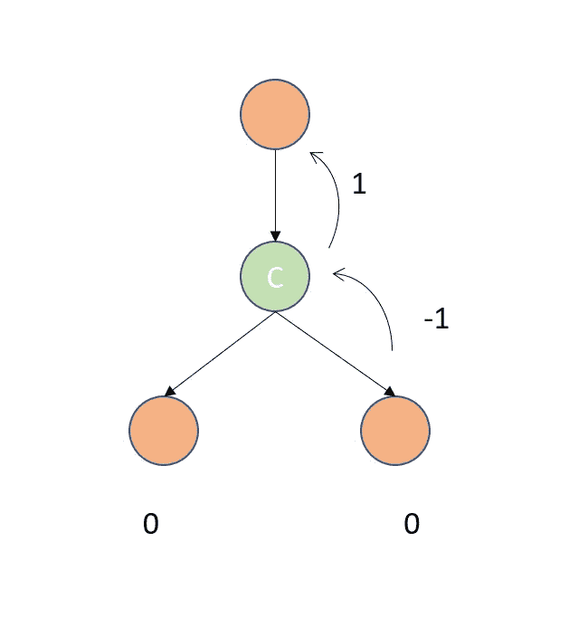

# 二叉树相机——亚马逊面试问题

> 原文：<https://medium.com/nerd-for-tech/binary-tree-cameras-daily-challenge-may-4881a07ecd62?source=collection_archive---------14----------------------->


照片由 [Unsplash](https://unsplash.com/s/photos/survelliance?utm_source=unsplash&utm_medium=referral&utm_content=creditCopyText) 上的 [Rishabh Varshney](https://unsplash.com/@rishabh?utm_source=unsplash&utm_medium=referral&utm_content=creditCopyText) 拍摄

## [968](https://leetcode.com/problems/binary-tree-cameras/) 。二叉树照相机

给定一棵二叉树，我们在树的节点上安装摄像机。

节点上的每个摄像机可以监控其父节点、自身及其直接子节点。

计算监控树的所有节点所需的最少摄像机数量。

## 示例:

```
**Input:** [0,0,null,0,0]
**Output:** 1
**Explanation:** One camera is enough to monitor all nodes if placed as shown.
```

## 理解问题:

因为我们想要最小化摄像机的数量，有一点是清楚的，我们不在叶节点放置摄像机。这样我们就可以从树叶追踪到树根。这使得 DFS 成为解决该问题的最有可能的选择。但是当我们往回追溯时，我们需要在节点之间交换信息，以查看当前节点是否需要摄像机。如果前一个节点已经有一个摄像机，我们不需要摄像机。总而言之，我们需要考虑以下事项:

> 如果当前节点是叶节点，那么我们不需要摄像机。
> 如果我们在当前节点上没有摄像机，那么父节点需要它。
> 如果当前节点有摄像机，那么它的父节点不需要摄像机。

我们可以指定不同的值来表示这些状态。-1 from children 的意思是放相机。1 来自任何儿童意味着没有相机。



## 代码实现:

```
# Definition for a binary tree node.
# class TreeNode:
#     def __init__(self, val=0, left=None, right=None):
#         self.val = val
#         self.left = left
#         self.right = right
class Solution:
    def minCameraCover(self, root: TreeNode) -> int:
        def dfs(node):
            l=0
            r=0
            if (node.left is None and node.right is None):
                return -1
            if node.left:
                l = dfs(node.left)
            if node.right:
                r = dfs(node.right)
            if(l == -1 or r == -1):
                self.count += 1
                return 1
            if(l == 0 and r == 0):
                return -1
            if(l == 1 or r == 1):
                return 0
        self.count=0
        cams = dfs(root)
        if(cams == -1):
            self.count += 1
        return self.count
```

## 复杂性分析

*   时间复杂度:O(N) 其中 *N* 是二叉树中节点的数量
*   空间复杂度:递归调用堆栈的空间可能是 n。

编码快乐！！！